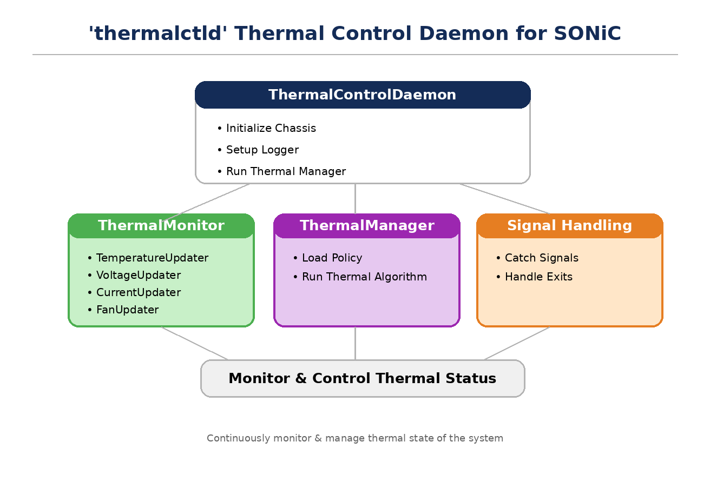
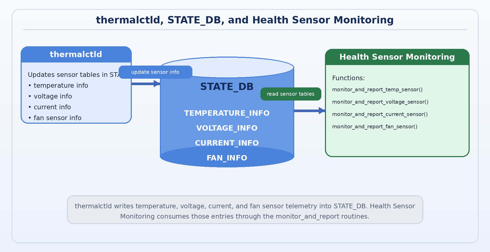
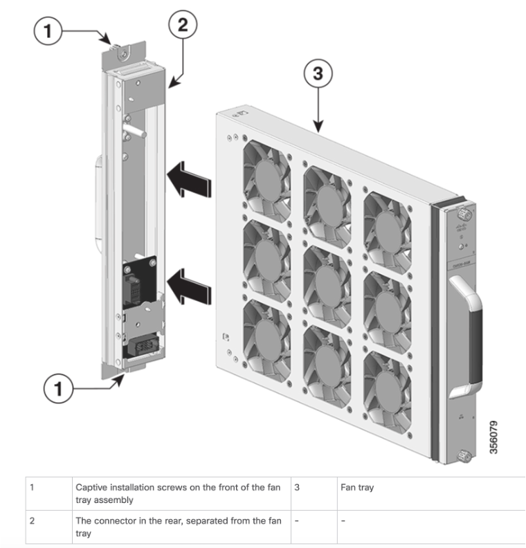

# SONiC Fault Handler and OBFL Infra

Design of Fault detection and propagation to Redis DB

Handling of the recorded fault and logging into OBFL

## Modification History

| Revision | Date | Originator | Comments (List impact by section) |
|:--:|:--:|:--:|:--:|
| 1.0 | 04/10/2024 | Rajan Narayanan | Initial Draft |
| 1.1 | 04/19/2024 | Rajan Narayanan | Review comments update |
| 1.2 | 05/10/2024 | Rajan Narayanan | Reorganized the document using this template document |
| 1.3 | 05/30/2024 | Rajan Narayanan | Included fault policy section and addressed review comments |
| 1.4 | 02/10/2025 | Nanma Purushotam | Added automation test suite and T2 chassis integration validation results |
| 1.5 | 02/18/2026 | Keith Lu | Improvement |
| 1.6 | 03/20/2026 | Keith Lu | added fan sensor fault mgmt |

## Table of Contents

- [1 Problem Definition](#problem-definition)
- [2 Software Functional Requirements](#software-functional-requirements)
  - [2.1 Functional Requirements Summary](#functional-requirements-summary)
  - [2.2 Fault Detection and reporting](#fault-detection-and-reporting)
    - [2.2.1 Sensor Fault monitoring](#sensor-fault-monitoring)
    - [2.2.2 Component fault monitor](#component-fault-monitor)
    - [2.2.3 Fault Detection Schema](#fault-detection-schema)
    - [2.2.4 Fault Filtering, Validation, and Duplicate Severity Tracking](#fault-filtering-validation-and-duplicate-severity-tracking)
  - [2.3 Fault Handler Service](#fault-handler-service)
    - [2.3.1 Enhanced Policy Validation and Error Handling](#enhanced-policy-validation-and-error-handling)
    - [2.3.2 Fault data flow](#fault-data-flow)
    - [2.3.3 Fault Handler Schema](#fault-handler-schema)
    - [2.3.4 Fault Policy](#fault-policy)
  - [2.4 Modular Utility Functions](#modular-utility-functions)
  - [2.5 Database Connectivity and Resilience](#database-connectivity-and-resilience)
  - [2.6 Restart](#restart)
  - [2.7 Power Cycle](#power-cycle)
  - [2.8 OBFL](#obfl)
    - [2.8.1 Reboot Info](#reboot-info)
    - [2.8.2 Alarms](#alarms)
    - [2.8.3 Inventory](#inventory)
    - [2.8.4 FPD Activity](#fpd-activity)
- [3 Performance and Code Quality Requirements](#3-performance-and-code-quality-requirements)
    - [3.1 Metrics](#metrics)
- [4 Automation Suite](#4-automation-suite)
    - [4.1 T2 Chassis Integration – Fault Monitoring Services](#t2-chassis-integration--fault-monitoring-services)
- [5 References](#5-references)

## List of Tables

- Table 1: Functional Requirements Summary

## List of Figures

- Figure 1 Fault Propagation
- Figure 2 Fault handler flow
- Figure 3 Obfl flow
- Figure 4 Upstream thermalctld concept
- Figure 5 fantray_structure

## 1 Problem Definition

SONiC as network OS enabled with infra to monitor the device and its resources. At this point, SONiC is capable of monitoring critical host services, process, docker and some peripheral device states. But there is no support to identify, categorize and handle the fault based on severity. This document defines the requirements, design, and functionality of the fault handler component.

Fault handling mechanism is a real time process in which all faults are handled based on the severity. But this doesn't give the history of the health of the device over a period. Device vendors are not provided with enough information about the device during RMA (i.e.) there is no clue about how the device was functioning. To mitigate such scenarios, critical events are logged into onboard flash (OBFL) card on every Fruable computing node. So, this document also captures the functional and design aspects of OBFL service.

## 2 Software Functional Requirements

Sonic does system health monitoring in a device agnostic way, which limits the capability of monitoring and handling the faults that are device specific. So, as part of the monitoring service infra, Sonic extends the capability by enabling platforms to hook up their respective platform specific monitoring scripts. This section captures the functionality needed to cover the platform specific monitoring and logging in a PID agnostic way.

### 2.1 Functional Requirements Summary

| **Section #** | **Section Title** | **Feature #** | **Req. Tag** | **Functional Description (Brief)** |
|---|---|---|---|---|
| 2.2.1 | Sensor fault monitor |  |  | Platform script to monitor sensor faults |
| 2.2.2 | Component fault monitor |  |  | Platform script to monitor faults using data file based on FaultDetectionSchema |
| 2.2.3 | FaultDetectionSchema |  |  | Schema to specify the mechanism to detect a fault |
| 2.2.4 | Fault filtering, validation, duplicate tracking |  |  | Improved fault quality and duplicate suppression |
| 2.3.1 | Enhanced policy validation and error handling |  |  | Fault handler robustness improvements |
| 2.4 | Modular utility functions |  |  | Shared utilities for fault data and helpers |
| 2.5 | Database connectivity and resilience |  |  | Retry, reconnection, and startup verification |
| 2.6 | Restart handling |  |  | Fault handling behavior during service restart |
| 2.7 | Power cycle handling |  |  | Fault handling behavior across power cycles |
| 2.8 | OBFL |  |  | Onboard flash logging and tracking |

**Table 1: Functional Requirements Summary**

### 2.2 Fault Detection and reporting

SONiC system health monitoring service tracks critical services and processes and summarizes them as a health report of the system. This service provides an optional configuration for the user to ignore monitoring entities and provision to enable additional monitoring. Below is the optional config schema provided by SONiC

```json
{ 
    "services_to_ignore": [], 
    "devices_to_ignore": [], 
    "user_defined_checkers": [], 
    "polling_interval": 60, 
    "led_color": { 
        "fault": "red_blink", 
        "normal": "green", 
        "booting": "amber" 
    }
}
```

**Figure 1 Fault Propagation**


As captured in the above figure, system health monitoring service is accomplished by "healthd" host deamon. Overall system health information is logged into SYSTEM_HEALTH_INFO table in stateDB. Using the same infra device specific monitoring can also be achieved.

Using the "user_defined_checkers" option in the above config, platform scripts can be hooked up to the system monitor service (depicted as "platform script 1….n" in the above figure) which will also be invoked as host services and monitor device specific faults. These detected faults are identified or logged as Fault information in StateDB within FAULT_INFO table. Also, the state of such components are exported to SYSTEM_HEALTH_INFO. Below subsection captures the functional requirement for these additional monitoring services.

#### 2.2.1 Sensor Fault monitoring

"thermalctld" monitors temperature sensors and "sensormond" monitor voltage and current sensors in the current model. These daemons periodically collect the sensor values and logs in StateDB. But the Sensors faults are not tracked and handled. This function filters such platform faults that are exceeding Major/Critical thresholds and reports them as fault information in the format recommended by the fault handler schema.

Since these sensor values are already exported by thermalctld and sensormond, there is no need to report this event/fault from the source, instead it can be retrieved/sourced from StateDB and process for fault handling. This is achieved by hooking up a user defined service (platform service) to monitoring infra.

This platform script periodically scans all the temperature, voltage and current sensors that are exceeding Major and Critical levels and updates/export to fault table. When the sensors return to normal levels, they will be removed from the fault table.

This service keeps track of the reported faults including the timestamp to avoid redundant reporting. Whenever the service restarts or the platform reboots, this service will re-sync with the FAULT_INFO table from stateDB and resume it's monitoring service.

**Upstream thermalctld concept**



The following interaction flow shows `thermalctld` updating temperature, voltage, current, and fan sensor information in STATE_DB, while Health Sensor Monitoring consumes those entries and publishes FAULT_INFO events through the platform monitoring routines below.




```
monitor_and_report_temp_sensor()
monitor_and_report_voltage_sensor()
monitor_and_report_current_sensor()
monitor_and_report_fan_sensor()
```

**Detection and validation flow**

(1) TEMP/VOLTAGE/CURRENT sensor fault monitoring

```
IF (threshold_exceeded AND warning_status == 'true') THEN
    validate sensor payload
    IF valid THEN
        evaluate duplicate/severity state
        publish fault event
    END IF
END IF
```

- Example sensor payload (`TEMPERATURE_INFO|PSU1 HSNK_Temp`):

```
sonic-db-cli STATE_DB HGETALL 'TEMPERATURE_INFO|PSU1 HSNK_Temp'
"TEMPERATURE_INFO|PSU1 HSNK_Temp": {
    "temperature": "91.0",
    "minimum_temperature": "56.0",
    "maximum_temperature": "58.0",
    "high_threshold": "85.0",
    "low_threshold": "-5.0",
    "warning_status": "True",
    "critical_high_threshold": "90.0",
    "critical_low_threshold": "-10.0",
    "is_replaceable": "False",
    "timestamp": "20250821 19:55:37"
}
```

Failure Temp sample (`temperature` = `91.0`):

```
"FAULT_INFO_TABLE|PSU1 HSNK_Temp": {
    "temperature": "91.0",
    "minimum_temperature": "56.0",
    "maximum_temperature": "58.0",
    "high_threshold": "85.0",
    "low_threshold": "-5.0",
    "warning_status": "True",
    "critical_high_threshold": "90.0",
    "critical_low_threshold": "-10.0",
    "is_replaceable": "False",
    "timestamp": "20250821 19:55:37",
    "severity": "CRITICAL",
    "action": "RAISE",
    "component": "TempSensor",
    "type_id": "TEMPERATURE_EXCEEDED",
    "comment": "91.0"
}
```

Validation includes:

- any N/A or missing value handling with state tracking
- numeric conversion and sanity bounds checks
- threshold ordering checks (critical_high >= high >= low >= critical_low)
- recovery logging when a sensor returns from invalid/N/A to valid state

<p>&nbsp;</p>

(2) FAN sensor fault monitoring

Fan fault judgement logic as upstream thermalctld refresh flow:
presence controls whether checks apply, and status controls raise/clear behavior.
CRITICAL fault: not presence or direction is not intake
MARJOR   fault: upstream logic below

Upstream source:
- https://wwwin-github.cisco.com/whitebox/sonic-platform-daemons/blob/master/sonic-thermalctld/scripts/thermalctld#L289
- https://wwwin-github.cisco.com/whitebox/sonic-platform-daemons/blob/master/sonic-thermalctld/scripts/thermalctld#L159

FAN redis format in STATE_DB:

Fan hardware context (fan tray and connector layout):



```
"PHYSICAL_ENTITY_INFO|fantray0": {
    "position_in_parent": "1",
    "parent_name": "chassis 1"
}

"PHYSICAL_ENTITY_INFO|fantray0.fan0": {
    "position_in_parent": "1",
    "parent_name": "fantray0"
}

"FAN_DRAWER_INFO|fantray0": {
    "presence": "True",
    "model": "8808-FAN",
    "serial": "FOC2430N1XJ",
    "status": "True",
    "is_replaceable": "True",
    "led_status": "green"
}
```

Normal fan sample (`status` = `True`):

```
"FAN_INFO|fantray0.fan0": {
    "presence": "True",
    "drawer_name": "fantray0",
    "model": "8808-FAN",
    "serial": "FOC2430N1XJ",
    "status": "True",
    "direction": "intake",
    "speed": "90",
    "speed_target": "100",
    "is_under_speed": "False",
    "is_over_speed": "False",
    "is_replaceable": "False",
    "timestamp": "20260320 19:03:55",
    "led_status": "green"
}
```

Failure fan sample (`status` = `False`):

```
"FAN_INFO|FAN_SENSOR_D": {
    "presence": "True",
    "drawer_name": "fantray3",
    "model": "8808-FAN",
    "serial": "FTSJJGDVNV3",
    "status": "False",
    "direction": "intake",
    "speed": "0",
    "speed_target": "100",
    "is_under_speed": "True",
    "is_over_speed": "False",
    "is_replaceable": "False",
    "led_status": "red",
    "timestamp": "20260306 21:51:48"
}
```

```
"FAULT_INFO_TABLE|FAN_SENSOR_D": {
    "direction": "intake",
    "drawer_name": "fantray3",
    "is_over_speed": "False",
    "is_replaceable": "False",
    "is_under_speed": "True",
    "led_status": "red",
    "model": "8808-FAN",
    "presence": "True",
    "serial": "FTSJJGDVNV3",
    "speed": "0",
    "speed_target": "100",
    "status": "False",
    "timestamp": "20260306 21:51:48",
    "warning_status": "True",
    "severity": "CRITICAL",
    "action": "RAISE",
    "component": "FanSensor",
    "type_id": "FAN_FAULT",
    "comment": "status=False, speed=0"
}
```

#### 2.2.2 Component fault monitor

This section captures the functionality of monitoring the non-sensor entities (i.e.) entities that can be monitored based on the fault detection schema.

Apart from monitoring the sensors there are a bunch of hardware entities that are monitored periodically. This periodic polling mechanism will catch failure that stays long enough or permanent failures. This service cannot handle any interruptions raised from hardware components. Depending up on the fault category, it might be monitored by more than one platform scripts

Platforms are monitored for:

- I2c link failure
- SPI link failure
- PCIe link failure
- FPGA registers reporting errors
- Power good status
- and additional PID specific entities

All these monitoring logics are platform agnostic but the data it operates is platform specific. And these data are packaged during build. This service is expected to be executed in production too.

#### 2.2.3 Fault Detection Schema

As mentioned in the above section, there are several similar platform components that are arranged in different topologies which can be monitored in the same way with relevant PID specific data. Below schema help organize PID specific data file with relevant information

- Name: Resource Name
- Access method: CLI, REG, sysfs
- Register: Register value
- Sysfs path: Path
- CLI: sonic/platform cli
- Expected Values: value
- Comment: Optional comments to capture
- System health DB: True

Every platform should provide information about the components that need to be monitored. This information's should be in line with the above Schema.

**Note:**

- If there are platform specific scripts that need to be staged, it will be handled as part of platform setup. It will be captured later (needs some more investigation)
- Event Alarm Framework infra is not available for fault propagation. Once the framework is in place, fault reporting will switch over to the alarm event framework.

#### 2.2.4 Fault Filtering, Validation, and Duplicate Severity Tracking

Fault monitoring applies duplicate-aware state tracking before publishing repeated events.

**Duplicate and severity handling**

```
IF sensor_key NOT in fault_cache THEN
    report new fault
ELSE IF current_severity != cached_severity THEN
    report severity transition (e.g., MAJOR -> CRITICAL)
ELSE
    skip duplicate
END IF
```

This model preserves meaningful state transitions while suppressing unchanged repeats.

**Operational impact**
- reduces false positives by requiring dual condition confirmation
- avoids malformed-data crashes through defensive validation
- prevents redundant OBFL/log writes for unchanged faults
- preserves fault history accuracy for escalation and recovery events

### 2.3 Fault Handler Service

Fault handler service runs as daemon in the host. The primary functional requirement is to scan for Fault Information in StateDB and act on it. It is assisted with a Fault Policy table that defines handling mechanism.

**Figure 2 Fault handler flow**


Fault handler is a host service spawned to listen/poll the database for the faults reported by platform monitors services/daemons. Every iteration is marked and compared against the faults in the DB to avoid redundant action. Designed to poll for fault information periodically

Every PID provides a fault policy table that gets referred to during fault handling. Policy table actions are PID specific, and it can be one or more from the list below:

- Syslog
- Obfl
- Reload
- shutdown

#### 2.3.1 Enhanced Policy Validation and Error Handling

Fault handling logic validates policy and payload before action execution, and degrades gracefully on non-fatal failures.

```
IF fault_policy NOT loaded THEN
    log error and skip handling
    RETURN
END IF

IF fault already exists with same severity THEN
    log info and skip duplicate
    RETURN
END IF

IF comment field missing THEN
    auto-generate comment from FaultDataManager
END IF

TRY
    log alarm to OBFL
CATCH error
    log error and continue processing
END TRY
```

Key behavior:
- validates fault-policy availability and rule structure before action evaluation
- suppresses handler-level duplicates as an additional protection layer
- auto-completes missing required fields when deterministic defaults are available
- isolates OBFL exceptions to avoid service-wide interruption
- emits actionable logs for troubleshooting and auditability

#### 2.3.2 Fault data flow

- Monitor service periodically tracks the list of components specified on the platform data file
- Anything outside of expected behavior is reported as fault
- Ignore the fault if it is already reported
- Clear the fault when the component resumes the expected functionality
- Fault handling service gets notified whenever the faults are raised and cleared
- Every fault is handled based on the recommended action in fault policy table.

#### 2.3.3 Fault Handler Schema

All the faults reported to the DB should be in line with the schema defined below

- resource: Component Name
- type-id: Type of Alarm
- severity: Major/Critical
- text: Producer comments
- time-created: Timestamp when the data is produced

#### 2.3.4 Fault Policy

Fault policy table provides the flexibility to handle faults in a platform specific way. By default, there are no actions. But the platform can set appropriate actions for the faults by staging fault_policy.json under the platform path /usr/share/sonic/device/\<platform\>/fault_policy.json

**Fault policy schema**

```json
{
    "chassis": {
        "name": "Product Name",
        "faults": [
            {
                "type-id": "Type of alarm",
                "severity": "Major or Critical",
                "action": "List of recommended action",
                "resource": "Entity raising alarm",
                "override": "Overriding action"
            }
        ]
    }
}
```

Policy match verification from faulthandler:

```
admin@sfd-vt2-sup:/mnt/obfl$ tail -n 20 /var/log/faulthandler.log
INFO - POLICY MATCHED! Entry 1: {'type': 'TEMPERATURE_EXCEEDED', 'severity': 'MAJOR', 'action': ['obfl']}
INFO - POLICY MATCHED! Entry 2: {'type': 'TEMPERATURE_EXCEEDED', 'severity': 'CRITICAL', 'action': ['obfl']}
INFO - POLICY MATCHED! Entry 3: {'type': 'VOLTAGE_EXCEEDED', 'severity': 'MAJOR', 'action': ['obfl']}
INFO - POLICY MATCHED! Entry 4: {'type': 'VOLTAGE_EXCEEDED', 'severity': 'CRITICAL', 'action': ['obfl']}
INFO - POLICY MATCHED! Entry 5: {'type': 'CURRENT_EXCEEDED', 'severity': 'MAJOR', 'action': ['obfl']}
INFO - POLICY MATCHED! Entry 6: {'type': 'CURRENT_EXCEEDED', 'severity': 'CRITICAL', 'action': ['obfl']}
INFO - POLICY MATCHED! Entry 7: {'type': 'FAN_FAULT', 'severity': 'MAJOR', 'action': ['obfl']}
INFO - POLICY MATCHED! Entry 8: {'type': 'FAN_FAULT', 'severity': 'CRITICAL', 'action': ['obfl']}
```

**Sample fault_policy.json**

```json
{
    "chassis": {
        "name": "x86_64-8101_32fh_o-r0",
        "faults": [
            {
                "type": "TEMPERATURE_EXCEEDED",
                "severity": "MAJOR",
                "action": ["obfl"]
            },
            {
                "type": "TEMPERATURE_EXCEEDED",
                "severity": "CRITICAL",
                "action": ["obfl", "shutdown"]
            },
            {
                "type": "TEMPERATURE_EXCEEDED",
                "severity": "CRITICAL",
                "resource": ["Noncritical board sensor"],
                "override": ["obfl"]
            },
            {
                "type": "VOLTAGE_EXCEEDED",
                "severity": "MAJOR",
                "action": ["obfl"]
            },
            {
                "type": "VOLTAGE_EXCEEDED",
                "severity": "CRITICAL",
                "action": ["obfl"]
            },
            {
                "type": "CURRENT_EXCEEDED",
                "severity": "MAJOR",
                "action": ["obfl"]
            },
            {
                "type": "CURRENT_EXCEEDED",
                "severity": "CRITICAL",
                "action": ["obfl"]
            },
            {
                "type": "FAN_FAULT",
                "severity": "MAJOR",
                "action": ["obfl"]
            },
            {
                "type": "FAN_FAULT",
                "severity": "CRITICAL",
                "action": ["obfl"]
            }
        ]
    }
}
```

**type-id**

'type-id' identifies the alarm type. Some of the default types are captured below.

Users can extend this list based on the alarm type supported by the platform.

- TEMPERATURE_EXCEEDED
- VOLTAGE_EXCEEDED
- CURRENT_EXCEEDED
- FAN_FAULT
- MISSING_PSU

**severity**

Every alarm is identified with severity.

- MAJOR
- CRITICAL

**action**

Every fault identified in the policy table should have an associated action. Users can identify more than one action for a fault. Below are the actions supported

- SYSLOG
- REBOOT
- SHUTDOWN
- OBFL

**resource/Entity**

Name of the entity raising the alarm. It's optional.

**Override**

This option is used only to indicate the deviation of action for certain resources (i.e.) if the default action for the alarm type "TEMPERATURE EXCEED" with severity "CRITICAL" is "shutdown", then use the override option to take a different action for the same alarm type and sev from different resources

### 2.4 Modular Utility Functions

The implementation uses a shared utility layer to centralize fault data preparation, mapping, and database helpers.

```
FaultDataManager:
    - prepare_fault_data(component, data, severity, action)
    - generate_sensor_comment(component, data)
    - get_type_id_from_component(component)

Database helpers:
    - verify_redis_connectivity(max_attempts, retry_delay, timeout)
    - reconnect_db()
```

Design outcomes:
- one canonical path for fault payload construction across monitor and handler
- lower code duplication and simpler maintenance for schema updates
- stronger unit-testability for utility-level functions
- consistent type-id mapping and comment formatting across components

### 2.5 Database Connectivity and Resilience

Database operations use configurable retries, startup verification, and controlled reconnection loops.

```
Connection verification:
TRY up to max_attempts:
    ping database
    if success -> connected
    else wait retry_delay and retry

Reconnection:
REPEAT until success:
    connect to StateDB
    if success -> return connections
    else log error, wait retry_delay, retry
```

Operational behavior:
- retry parameters are configurable for different deployment profiles
- monitoring starts only after connectivity checks pass
- transient Redis faults are recovered automatically without process crash
- reconnect logic maintains service continuity during DB restarts

### 2.6 Restart

When the fault handling service restarts, it does re-sync to the current fault info table. There are conditions which lead to repeated action during re-sync (i.e.) an event raised with action as reboot might trigger another reboot. Unless the event is cleared in the following boot, the same action leads to reboot in loop. To avoid this, the fault handler service marks the timestamp of the last handled fault in some persistent manner. Whenever the service re-syncs to the current fault in the table, it takes actions for the faults that are raised after restart/reboot based on the cached timestamp.

Every restart/reboot will be marked in the OBFL flash.

### 2.7 Power Cycle

This is like restart, but this time all the faults will be handled afresh irrespective of the status of the faults recorded in OBFL.

### 2.8 OBFL

OBFL is a flash component to record critical information during system operations that can be used for analysis during RMA. During boot flash the file system gets mounted if not already mounted.

**Figure 3 Obfl flow**


Platform monitor service tracks alarms, reboot history and Inventory. Also provides CLI to view the collected information. Sections below explain the data captured as part of this tracking. Below information's are tracked via obfl

- Alarms
- FPD Activity
- Reboot history
- Inventory tracking
- NPU Fault

#### 2.8.1 Reboot Info

This file tracks the reboot information of the system. It should track the power cycle, user reboot and watchdog reboot.

```
Name            Cause           Time                                    User

Chassis         Power Loss      N/A                                     N/A
Chassis         Reboot          Fri 19 Apr 2024 02:49:37 PM UTC         cisco
```

#### 2.8.2 Alarms

Alarms are generated by fault handler daemon and captured in flash.

Explained in fault handling service

#### 2.8.3 Inventory

When the system comes online it captures all the Inventory information. Post that every OIR is tracked and recorded with IDPROM information.

```
2024-03-19  07:50:54  Chassis IDPROM INFORMATION:
  Location        : Chassis
  Device Name     : Cisco 8100 32x400G QSFPDD 1RU Fixed System w/o HBM, Open SW
  HW Version      : 0.41
  PID             : 8101-32FH-O
  SN              : FOC2342PBR2

2024-03-19  07:51:54  Fantray IDPROM INFORMATION:
  Location        : Fantray0
  Device Name     : Cisco 8000 Series 1RU Fan with Port-side Air Intake Ver 2
  HW Version      : 0.0
  PID             : FAN-1RU-PI-V2
  SN              : NCV2505Q07C

2024-03-19  02:50:30  Fantray IDPROM INFORMATION:
  Location        : Fantray0
  Device Name     : Cisco 8000 Series 1RU Fan with Port-side Air Intake Ver 2
  HW Version      : 0.0
  PID             : FAN-1RU-PI-V2
  SN              : NCV2505Q08Y
```

#### 2.8.4 FPD Activity

FPD activity is not tracked using platform monitor service. Instead, it will be recorded from the source while the upgrade action takes place.


## 3 Performance and Code Quality Requirements

This section summarizes key performance, quality, and reliability outcomes of the current fault management design.

### **3.1 Metrics**

#### **Integrated Performance and Reliability Controls**
- **Duplicate prevention**: Defense-in-depth checks at both monitor and handler levels prevent repeated alarms.
- **Batch validation**: Centralized `_validate_sensor_data()` removes redundant per-sensor validation calls.
- **Efficient filtering**: AND gating (`threshold_exceeded` and `warning_status`) suppresses false positives before DB updates.
- **State tracking**: `logged_states` avoids redundant validation/logging while preserving transition-aware behavior.
- **Exception resilience**: Comprehensive exception handling avoids unhandled service crashes.
- **DB reconnect handling**: Automatic recovery from temporary database disconnections.
- **Smarter caching**: Duplicate detection prevents re-processing identical faults and reduces database/OBFL I/O.
- **Graceful degradation**: Monitoring continues even when OBFL logging fails.

---


## 4 Automation Suite

<a id="t2-chassis-integration--fault-monitoring-services"></a>
### 4.1 T2 Chassis Integration – Fault Monitoring Services

Fault monitoring feature will be supported on T2 Chassis architecture. This requires the feature specific services to be enabled on the Chassis RP and Line cards. Chassis cards run in multi-asic architecture. This feature does not require any multi-asic awareness. The fault monitoring framework services will be responsible for monitoring sensor states and ensuring system health is continuously tracked.

### Key Validation Outcomes

**Feature Verification**
- Re-tested all features on line cards and supervisor cards.
- No multi-ASIC impact expected, as the service runs on the host and monitors all connected devices.

**Architecture Confirmation**
- Service monitoring architecture confirmed as **namespace-agnostic**.
- Ensures uniform fault monitoring across all namespaces without requiring service duplication.


### Test Suite Coverage

Test suites will be developed for sonic-mgmt to cover full functionality and unit testing for single form factor and chassis systems. Test suite will cover all

#### TB – Boot Tests

| ID | Name | Description |
|----|----|------------|
| TB-01 | First Boot | First boot on RP/LC - service started cleanly/not restarted multiple times; Validate via journalctl logs. Fault handler log files created. |

#### RB – Reboot

| ID | Name | Description |
|----|----|------------|
| RB-01 | System Reboot | System reboot: Services come up cleanly. Prior faults and `show platform obfl alarms` cleared; New faults get declared. |

#### TH – Threshold Tests

| ID | Name | Description |
|----|----|------------|
| TH-01 | Temperature Thresholds | Temp below warning → no fault raised; major threshold → major fault raised; critical threshold → critical fault raised. |
| TH-02 | Recovery Bands | Threshold edges: clear only after recovery bands satisfied. |
| TH-03 | Voltage Thresholds | Voltage thresholds (major/critical) mirror temperature behavior. |
| TH-04 | Current Thresholds | Current thresholds (major/critical) mirror temperature behavior. |
| TH-05 | Fan Thresholds | Current status (critical) true/false |

#### OB – OBFL Tests

| ID | Name | Description |
|----|----|------------|
| OB-01 | OBFL Schema | On raise/clear, OBFL entry has correct schema (timestamp, sensor_id, value, threshold, severity, action). File created; readable. |

#### DB – Database Validation

| ID | Name | Description |
|----|----|------------|
| DB-01 | DB Key Validation | Invalid DB keys (unknown sensor path) are logged and ignored. Missing fields (e.g., thresholds) → validation error; sensor skipped; no fault. Wrong types (str/None for float) → validation error; safe handling; no crash. Out-of-range values (neg voltage/absurd current) → rejected. |

#### SV – Service Resiliency

| ID | Name | Description |
|----|----|------------|
| SV-01 | Mid-stream Restart | Docker/service restart mid-stream (DB drop) → auto reconnect/backoff; processing resumes. |
| SV-02 | DB Restart Handling | Database service restart (READONLY/timeouts) → monitor retries until healthy; no crash. |
| SV-03 | Fault Service Restart | Fault services restart → validate basic functionality (rebuilds fault table; resubscribes to DB). |
| SV-04 | Policy Update Critical | Policy JSON file update – critical=reboot; restart service; trigger the critical temperature; check reboot cause (via show reboot history, OBFL); validate basic checks. |

#### MT – Multi-Sensor

| ID | Name | Description |
|----|----|------------|
| MT-01 | Multi-Sensor Faults | Multiple sensors breach simultaneously → independent faults raised and mapped action taken; |

#### Logs

```
/mnt/obfl$ tail -n 20 alarms.txt

individaul fault:
DECLARE  CRITICAL  VOLTAGE_EXCEEDED          VOLT_SENSOR_A               14401mV
DECLARE  MAJOR     VOLTAGE_EXCEEDED          VOLT_SENSOR_A               13801mV
DECLARE  CRITICAL  VOLTAGE_EXCEEDED          VOLT_SENSOR_A               7999mV
CLEAR              VOLTAGE_EXCEEDED          VOLT_SENSOR_A
DECLARE  CRITICAL  CURRENT_EXCEEDED          CURR_SENSOR_A               9001mA
DECLARE  MAJOR     CURRENT_EXCEEDED          CURR_SENSOR_A               7001mA
DECLARE  CRITICAL  CURRENT_EXCEEDED          CURR_SENSOR_A               999mA
CLEAR              CURRENT_EXCEEDED          CURR_SENSOR_A

multiple faults:
DECLARE  CRITICAL  TEMPERATURE_EXCEEDED      TEMP_SENSOR_B               106.0
DECLARE  CRITICAL  VOLTAGE_EXCEEDED          VOLT_SENSOR_B               14401mV
DECLARE  CRITICAL  CURRENT_EXCEEDED          CURR_SENSOR_B               9001mA
DECLARE  MAJOR     TEMPERATURE_EXCEEDED      TEMP_SENSOR_B               101.0
DECLARE  MAJOR     VOLTAGE_EXCEEDED          VOLT_SENSOR_B               13801mV
DECLARE  MAJOR     CURRENT_EXCEEDED          CURR_SENSOR_B               7001mA
CLEAR              TEMPERATURE_EXCEEDED      TEMP_SENSOR_B
CLEAR              VOLTAGE_EXCEEDED          VOLT_SENSOR_B
CLEAR              CURRENT_EXCEEDED          CURR_SENSOR_B

fan fault:
DECLARE  CRITICAL  FAN_FAULT                 FAN_SENSOR_D                status=False,speed=0
CLEAR              FAN_FAULT                 FAN_SENSOR_D
```

| ID | Name | Description |
|----|----|------------|
| LOG-01 | Log Policy | `fault.log` and `faulthandler.log` contain no unnecessary entries. Logrotate policy will be implemented. |

---


**Observations:**
This section list few observation from the current design.

1. **Multi-sensor fault handling behavior**
    - **Observation**: Multiple simultaneous sensor faults create independent entries correctly
    - **OBFL impact**: Each sensor generates separate OBFL entries with proper timestamps
    - **Performance**: No significant performance degradation observed with 10+ concurrent faults
    - **Cleanup**: Fault clearing works independently for each sensor without affecting others

2. **Service log management**
    - **Log volume**: Fault monitoring can generate significant log volume during active fault conditions
    - **Debugging**: Logs essential for troubleshooting but need careful management in production
    - **Performance**: Excessive logging can impact service responsiveness during fault storms

3. **Low threshold management**
    - **Observation**: The current Fault Handler design handles high thresholds (e.g., high temperature exceeding major and critical thresholds). Low threshold detection and handling should be implemented similarly for completeness.

4. **Manual fault injection for testing**
    
    You can manually inject faults for testing purposes using one of the following methods:
    
    - Run fault_handler tests in sonic-mgmt
    - Use Redis CLI commands directly
    
    **Example: Inject a temperature sensor fault above warning threshold**
    
    ```bash
    # Create a fake temp sensor exceeding warning threshold
    redis-cli -n 6 HSET 'TEMPERATURE_INFO|TEMP_SENSOR_A' \
        critical_high_threshold '106.0' \
        high_threshold '100.0' \
        temperature '107.0' \
        warning_status 'True' \
        timestamp "$(date '+%Y%m%d %H:%M:%S')"
    
    # Verify that the fault entry has been created
    redis-cli -n 6 EXISTS 'FAULT_INFO_TABLE|TEMP_SENSOR_A'
    
    # Check OBFL to confirm the alarm has been declared
    show platform obfl alarms
    ```

## 5 References

- https://github.com/sonic-net/SONiC/blob/master/doc/system_health_monitoring/system-health-HLD.md
- https://github.com/sonic-net/SONiC/blob/master/doc/event-alarm-framework/event-alarm-framework.md
- https://github.com/sonic-net/SONiC/blob/ba5dd460469b103c23c31bfc6fbb5f3837c1b657/doc/fault_management/fault_mgmt_infra_HLD.md
- https://wwwin-github.cisco.com/whitebox/sonic-platform-daemons/blob/master/sonic-thermalctld/scripts/thermalctld

---
