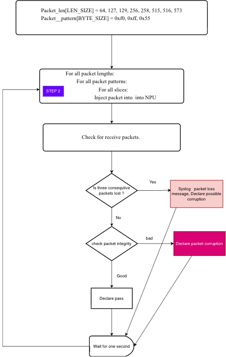
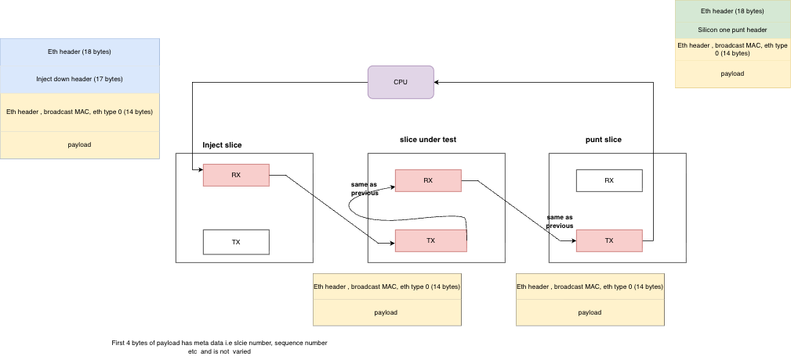

# Online Diagnostics HLD

## Revision

<pre>

| Rev | Date       | Author | Change Description |
|-----|------------|--------|--------------------|
| 0.1 | 03/02/2026 |Sridhar | Initial version    |

</pre>

## Table of Contents

- [1 Introduction](#1-introduction)
  - [1.1 Motivation](#11-motivation)
- [2 Requirements](#2-requirements)
- [3 Supported Platforms](#3-supported-platforms)
- [4 Design](#4-design)
  - [4.1 Theory of Operation](#41-theory-of-operation)
  - [4.2 Flow Chart](#42-flow-chart)
  - [4.3 How to Cover Data Paths](#43-how-to-cover-data-paths)
  - [4.4 Design Choices](#44-design-choices)
    - [4.4.1 How and Where to Run the Feature](#441-how-and-where-to-run-the-feature)
  - [4.5 Inject Packet Format, Size and Content](#45-inject-packet-format-size-and-content)
  - [4.6 Performance Analysis](#46-performance-analysis)
  - [4.7 Dependencies](#47-dependencies)
  - [4.8 Sample Syslogs](#48-sample-syslogs)
- [5 Limitations](#5-limitations)
- [6 Implementation](#6-implementation)
  - [6.1 SONIC Team Tasks](#61-sonic-team-tasks)
  - [6.2 SDK Team Tasks](#62-sdk-team-tasks)
  - [6.3 Implementation Details](#63-implementation-details)
  - [6.4 Device Properties](#64-device-properties)
  - [6.5 Commits](#65-commits)
- [7 Management CLI](#7-management-cli)
  - [7.1 Configuration Commands](#71-configuration-commands)
  - [7.2 Show Commands](#72-show-commands)
  - [7.3 Commands to Simulate Errors for Testing](#73-commands-to-simulate-errors-for-testing)
- [8 Warmboot/Fastboot](#8-warmbootfastboot)
- [9 Yang Model](#9-yang-model)
- [10 Community Contributions](#10-community-contributions)
  - [10.1 New Switch Stats](#101-new-switch-stats)
  - [10.2 New Switch Attributes](#102-new-switch-attributes)
  - [10.3 Flex Counter Support](#103-flex-counter-support)
- [11 Testing and Validation](#11-testing-and-validation)
  - [11.1 Unit Test Plan](#111-unit-test-plan)
  - [11.2 Automation](#112-automation)
  - [11.3 Example Output](#113-example-output)
- [12 Future Enhancements](#12-future-enhancements)
- [13 References](#13-references)

## List of Figures

| # | Figure | Description |
|---|--------|-------------|
| 1 | [Flow chart](flowchart-onlinediag.png) | Online diagnostics flow chart |
| 2 | [Packet path](dphm-online-sonic.drawio.png) | Online diagnostics packet path through NPU slices |

# 1 Introduction

Online diagnostics feature contain packet-switching tests that check and verify the health of data path periodically while router is running in production.
The feature  attempts to catch HW data path problems leading to silent packet drops, packet corruption and total HW failure.

## 1.1 Motivation

Silent Packet drops, corruption and NPE timeout issues are seen in different customer deployments of Q200 NPU based platforms. Pro-actively monitoring data path and report any anomalies helps minimize traffic loss and provide better quality. 
 
# 2 Requirements

- Feature should cover all the blocks in the system on both line card and fabric card (IFG, SLICE, NPU, etc.)
- Feature should be enabled by default on boot-up and can be disabled via CLI
- Raise syslog when more than configured number of packets are lost sequentially
- For packet corruption syslog should happen as soon as it is detected.
- Configurable interval, packet size, packet content and burst size of packets that can be sent
- Maintain transmit/receive counters per slice per NPU
- should cover all intra-NPU and inter-NPU paths in  the system
- Additional CPU usage should be minimum.
- No impact to any existing host path applications
- These packets should not be forwarded
- Detection time should be as fast as possible
- False alarms should not happen.
- Online diag. packets should take path used by regular punt/inject/transit packets
- should be light weight and latency sensitive
- should be able to run the test even if all interfaces are down
- Should cover punt/inject path from local CPU

# 3 Supported Platforms

 - Initiall targeted for all Q200 NPU based platforms
 - Platforms can be fixed are modular.
 - Not supported on simulator
 

# 4 Design

## 4.1 Theory of Operation

All fixed  platforms in cisco-8000 has one NPU in data-path. Modular chassis have multiple NPU's per line card. All inter-NPU traffic within and across line cards are switched by NPU in fabric cards.

Each  silicon one  NPU  is made of multiple slices connected by cross bar switch. Q100/Q200 NPU's has 6 slices. Each slice has  IFG, RX and TX processor. Each slice  provides packet processing for set of interfaces.

For chassis, Line card CPU takes care  of its NPU's. RP card CPU takes care of all the NPU on fabric cards

The basic idea of online diagnostics is to inject test packets into NPU and receive them back after they go through the data path. By checking the received packet content and sequence number, we can detect if there is any packet loss or corruption happening in the data path.

It generates syslog when there is packet loss or corruption detected. It also maintains counters for number of packets sent, received, lost and corrupted for visibility and troubleshooting.

## 4.2 Flow Chart of diganistics process

  

## 4.3 How to Cover Data Paths

CPU  currently Injects on slice-2 of NPU. We need to check data path in all slices.
Inject them on recycle port of slice under test by adding additional inject down with DSP as recycle port of slice under test.

  
 

## 4.4 Design Choices

### 4.4.1 How and Where to Run the Feature

Feature can be implemnented in docker or separate process or thread in existing process. It can be implemented in C++ or Python. Below are the design choices and rationale for the same.

For the Feature to be able to send these packets, below requirements have to be met:

- NPU is fully initialized
- Punt/inject path is established
- Forwarding stack is ready

It  need details on the recycle ports and creation of additional attachment circuit (AC) service port on top of recycle port to be able to inject packets to all slices. 

Running in SYNCD as part of SAI layer implicitly takes care ofabove requiremnents. 

If NPU  is not up, SYNCD container itself will not be running. 

It is decided to run the feature as a thread in SAI layer of SYNCD container as it is light weight and latency sensitive. Running in SYNCD also allows us to easily access SAI APIs and device properties.

C++ is chosen for implementation of online diag feature as it provides better performance and lower latency compared to Python. Since the feature is running in SYNCD, which is a C++ application, it is easier to implement the feature in C++ and avoid any potential issues with inter-process communication if it were implemented in Python.

## 4.5 Inject Packet Format, Size and Content

The probing packet contains ethernet header, punt/inject header, probing header, and probing payload.

SMAC - 0x000000000099
DMAC - 0xffffffffffff
Ethertype - 0x0000

Payload data is chosen to aid in below tasks

- Match request to response
- Identify all bit flip scenarios

Payload data is divided into two parts

- Probing header
- Probing payload

Probing header is an 8-byte header, organized as follows:

In which dst slice, dst slot, and NP uniquely identifies the NPU/slice to probe, and the sequence number is incremented on each probe. The value of NP must match the NP set in the inject header.

The probing packets different lengths from 64 to 1518, as follows:
static const int packet_length[] = {
    64, 127, 129, 256, 258, 515, 516, 1029, 1518, 4096, 9000
};

After writing all the headers, the rest of the payload is scribbled with one of the following payload patterns:
static const uint32_t diag_payload[] = {
 0x00000000,
 0xffffffff,
 0xffff0000,
 0xff00ff00,
 0xf0f0f0f0,
 0xcccccccc,
 0xaaaaaaaa,
 0x77777777,
 0x55555555,
 0x00000001,
};

Each round of NPU loopback probing uses i-th packet sizes and j-th payload patterns; the next round uses (i+1)-th packet size and (j+1)-th payload patterns. The number of packet sizes and the number of payload patterns are relatively prime, such that eventually the online diag can iterate through all combinations of different packet size/payload patterns. 

The response of a probing request is expected to have identical probing payload as the request for verification. A response is considered as successfully verified if the following conditions are met:

- The punt reason is PUNT_DIAGS
- Value of NP and seq num equal to the sent NP/seq num.
- Response has the same packet size as request.
- The rest of payload matches the payload of injected packet.

## 4.6 Performance Analysis

Assuming N NPU and M slices with 60 ppm per stream total PPS rate is N * M * 60

## 4.7 Dependencies

Dependency on SAI/SDK team for implementation of online diagnostics thread in SAI layer of SYNCD container and SAI APIs to support online diagnostics feature.

# 5 Limitations

- Cannot run at higher rate
- All data paths are not covered
- No coverage for packet processing logic
- Can identify packet loss or corruption issue but no mechanism to identify the block causing the issue. It needs to be done with other offline tools.

# 6 Implementation

## 6.1 SONIC Team Tasks

- Feature Design and S1 intake
- Enable Device properties for supported platforms
- Manual testing and validation of the feature on supported platforms
- Automation of test cases for the feature

## 6.2 SDK Team Tasks

- Implementation of online diagnostics thread in SAI layer of SYNCD container
- Implement SAI APIs to support online diagnostics feature
- Provide support for device properties related to online diagnostics

## 6.3 Implementation Details
 
 New SAI thread to construct and inject packets into NPU is implemented.

 Existing punt listen thread is enhanced to recieve packets back from NPU and check for packet loss and corruption.

 Kernel changes to redirect online diag packets to punt listen thread is implemented.

 LPTS rule to match on DMAC and ethertype is inntalled to redirect packets to CPU.

 S1-CLI to show online diag status and configuration is implemented.

## 6.4 Device Properties

Below device properties are added

online_diag_interval_ms: 1000. >>> it specifies interval between successive packets hit

online_diag_consecutive_loss: 3 >>> specifies number of consecutive packets that need to get lost to declare error

enable_online_diag: true. >>> it is to enable the feature

online_diag_start_delay: 200 >>> It is to wait for certian time after bring up to get NPU ready

## 4.8 Sample Syslogs

2026 Mar  4 20:52:19.628623 sonic WARNING syncd#syncd: SAI_LOG|SAI_API_SWITCH: OnlineDiag: Loss detected on slice 3, consecutive misses=1

2026 Mar  4 20:54:51.855839 sonic WARNING syncd#syncd: SAI_LOG|SAI_API_SWITCH: OnlineDiag: Payload corruption detected on slice 2: 1 bytes corrupted out of 1029

2026 Mar  4 20:54:51.855839 sonic WARNING syncd#syncd: SAI_LOG|SAI_API_SWITCH: OnlineDiag: Byte offset 30: expected 0x00, got 0xff

2026 Mar  4 20:54:52.857986 sonic WARNING syncd#syncd: SAI_LOG|SAI_API_SWITCH: OnlineDiag: Payload corruption detected on slice 2: 1 bytes corrupted out of 1518

2026 Mar  4 20:54:52.857986 sonic WARNING syncd#syncd: SAI_LOG|SAI_API_SWITCH: OnlineDiag: Byte offset 30: expected 0x0f, got 0xf0

2026 Mar  4 20:54:53.858647 sonic WARNING syncd#syncd: SAI_LOG|SAI_API_SWITCH: OnlineDiag: Payload corruption detected on slice 2: 1 bytes corrupted out of 4096

2026 Mar  4 20:54:53.858647 sonic WARNING syncd#syncd: SAI_LOG|SAI_API_SWITCH: OnlineDiag: Byte offset 30: expected 0x33, got 0xcc

2026 Mar  4 20:54:54.859882 sonic WARNING syncd#syncd: SAI_LOG|SAI_API_SWITCH: OnlineDiag: Payload corruption detected on slice 2: 1 bytes corrupted out of 9000

2026 Mar  4 20:54:54.859882 sonic WARNING syncd#syncd: SAI_LOG|SAI_API_SWITCH: OnlineDiag: Byte offset 30: expected 0x55, got 0xaa

2026 Mar  4 21:36:40.756997 sfd-vt2-lc0 WARNING syncd1#syncd: SAI_LOG|SAI_API_SWITCH: OnlineDiag: Sequence number mismatch on slice 1: expected 63, got 62

2026 Mar  4 21:36:40.759482 sfd-vt2-lc0 WARNING syncd1#syncd: SAI_LOG|SAI_API_SWITCH: OnlineDiag: Loss detected on slice 2, consecutive misses=1

2026 Mar  4 21:36:40.770213 sfd-vt2-lc0 WARNING syncd1#syncd: SAI_LOG|SAI_API_SWITCH: OnlineDiag: Loss detected on slice 3, consecutive misses=1

2026 Mar  4 21:36:40.770378 sfd-vt2-lc0 WARNING syncd1#syncd: SAI_LOG|SAI_API_SWITCH: OnlineDiag: Loss detected on slice 4, consecutive misses=1

2026 Mar  4 21:36:40.770506 sfd-vt2-lc0 WARNING syncd1#syncd: SAI_LOG|SAI_API_SWITCH: OnlineDiag: Loss detected on slice 5, consecutive misses=1

2026 Mar  4 21:36:40.772647 sfd-vt2-lc0 WARNING syncd1#syncd: SAI_LOG|SAI_API_SWITCH: OnlineDiag: Sequence number mismatch on slice 2: expected 63, got 62

2026 Mar  4 21:36:40.880952 sfd-vt2-lc0 WARNING syncd1#syncd: SAI_LOG|SAI_API_SWITCH: OnlineDiag: Sequence number mismatch on slice 3: expected 63, got 62

2026 Mar  4 21:36:40.883323 sfd-vt2-lc0 WARNING syncd1#syncd: SAI_LOG|SAI_API_SWITCH: OnlineDiag: Sequence number mismatch on slice 4: expected 63, got 62

2026 Mar  4 21:36:40.883323 sfd-vt2-lc0 WARNING syncd1#syncd: SAI_LOG|SAI_API_SWITCH: OnlineDiag: Sequence number mismatch on slice 5: expected 63, got 62

## 6.5 Commits
- https://cto-github.cisco.com/Leaba/sdk/pull/66806
- https://cto-github.cisco.com/Leaba/sdk/pull/68067
- https://cto-github.cisco.com/Leaba/sdk/pull/67642
- https://cto-github.cisco.com/Leaba/sdk/pull/68232
- https://cto-github.cisco.com/Leaba/sdk/pull/73424
- https://wwwin-github.cisco.com/whitebox/platform-cisco-8000/pull/3753

# 7 Management CLI

## 7.1 Configuration Commands

New S1 CLI introduced is shown below.

- debug sai online-diag state <enable/disable>
- debug sai online-diag  interval <in millisecond>
- debug sai online-diag threshold <max consecutive losses> 

## 7.2 Show Commands

- show sai online-diag config 
- show sai online-diag status

## 7.3 Commands to Simulate Errors for Testing

- debug sai online-diag simulate corruption slice <0-5> <enable/disable>
- debug sai online-diag simulate drop slice <0-5> <enable/disable>

# 8 Warmboot/Fastboot

No additional changes needed.

# 9 Yang Model

NO new SONIC CLI implemented as part of this feature, hence no new yang model is needed.

# 10 Community Contributions

Work in progress with SAI team to upstream the feature. Link is provided in reference

Added online diagnostic counters and configurable probing packet attributes.

## 10.1 New Switch Stats

SAI_SWITCH_STAT_ONLINE_DIAG_TX_PACKETS

SAI_SWITCH_STAT_ONLINE_DIAG_RX_PACKETS

SAI_SWITCH_STAT_ONLINE_DIAG_PACKET_LOSS

SAI_SWITCH_STAT_ONLINE_DIAG_PACKET_CORRUPTIONS

## 10.2 New Switch Attributes

SAI_SWITCH_ATTR_ONLINE_DIAG_INTERVAL_MS

SAI_SWITCH_ATTR_ONLINE_DIAG_LOSS_THRESHOLD

SAI_SWITCH_ATTR_ONLINE_DIAG_ENABLE

SAI_SWITCH_ATTR_ONLINE_DIAG_FAILURE_ACTION

SAI_SWITCH_ATTR_ONLINE_DIAG_PAYLOAD_PATTERNS

SAI_SWITCH_ATTR_ONLINE_DIAG_PACKET_LENGTHS

## 10.3 Flex Counter Support

Online diagnostics have counters tracking number of packets sent per slice, received, dropped, received out of order, corrupted etc.
These debug counters will be exposed to SONiC and can be added as part of the flex counters.

# 11 Testing and Validation
## 11.1 Unit Test Plan
- Check if all config commands work
- Check if all show commands work
- Check feature is running by default
- change interval and see packets are injected at rate configured
- change threshold and see syslog is generated after configured number of losses
- disable and enable the feature and check if it is working as expected
- Simulate packet loss on one slice and check if syslog is generated  
- Simulate packet corruption on single slice and check if syslog is generated
- Simulate packet loss on multiple slices and check if syslog is generated  
- Simulate packet corruption on multiple slices and check if syslog is generated
- Verify it on both Fixed form factor and T2 chassis
- Test on fully loaded system with all interfaces up and passing traffic and make sure there are no false alarms
- Verify reboot and restart scenarios

## 11.2 Automation

All the above unit test cases are automated using spytest framework. Testing in progress
will provide the link to the test cases once it is ready.

## 11.3 Example Output

<pre>
+-----------------------------------------------------------------+
|                 Online Diagnostics Configuration                |
+---------+---------+-------------+-----------+-------------------+
| enabled | started | interval-ms | threshold | total-loss-alarms |
+---------+---------+-------------+-----------+-------------------+
| true    | true    | 20          | 1         | 484               |
+---------+---------+-------------+-----------+-------------------+
</pre>

<pre>
+--------------------------------------------------------------------------------------------------------------------+
|                                         Online Diag Testing Session Status                                         |
+-------+------------+---------+---------+--------+--------------------------+--------------------+------------------+
| slice | state      | rx-     | tx-     | out-   | packet-corruption-errors | packet-loss-errors | expected-seq-num |
|       |            | counter | counter | of-    |                          |                    |                  |
|       |            |         |         | seq-   |                          |                    |                  |
|       |            |         |         | errors |                          |                    |                  |
+-------+------------+---------+---------+--------+--------------------------+--------------------+------------------+
| 0     | Active(OK) | 288556  | 288556  | 12     | 0                        | 5                  | 288556           |
| 1     | Active(OK) | 288556  | 288556  | 25     | 0                        | 22                 | 288556           |
| 2     | Active(OK) | 288556  | 288556  | 50     | 0                        | 41                 | 288556           |
| 3     | Active(OK) | 288556  | 288556  | 88     | 0                        | 67                 | 288556           |
| 4     | Active(OK) | 288556  | 288556  | 165    | 0                        | 120                | 288556           |
| 5     | Active(OK) | 288556  | 288556  | 289    | 0                        | 229                | 288556           |
+-------+------------+---------+---------+--------+--------------------------+--------------------+------------------+
</pre>

# 12 Future Enhancements
- soft reset and provide other action options on failure instead of just logging
- Additonal debug data that needs to be collected for better visibility into the failures and to help with troubleshooting
- Resilient reaction to NPU failures (reboot, soft reset etc.)
- Coverage for NPUH and any additional blocks 
- online end to End path monitoring across line cards
- Implement show tech online-diags' to capture the full list of NP datalogs present
- Explore ways to increase detection speed
- Disable online diag at per slice level
- Command to change byte pattern
- Command to change length
- Clear online diag statistics
- More coverage of header similar to offline diag
- Limit default byte pattern as only (0xff)
- Two streams at once with inverted byte pattern
- Bursty traffic in between to test  
- Adaptive packet rate based on loss observed
- Implement SONIC CLI to configure and show online diag status  

# 13 References

https://cisco.sharepoint.com/:p:/r/sites/SONIC_on_SF/_layouts/15/Doc.aspx?sourcedoc=%7B16F5BD51-4504-4558-9E9A-00FCC09ACA84%7D&file=Online%20Diag%20SAI%20API.pptx&action=edit&mobileredirect=true

https://cisco.sharepoint.com/:p:/r/sites/SONIC_on_SF/_layouts/15/Doc.aspx?sourcedoc=%7BBB2B6575-3513-44B2-8070-A8BC273A238D%7D&file=Online%20diag%20feature%20design%20v2%20(inject-down).pptx&action=edit&mobileredirect=true

https://wiki.cisco.com/display/SFFWD/Online-Diag

https://wiki.cisco.com/display/SFFWD/2023-24%3A+BitFlip+and+other++Corruption+Cases

# 14 Coverage details

| Feature | Coverage |
|---|---|
| CPU packet injection and reception | Yes |
| NPU host packet injection and reception | No |
| NPU host lookup | No |
| L2 forwarding (CDB lookup) with IVE/EVE | No |
| IPV4 forwarding (LPM lookup) | No |
| IPV6 forwarding (LPM lookup) | No |
| VXLAN forwarding | No |
| MPLS forwarding | No |
| Port mirroring (IBM and OBM) | No |
| Counters | No |
| Policers | No |
| Service mapping table | No |
| Resolution table | No |
| Encapsulation tables | No |
| Schedule recycle path | Yes |
| UnSchedule recycle path | No |
| Data bus between SMS and MMU should be covered by sending traffic to HBM | No |
| UC traffic will use VN forward destination and not DSP | No |
| VOQ IDs that will toggle the 16 bits (0xaaaa, 0x5555) | No |
| VCS IDs that will toggle the 15 bits | No |
| All bits of VOQ Contexts (4K contexts per slice) | No |
| Multicast | No |
| ACL (ingress and egress) | No |
| Line rate testing | No |
| Payload content verification | Yes |
| Packet size | upto 9K bytes |
| Packet rate | 2 pps |
| Cover IFG | Yes, some of them |
| LAG, ECMP | No |
| LC mode | No |
| TC/DP check | No |
| Coverage of packet data | First 18 bytes are fixed |
| SMS | Yes |
| RXPP data path | Yes |
| TXPP data path | Yes |

# 15 Review comments and action

- Need to work with SAI team to ensure S1-CLI works only for platforms it is enabled i.e. Q200 NPU based platforms. Action: Sridhar to work with SAI team on this.

- Need to add SAI HW tests to validate the feature. Action: Sridhar to work with SAI HW test team on this.

-  Add details on blocks covered . Action: Sridhar to add details on blocks covered.