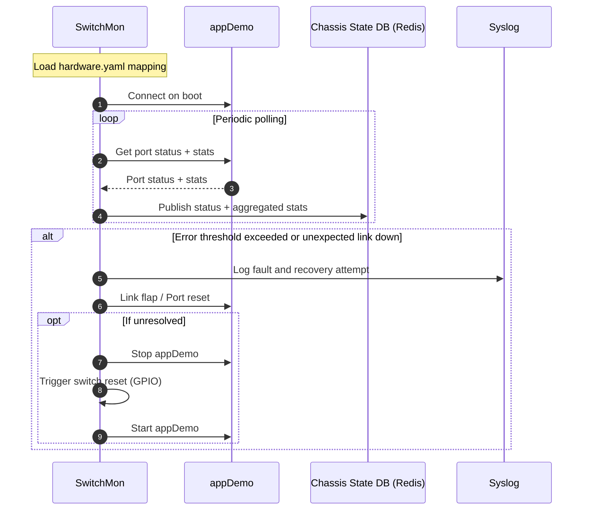

# SONiC Ethernet Switch Error Monitor HLD #

## Table of Content 

1. [Scope](#Scope)
2. [Overview](#Overview)
3. [Requirements](#Requirements)
4. [High Level Design](#High%20level%20Design)
5. [Testing Requirements/Design](#Testing%20Requirements/Design)


### Revision  

### Scope  

This document provides a mechanism to enable error detection and handling for link related errors on the Ethernet switches on RPs and LCs in SFD chassis.


### Definitions/Abbreviations 

This section covers the abbreviation if any, used in this high-level design document and its definitions.

### Overview 

Spitfire chassis has ethernet switches on RPs and LCs for internal and management network connectivity. The ethernet switches are initialized at power up using Micro-init and subsequently by the AppDemo process in SONiC. The MicroInit is a device configuration which is read from the eeprom attached to the device and is used to initialize the device with certain basic configuration to enable connectivity at Bios level. It also pre-inits the device to be initialized later by device SDK. On SONiC bootup, the AppDemo process loads the device SDK and initializes the device based on the configuration provided in a file. The SONiC configuration of the ethernet switches enables VLANs and Mac learning.

Currently there is a platform-monitor shell script which periodically checks CRC errors and link state on the CPU-Switch link on the LCs. If there is an error detected the switch  is reset using GPIO and the driver process is restarted on LC in an attempt to recover from the condition. There is very limited and no fault handling is done on the RP. This was done as a short term workaround to issues that were encountered during bringup where sometimes the link between CPU and ethernet switches would not come up properly on the LC.

However there are a number of fault scenarios that have been observed with XR, limited SONiC deployment and XR-to-SONiC migrations scenarios which warrant a more comprehensive fault detection, reporting and handling on the RP and LC ethernet switches. And there is an ask from customer to improve the fault handling as T2 chassis packet mode solution is being deployed currently.

This document discusses a proposal to implement a solution for a more comprehensive fault reporting and handling of Ethernet switch issues.

We would like to note that a rewrite of the Ethernet switch management using SDK directly might be done in future if there are more requirements that might come up esp. relating to Centralized routing architecture as in SONiC Modular Chassis project. Some examples of those might be exchanging control plane traffic over internal ethernet, managing vlans and traffic classes on internal ethernet etc. However, this feature is primarily attempting to implement link failure handing in the context of the current implementation for chassis packet mode.

### Requirements

Following scenarios are planned to be addressed as part of this effort:

1. CRC/Link error monitoring between RP and LC ethernet links.
2. Unexpected ethernet link down between RP and LCs switches. 
3. Fix the read on clear behavior in the statistics display today.
4. Display the connected endpoints in the switch CLIs.

The monitoring process will report log and report the errors as well as try to recover from these.

### High Level Design 

The SwitchMon process connects to appDemo on boot, periodically polls port status/counters, and also supports on-demand collection via a Redis request/response handshake. Port statistics are accumulated because the device API is clear-on-read. Port status and aggregated statistics are published to the chassis state DB for CLI/show tech. The on-demand request is triggered by the CLI and handled immediately (not tied to the polling interval).

At initialization, the SwitchMon process will load the PID specific configuration from hardware.yaml file identifying the mapping of switch ports to the connected endpoints. It will then connect to the appDemo process and start its monitoring.

Following are some of the tasks that the monitor process will do periodically:

1. Retrieve ethernet switch port status, publish to redis and syslog any port status changes
2. Retrieve port statistics, aggregate and publish to redis
3. Monitor Rx and Tx errors on the ports and raise syslog if the error rate exceeds a threshold
4. Identify unexpected link down issues and raise syslog (if the connected node is operational and ethernet link is down).
5. Attempt recovery for 3 and 4 above (discussed further down)

On detecting the link errors, the monitor process will attempt recovery for the same. The following will be tried to fix the errors. Each operation is more intrusive than the previous one, so. If the issue is still not fixed, the process will raise a fault syslog and continue checking if the situation is cleared by operator.

* Link shut and no-shut
* Port reset
* Switch reset

Switch reset will require the appDemo process to be shutdown, trigger physical switch reset using GPIO and then restart the appDemo process. This is the most intrusive for the error handling operation so will be tried if the other mechanisms are not able to fix the issues.

Figure: SwitchMon and appDemo interaction overview



#### Serviceability & Debugability

The CLIs now report connected endpoints and provide both brief and detailed views for switch port status and statistics. The brief views show link state, endpoint, and a human-readable timestamp; the statistics view summarizes RX/TX packets, bytes, and errors, with a detail mode listing per-counter values.

* show platform eth-switch ports  
* show platform eth-switch statistics  
* show platform eth-switch statistics --detail

Example (abridged):  
```
# show platform eth-switch ports
Port    Link    Endpoint     Timestamp
------  ------  -----------  -------------------
0/0     Up      SUPERVISOR0  2026-03-31 21:57:53
0/1     Down    unknown      2026-03-31 21:57:53
0/2     Down    unknown      2026-03-31 21:57:53
0/3     Down    NPU0         2026-03-31 21:57:53
...
```

Example (abridged):  
```
# show platform eth-switch statistics
Port    Endpoint       Rx Pkts    Rx Bytes    Rx Err    Tx Pkts    Tx Bytes    Tx Err  Timestamp
------  -----------  ---------  ----------  --------  ---------  ----------  --------  -------------------
0/0     SUPERVISOR0      19994     2405618         0      28317     6387971         0  2026-03-31 21:58:51
0/1     unknown              0           0         0          0           0         0  2026-03-31 21:58:51
0/2     unknown              0           0         0          0           0         0  2026-03-31 21:58:51
0/3     NPU0                 0           0         0          0           0         0  2026-03-31 21:58:51
...
```

Example (abridged):  
```
# show platform eth-switch statistics --detail
Port: 0/0  Endpoint: SUPERVISOR0  Timestamp: 1774994375
  rx_uc: 12979
  rx_mc: 1933
  rx_brdc: 5822
  rx_octets: 2512960
  bad_crc: 0
  mac_rx_err: 0
  drop_event: 0
  ...
```


#### Summary of Changes

The code changes for the above are primarily in platform-cisco-8000 and cisco-wb-bsp. PID-specific connectivity mapping for the ethernet switch is in hardware.yaml. The monitor is launched by platform-ethswitch.service, and the legacy shell script is deprecated. New platform CLIs provide endpoint-aware status and statistics, with an on-demand refresh via Redis request/response.

### Testing Requirements/Design  

Spytest test cases are developed and are run on the minimal Spytest topology consisting of a T2 chassis and a traffic generator (Tgen).
Following test cases have been added

- Verify platform-ethswitch.service is active and that sonic-esd-monitor.py and appDemo are running.
- Verify CLIs show platform eth-switch [ports|statistics [--detail] ] 
- Verify statistics are accumulated (no clear on read behavior)
- Inject link-down on switch port and verify recovery 
- Inject link fault (invalid config which would need switch port reset) and verify recovery
- Inject faults which need switch reset to recover and verify recovery
- Inject link errors and verify link recovery


### Open/Action items 

Test cases will be added to Ring-3 on completion and Spytest enablement.