# VxLAN Data Center Interconnect (DCI) High-Level Design (HLD)

## Table of Contents

- [1. Revision](#1-revision)
- [2. Scope](#2-scope)
- [3. Definitions/Abbreviations](#3-definitionsabbreviations)
- [4. Overview](#4-overview)
- [5. Requirements](#5-requirements)
  - [5.1 Functional Requirements](#51-functional-requirements)
  - [5.2 Non-Functional Requirements](#52-non-functional-requirements)
  - [5.3 Interoperability Requirements](#53-interoperability-requirements)
  - [5.4 Comparison to IETF Documents](#54-comparison-to-ietf-documents)
  - [5.5 List of Restrictions](#55-list-of-restrictions)
  - [5.6 Scale Requirements](#56-scale-requirements)
- [6. Architecture Design](#6-architecture-design)
  - [6.1 Domain](#61-domain)
  - [6.2 Site](#62-site)
  - [6.3 Forwarding Paradigm](#63-forwarding-paradigm)
  - [6.4 Remote entries programming](#64-remote-entries-programming)
  - [6.5 Tunnel Establishment](#65-tunnel-establishment)
  - [6.6 VNI assignment](#66-vni-assignment)
    - [6.6.1 L2 Interconnect: L2VNI with Normalized Symmetric VNI](#661-l2-interconnect-l2vni-with-normalized-symmetric-vni-type-2-routes)
    - [6.6.2 L3 Interconnect: L3VNI with Asymmetric Translation](#662-l3-interconnect-l3vni-with-asymmetric-translation-type-5-routes)
  - [6.7 VTEP address](#67-vtep-address)
  - [6.8 Forwarding Tables](#68-forwarding-tables)
  - [6.9 Split-Horizon Group](#69-split-horizon-group)
  - [6.10 Understanding the Split-Horizon Table](#610-understanding-the-split-horizon-table)
    - [6.10.1 Tunnel Interface Architecture](#6101-tunnel-interface-architecture)
    - [6.10.2 BGW-PEER Identification and Initialization](#6102-bgw-peer-identification-and-initialization)
    - [6.10.3 Failure Handling](#6103-failure-handling)
  - [6.11 Traffic Flows](#611-traffic-flows)
    - [6.11.1 Anycast VTEP - no directly connected host / orphan port](#6111-anycast-vtep---no-directly-connected-host--orphan-port)
    - [6.11.2 Ethernet Segment - directly connected host / orphan port](#6112-ethernet-segment---directly-connected-host--orphan-port)
  - [6.12 Mobility](#612-mobility)
  - [6.13 Mobility with L2VNI and L3VNI](#613-mobility-with-l2vni-and-l3vni)
  - [6.14 Control Plane](#614-control-plane)
    - [6.14.1 Route Re-origination](#6141-route-re-origination)
  - [6.15 Failure Scenarios](#615-failure-scenarios)
    - [6.15.1 Failure Scenarios and Recovery with Anycast VTEP](#6151-failure-scenarios-and-recovery-with-anycast-vtep)
    - [6.15.2 Limitations and Future Improvements](#6152-limitations-and-future-improvements)
  - [6.16 Peer Link and Isolation Behavior using physical VTEPs](#616-peer-link-and-isolation-behavior-using-physical-vteps)
    - [6.16.1 Peer Link Design: Underlay & eBGP](#6161-peer-link-design-underlay--ebgp)
    - [6.16.2 WAN Isolation on DCI1](#6162-wan-isolation-on-dci1)
    - [6.16.3 DC Isolation on DCI1](#6163-dc-isolation-on-dci1)
    - [6.16.4 AC-originated BUM](#6164-ac-originated-bum)
- [7. Implementation Details](#7-implementation-details)
  - [7.1 L2 Interconnect](#71-l2-interconnect)
    - [7.1.1 FRR Changes](#711-frr-changes)
    - [7.1.2 SONiC SWSS Changes](#712-sonic-swss-changes)
    - [7.1.3 SONiC Utilities Changes](#713-sonic-utilities-changes)
    - [7.1.4 iproute2 Changes](#714-iproute2-changes)
    - [7.1.5 YANG Model Changes](#715-yang-model-changes)
  - [7.2 L3 Interconnect](#72-l3-interconnect)
    - [7.2.1 FRR Changes](#721-frr-changes)
    - [7.2.2 Linux Kernel Changes](#722-linux-kernel-changes)
    - [7.2.3 iproute2 Changes](#723-iproute2-changes)
    - [7.2.4 SONiC SWSS Changes](#724-sonic-swss-changes)
  - [7.3 Database Schema](#73-database-schema)
- [8. SAI API](#8-sai-api)
- [9. Configuration and Management](#9-configuration-and-management)
  - [9.1. Manifest](#91-manifest-if-the-feature-is-an-application-extension)
  - [9.2. Inter-DC L2VNI CLI/YANG model Enhancements](#92-inter-dc-l2vni-clyang-model-enhancements)
  - [9.3. Inter-DC L3VNI CLI/YANG model Enhancements](#93-inter-dc-l3vni-clyang-model-enhancements)
  - [9.4. Inter-DC IRB CLI/YANG model Enhancements](#94-inter-dc-irb-clyang-model-enhancements)
- [10. Warmboot and Fastboot Design Impact](#10-warmboot-and-fastboot-design-impact)
- [11. Memory Consumption](#11-memory-consumption)
- [12. Restrictions/Limitations](#12-restrictionslimitations)
- [13. Testing Requirements/Design](#13-testing-requirementsdesign)
  - [13.1. DCI Test Topology](#131-dci-test-topology)
  - [13.2. L3 Interconnect Configuration](#132-l3-interconnect-configuration)
  - [13.3. FRR Topotest Cases](#133-frr-topotest-cases)
  - [13.4. SpyTest cases](#134-spytest-cases)
  - [13.5. SAI Dataplane Tests](#135-sai-dataplane-tests)
- [14. Open/Action Items](#14-openaction-items)

### 1. Revision
| Rev  | Date       | Authors            | Change Description |
| ---- | ---------  | ------------------ | ------------------ |
| 0.1  | Sept-2025  | Patrice Brissette  | Initial draft      |
| 1.0  | Oct-2025   | Thushar Gowda, Yanjun Deng, Mrinmoy Ghosh, Sudharsan Rajagopalan, Yucai Gu, Abhishek Ramamurthy, Sridhar Santhanam, Patrice Brissette  | Multi-site Phase-1 delivery   |
| 2.0  | Nov-2025   | Thushar Gowda, Yanjun Deng, Sudharsan Rajagopalan, Yucai Gu, Abhishek Ramamurthy, Sridhar Santhanam, Patrice Brissette  | Multi-site Phase-2 delivery   |


### 2. Scope
This document outlines the high-level design for VxLAN Data Center Interconnect (DCI) in SONiC, with a particular focus on enabling and managing multi-site connectivity. It details the architectural principles, functional requirements, and implementation considerations necessary to support seamless, scalable, and resilient interconnection of multiple data centers using VxLAN EVPN technology within the SONiC platform.

### 3. Definitions/Abbreviations
- AC:   Attachment Circuit - physical or logical port connecting hosts to the network
- AFI:  Address Family Identifier - identifies the network layer protocol (e.g., IPv4, IPv6)
- ASN:  Autonomous System Number - unique identifier for a routing domain in BGP
- BDS:  Bridge Domain Service - Layer 2 broadcast domain in EVPN
- BGP:  Border Gateway Protocol - routing protocol used for EVPN control plane
- BGW:  Border GateWay - node providing DCI functionality and its placement in the network
- BL:   Border Leaf - leaf switch at the edge of a data center fabric
- BUM:  Broadcast, Unknown unicast, Multicast - Layer 2 traffic types requiring flooding
- DC:   Data Center
- DCI:  Data Center Interconnect - functionality enabling multi-site connectivity
- DF:   Designated Forwarder - primary node for BUM traffic in EVPN multihoming
- eBGP: External BGP - BGP sessions between different autonomous systems
- ECMP: Equal-Cost Multi-Path - load balancing across multiple equal-cost paths
- ES:   Ethernet Segment - set of links connecting a multihomed device to PE nodes
- ESI:  Ethernet Segment Identifier - unique identifier for an Ethernet Segment
- EVPN: Ethernet VPN - BGP-based control plane for Layer 2/3 VPN services
- FRR:  Free Range Routing - open-source routing protocol suite used in SONiC
- HLD:  High-Level Design
- iBGP: Internal BGP - BGP sessions within the same autonomous system
- IP:   Internet Protocol
- IR:   Ingress Replication - method for BUM traffic replication in VXLAN
- IRO:  Ingress Route Optimization - feature enabling VM mobility with route re-origination
- L2VNI: Layer 2 VNI - VXLAN Network Identifier for Layer 2 services
- L3VNI: Layer 3 VNI - VXLAN Network Identifier for Layer 3 services (VRF)
- LAG:  Link Aggregation Group - bundle of physical links acting as a single logical link
- LACP: Link Aggregation Control Protocol - protocol for dynamic LAG formation
- MAC:  Media Access Control - Layer 2 address
- MH:   Multi-Homing - host connected to multiple PE nodes for redundancy
- NDF:  Non-Designated Forwarder - backup node in EVPN multihoming
- PIP:  Physical IP address - unique VTEP IP address in a network domain
- RD:   Route Distinguisher - unique identifier for EVPN routes in BGP
- RT:   Route Target - BGP extended community for route import/export filtering
- RT-1: EVPN Route Type 1 - Ethernet Auto-Discovery route (mass-withdraw, aliasing)
- RT-2: EVPN Route Type 2 - MAC/IP Advertisement route
- RT-3: EVPN Route Type 3 - Inclusive Multicast Ethernet Tag route (Ingress Replication)
- RT-4: EVPN Route Type 4 - Ethernet Segment route (multihoming)
- RT-5: EVPN Route Type 5 - IP Prefix route (IRB/subnet advertisement)
- SAFI: Subsequent Address Family Identifier - provides additional context within an AFI
- SAI:  Switch Abstraction Interface - standardized API for network hardware
- SH:   Single-Homed - host connected to only one PE node
- SVI:  Switch Virtual Interface - Layer 3 interface for a VLAN/bridge domain
- VIP:  Virtual IP address - anycast VTEP IP address shared across nodes
- VLAN: Virtual Local Area Network - Layer 2 broadcast domain
- VM:   Virtual Machine
- vMotion: VMware's live migration technology for moving VMs between hosts
- VNI:  VXLAN Network Identifier - 24-bit segment ID in VXLAN encapsulation
- VRF:  Virtual Routing and Forwarding - isolated routing instance
- VTEP: VXLAN Tunnel Endpoint - device that encapsulates/decapsulates VXLAN traffic
- VXLAN: Virtual Extensible LAN - network virtualization technology using MAC-in-UDP encapsulation
- WAN:  Wide Area Network - network connecting geographically dispersed data centers

### 4. Overview
The Data Center Interconnect (DCI) feature in SONiC provides robust, scalable, and secure connectivity across geographically dispersed data centers.

Key capabilities include:

- Automated control plane mechanisms supporting both MAC and IP mobility
- High availability and resiliency with built-in multi-site redundancy
- Seamless VM migration (vMotion) enabled by Inclusive Route Origination (IRO)
- Flexible policy enforcement through dynamic BGP Route Target (RT) translation
- Separation of control plane and data plane for optimized operations

DCI is purpose-built for the requirements of modern cloud and enterprise deployments, offering:

- Support for multi-tenancy and network segmentation
- Rapid convergence and reduced downtime during migration events
- Seamless integration with existing SONiC infrastructure and operational workflows

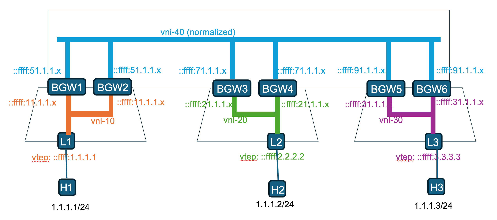
*Figure 1: DCI Architecture Overview*

The diagram illustrates three data centers interconnected over a WAN. Each data center connects to the WAN through a redundant pair of BGW nodes that provide DCI (Data Center Interconnect) functionality. Connectivity across the multi-site WAN is normalized between sites, and the WAN may optionally include a BGP route server.

Here's a detailed summary of the DCI (Data Center Interconnect) functionality:

* BGW Node Configuration
  - BGW nodes can be spine
  - BGW nodes may also run as separate nodes
  - BGW may have directly connected hosts or orphan ports
  - Pair of BGW nodes per data center
  - Normalized VNI – symmetric VNI across data centers
  - Full VXLAN tunnel termination, lookup and re-encapsulation at BGW
  - Support of L2 and L3 connectivity at the BGW node

* Network Design Simplifications
  - Presence of route reflector or route server within WAN and DC
  - May use AnyCast VTEP for overlay
    - No ESI (Ethernet Segment Interface) support
    - Simplified design by removing DF election and filtering
  - VTEP can either be IPv4 or IPv6

* Route Handling
  - Route targets rewrites based on source and destination data centers AS number and normalized-VNI value
  - End-to-end vMotion Sequence number handling
  - Ingress replication routes are locally significant to DC/WAN

* Policy and Advertisement
  - BGP Implicit and Exlicit route policy with route summarization
  - EVPN advertisement limited to:
    - Type 1 for mass-withdraw and aliasing
    - Type 2 for host advertisement; re-origination at BGW
    - Type 3 for ingress replication
    - Type 4 for Ethernet Segment and Multi-homing using per site-id
    - Type 5 for subnet advertisement; re-origination at BGW

The BGW / DCI solution plays an important role in data center deployment as a "swiss army" knife.
The main advantages are:

- Multi-hop native L2/L3 DC
  - Allow simple and easy DC extension for L2 and L3 services
- Scaling feature e.g., VTEPs, ingress replication endpoints, etc.
  - Allow to blast radius of some component to be small
  - Easy of hardware resources
- Ownership separation
  - Allow to extend DC across different owners
- Coexistence of different technology e.g., ACI, standalone, etc.
  - Allow to extend DC across different technologies
- Policy boundary
  - Allow route policy to control what is in/out from a specific DC
- Multi-VRF Northbound BGP / peering
  - Allow to extend DC to Northbound peer

For example, consider a customer who initially built a small data center with 2 spine switches and 4 leaf switches. As the customer looks to expand, the straightforward approach is to add more leaf switches and possibly additional spines. This expansion directly impacts the existing setup and configuration: it requires more VTEPs, additional tunnels, and larger ingress replication lists with more endpoints. The devices will also need increased hardware resources to accommodate the larger data center.

Using Data Center Interconnect (DCI) simplifies this process. Instead of significantly changing the existing configuration or upgrading hardware, the customer can expand by adding another similar data center (with 2 spines and 4 leafs) and interconnecting it. This allows for seamless growth without major configuration changes or hardware upgrades.

A second layer of spine switches (super-spine) can also be introduced, serving as Border Gateway (BGW) devices to connect with external WAN networks. If a tunneling technology such as IPsec is used for connectivity, the existing underlay encapsulation can remain unchanged. For example, the connection can be established using VXLAN over an IPsec tunnel.


*Figure 2: DCI / Multi-site Advantages*

### 5. Requirements
DCI functionality is delivered in multiple phases. The initial phase establishes the core foundation and Layer-2 services, while the second phase introduces Layer-3 stitching services and multi-homing support for redundant BGW nodes.

#### 5.1 Functional Requirements
The initial requirements are:

- Establish VxLAN EVPN-based DCI between multiple data centers using multi-site architecture as per IETF recommendation
- Node resiliency connecting DC to WAN
- Support for transparent Layer-2 extension
- L2VNI normalized across Multi-site
- Enable VM mobility with Inclusive Route Origination (IRO)
- vMotion capabilities have global scope
- Implement BGP Route Target (RT) translation for ingress/egress traffic
- VxLAN tunnels can be either IPv4 or IPv6 (VTEP)
- BGP policy over L2VNI is implicit
- Per tunnel traffic counters
- vMotion capabilities with local scope
- Configuration of domain specific BGP route-target
- Explicit BGP policy over VNI

The future phase requirements are not addressed yet as part of this document:
- Support for Layer-3 segmentation and stitching
- Support of locally connected host and orphan port on DCI nodes
- Support of ESI and multi-homing machinery on DCI nodes
- Support the concept of site-id per Ethernet Segment
- L3VNI tunnel termination facing DC into IPv4/IPv6 unicast towards Northbound customer
- Hub and spoke topology between sites
- Tunnel cost over BGP policy (pref. path)
- Use of BGP route server in WAN
- DC and WAN facing interface failure tracking
- DC and WAN facing remote neighbor tracking
- Failure tracking congestion policy based using weighted-ECMP
- BUM rate limitation
- Support multi-tenancy and scalable segmentation
- Integrate with SONiC management interfaces (CLI, REST, SNMP)

#### 5.2 Non-Functional Requirements
- Minimal impact on existing SONiC boot and memory performance
- Backward compatibility with existing SONiC deployments

#### 5.3 Interoperability Requirements
- Compliance with DCI, multi-site EVPN and anycast aliasing standards
- Interoperability with third-party EVPN/VxLAN implementations

#### 5.4 Comparison to IETF Documents
The DCI requirements are mapped to the latest DCI, multi-site EVPN and anycast aliasing documents. Key matching features include:
- Route advertisement and aliasing for MAC/IP mobility
- Anycast IP in the overlay
- Control plane scalability and redundancy
- Policy enforcement via BGP RT translation

Documents are:
- https://datatracker.ietf.org/doc/html/rfc9014
- https://datatracker.ietf.org/doc/draft-rabnag-bess-evpn-anycast-aliasing/
- https://datatracker.ietf.org/doc/draft-sharma-bess-multi-site-evpn/

#### 5.5 List of Restrictions
This section provides the list of restrictions:

BGW node does NOT support:
- STP, DHCP-relay, IGMP, etc.
- IPM and/or any performance/probing measurement protocol
- Interface tracking (used in failure E scenario)
- Neighbor tracking (used in failure E scenario)

Furthermore, there are few more restrictions that you MUST be aware based on the chosen mode of operation.
- Use of anycast VTEP on BGW nodes for L2/L3 connectivity
- BGP-EVPN peering done over separate loopback interface
- Full mesh connectivity required within DC and WAN domains
- VNI-normalized value is globally unique


#### 5.6 Scale Requirements
| Requirement                   | Comments                    |
|-------------------------------|-----------------------------|
| Pair of remote tunnels per DCI| 10 remote sites             |
| # of VTEPs per site           | 36                          |
| # of MAC per site             | 20K                         |
| # of L2VNI per site           | 256                         |
| # of L3VNI per site           | 10                          |
| # of Leaf per site            | 32                          |
| # of sites                    | 11                          |
| # of host                     | 20K / 40K with IRO          |
| # of redundant BGW per site   | 2 BGW per site              |


### 6. Architecture Design
The DCI architecture is designed to seamlessly integrate with the existing SONiC infrastructure and extending current capabilities to support multi-site connectivity, VM mobility, and advanced policy enforcement. The architecture is modular, allowing for phased implementation and future enhancements.

#### 6.1 Domain
As part of DCI functionality, concept of domain is introduced at BGW nodes enabling granular control on network entity. For example, in the first picture, there are 4 different domains: 1 per DC and 1 for the WAN. BGW nodes support 2 domains; 1 domain for the connected data center and 1 domain for the WAN.

The domain concept significantly enhances the architecture by enabling a clear separation between the control plane and the data plane. Services are configured directly on the data plane side, such as a bridge domain with tunnel endpoints, where each tunnel connects to a different domain. Control plane establishment occurs on a per-domain basis, resulting in a more streamlined and cohesive architecture.

#### 6.2 Site
A data center domain interconnects with a WAN domain via a pair of redundant BGW nodes where DCI functionality is provided. That pair of BGW nodes and its DC domain form a site. It is identified by defining a site-id. Both BGW node share that same site-id.

#### 6.3 Forwarding Paradigm
A BGW node performs simple operations to achieve DCI functionality. For each incoming packet from DC/WAN side, a full tunnel disposition chain is performed followed by a lookup based on the inner payload followed by a full tunnel imposition chain. For layer-2 connectivity, it looks like:


*Figure 3: L2 Forwarding Paradigm*
Dataplane MAC learning is disable on these tunnels / ports. All programmed MAC entries are coming from BGP-EVPN; remote MAC are installed with remote nexthop taken from EVPN RT-2. The same forwarding paradigm is used in both directions

Similarly, for layer-3 connectivity, the forwarding chain looks like:

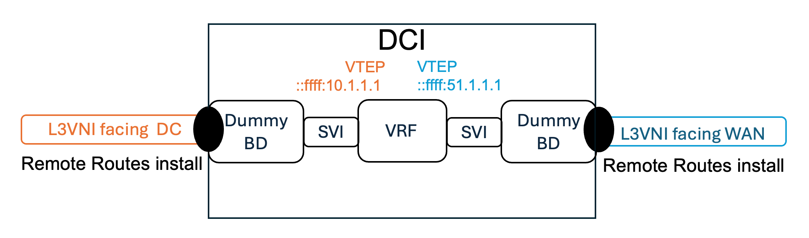
*Figure 4: L3 Forwarding Paradigm*

IP entries are installed in the VRF with remote nexthop taken from either the EVPN RT-2 IP portion or from EVPN RT-5.
Finally, to complete the picture, directly connected host may also be attached to the BGW node. In that case the forwarding chain looks like:

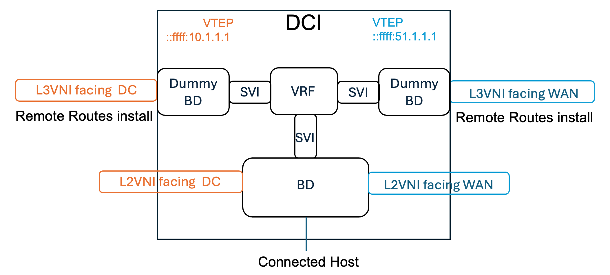
*Figure 5: DCI Forwarding Paradigm*

Since BGW comes generally in pair for redundancy, to support locally connected host on BGW, EVPN Ethernet Segment, DF election, local bias and carving are required. This is well describes in [Ethernet Segment](#ethernet-segment) and [Traffic Flows](#traffic-flows) sections.

Lastly, it may also be possible to run VRF-lite as described in section [Combining BL function with BGW](#combining-bl-function-with-bgw). This allows the BGW to send traffic to external northbound customer. 

#### 6.4 Remote entries programming
The L2 DCI functionality is achieved by installing EVPN remote MAC received from DC & WAN domains. This allow the MAC lookup to be performed properly after tunnel termination. Similar approach is taken for IP payload where the lookup is performed within the appropriate VRF. EVPN installs remote MAC/IP received from DC & WAN domains.

#### 6.5 Tunnel Establishment

*Figure 6: Tunnels Establishment*

With VxLAN, tunnels are established per source and destination VTEP addresses. During imposition procedures, the association of the VNI value is done per destination VTEP address. In the example of a BGW node, the VNI value differ for each domain / destination. This allows the support of downstream assigned VNI used in a different context/scenario when required.

#### 6.6 VNI assignment

##### 6.6.1 L2 Interconnect: L2VNI with Normalized Symmetric VNI (Type-2 Routes)

For Layer-2 services (MAC/MAC+IP routes), the implementation uses a normalized symmetric VNI approach. **Each VLAN is mapped to TWO L2VNIs** - one for the DC-facing domain and one for the WAN-facing domain. When DCI re-originates Type-2 routes:
- Routes from DC leafs are re-originated with the WAN-side L2VNI
- Routes from WAN/remote DCs are re-originated with the DC-side L2VNI

This approach is geared towards greenfield or fully managed deployments. Main advantages are: simplicity in term of monitoring, statistic, debugability and consistency. This solution also scale much better; it avoids having VNI dependency on the nexthop object. The normalized VNI value must be globally unique across all domains (WAN and data centers).

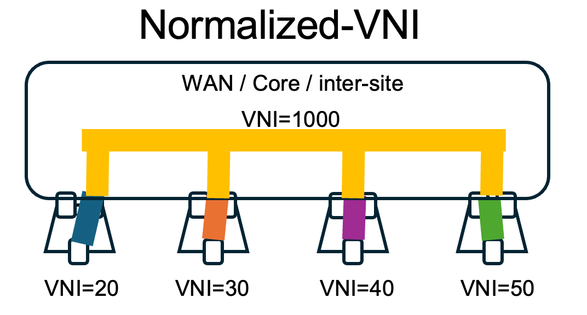
*Figure 7: Normalized-VNI Architecture*

Other NOS may use a different approach where VNI being used are coming from BGP routes. That asymmetric approach is referred as downstream-assign VNI. It is usually used in brownfield deployment where there are already an established WAN connecting data centers using different VNI values. The main advantage is to have a single VNI rewrite across the entire network (instead of two with normalized-vni approach). On the down side, the VNI value being imposed is now dependent of the remote nexthop.

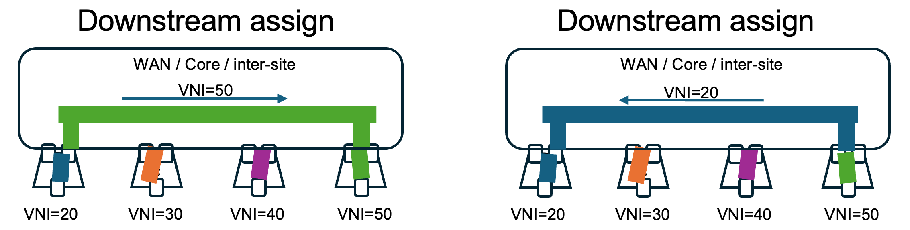
*Figure 8: Downstream-assign VNI Architecture*

##### 6.6.2 L3 Interconnect: L3VNI with Asymmetric Translation (Type-5 Routes)

For Layer-3 services (IP prefix routes), the DCI node has **only ONE L3VNI per VRF** configured locally. However, when re-advertising Type-5 routes from a local leaf to a remote DC (or vice versa), the DCI must perform **route attribute rewriting** to ensure proper forwarding at the destination.

**Type-5 Route Re-origination at DCI:**

When DCI receives a Type-5 route from a local leaf and re-advertises it to the WAN/remote DC, the following attributes are rewritten:

| Attribute | Original (from Leaf) | Rewritten (by DCI) |
|-----------|---------------------|-------------------|
| **VNI** | Leaf's L3VNI (e.g., 100) | DCI's L3VNI (e.g., 500) |
| **Next-Hop** | Leaf's VTEP IP | DCI's WAN-facing VTEP IP |
| **Router MAC** | Leaf's RMAC | DCI's RMAC |
| **Route Target** | Leaf's RT | DCI's RT (for WAN domain) |

This rewriting is performed via **BGP route-maps** applied on the outbound direction to EVPN neighbors. The `set evpn vni` and `set evpn rmac-local` commands enable this functionality.

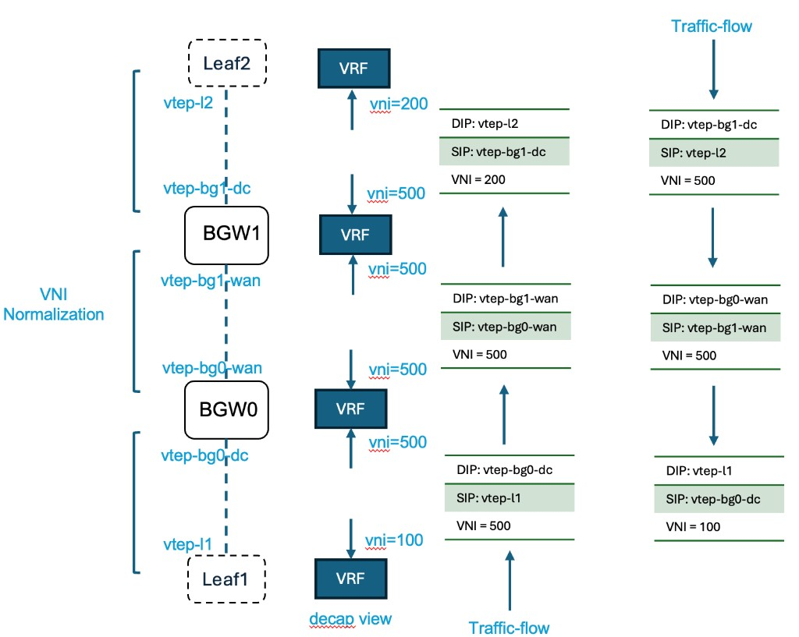
*Figure 9: Asymmetric L3VNI VNI Normalization and Traffic Flow*

**Traffic Flow Example (DC1 Leaf1 → DC2 Leaf2):**

As shown in the diagram above, consider inter-DC routing where each site has different L3VNI values:
- **Leaf1 (DC1):** L3VNI = 100
- **BGW0/BGW1 (DCI):** L3VNI = 500 (normalized WAN VNI)
- **Leaf2 (DC2):** L3VNI = 200

**Encapsulation View (left side of diagram):**
1. **Leaf1** sends packet to BGW0 (vtep-bg0-dc) with VNI=500 (Leaf1 uses BGW0's expected L3VNI)
2. **BGW0** decapsulates, performs VRF lookup, re-encapsulates with VNI=500 to BGW1 (vtep-bg1-wan)
3. **BGW1** decapsulates, performs VRF lookup, re-encapsulates with VNI=200 to Leaf2 (vtep-l2)

**Traffic Flow (right side of diagram):**
- DC2 delivery: DIP=vtep-l2, SIP=vtep-bg1-dc, VNI=200
- WAN transit: DIP=vtep-bg1-wan, SIP=vtep-bg0-wan, VNI=500
- DC1 origin: DIP=vtep-bg0-dc, SIP=vtep-l1, VNI=500

Note: In the diagram, Leaf1's local VNI is 100 for its VRF, but when sending to BGW0, the encapsulation uses VNI=500 based on the route's advertised L3VNI from BGW0.

**Key Differences from L2 Interconnect:**

| Aspect | L2 Interconnect | L3 Interconnect |
|--------|-----------------|-----------------|
| VNIs per service | 2 per VLAN (DC + WAN) | 1 per VRF at DCI |
| Route type | Type-2 (MAC/MAC+IP) | Type-5 (IP Prefix) |
| Rewrite method | VNI mapping per domain | Route-map based rewrite |
| Attributes rewritten | VNI only | VNI, NH, RMAC, RT |
| Control plane | Implicit (domain-based) | Explicit (route-map per RT) |

#### 6.7 VTEP address
There is a design choice for the implementation regarding VTEP IP address assignment: using either a Physical IP address (PIP) or an Anycast virtual IP address (VIP). Originally, SONIC VxLAN implementation has been done using PIP approach. For leaf type of implementation, it generally works very well. EVPN multi-homing machinery was also developped around that concept.

In a Layer-2 only DCI usecase, when there is no requirement of support for orphan port and/or direclty connected host on BGW nodes, the usage of anycast VIP simplify greatly the solution. With anycast VIP, there is no need to support EVPN multi-homing between peering BGW nodes. L2 unicast and BUM traffic always hit a single BGW node from the data center and from the WAN side. There is no need for DF election and any blocking scheme regarding L2 BUM traffic coming in/out from DC/WAN to WAN/DC. VTEP addresses scope is per domain i.e., a different VTEP is used facing connected data center from the one used on the WAN side allowing tunnel separation per domain.

When locally connected hosts are present, anycast VTEP is no longer suitable. A physical VTEP (PIP) must be used to ensure proper connectivity and redundancy. Since the BGW operates as a redundant pair, host connectivity must survive failures on either BGW node or its peer, requiring EVPN multi-homing capabilities that depend on unique physical VTEP addresses.

Additionally, when L3 services are enabled, physical VTEP must be used. In some deployments, both anycast and physical VTEPs may operate together using the VIP for L2 services and the PIP for L3 services. The exact combination depends on the specific setup and supported features.

#### 6.8 Forwarding Tables
When customers use anycast VTEP, it does not change how forwarding tables are built and how entries are resolved. For instance, there is no need for an extra recursion. The following pictures illustrate how FIB and FDB tables are built based on anycast VIP.
The first picture shows an example with separate Spine and BGW nodes.


*Figure 10: Separate BGW and Spine nodes*

This second picture illustrates spine nodes playing also the role of BGW.


*Figure 11: Combine BGW and Spine nodes*

The usage of physical VTEP works in a very similar way; forwarding tables remains simple as illustrated above.

#### 6.9 Split-Horizon Group 
In SONiC today, the per bridge domain split-horizon group table built for VxLAN multi-homing is as follow:

| Ingress / Egress     | AC-SH | AC-DF | AC-NDF | TUN  |
|----------------------|-------|-------|--------|------|
| **AC-BUM**           |   P   |   P   |   P    |  P   |
| **TUN-UC**           |   P   |   P   |   P    |  D   |
| **TUN-BUM-PEER**     |   P   |   D   |   D    |  D   |
| **TUN-BUM-REMOTE**   |   P   |   P   |   D    |  D   |

where P = Permit and D = Denial

For VxLAN multi-homing, the basic rule is the support of local bias for BUM packet coming for connected hosts.

In the SiOne SDK, the split-horizon group table is configured on a per-VTEP basis. This approach is necessary because a tunnel (defined by its source and destination VTEP) can transport both L2VNI and L3VNI traffic. Since customer configurations can vary widely where they may enable Layer-2 and/or Layer-3 services, programming the table per VTEP keeps the design straightforward and flexible. Currently, the SDK architecture supports only a 2x2 split-horizon group table.

The VxLAN MH split horizon table is modified to support DCI functionality.
This table is for the generic version where physical VTEP is used (no anycast VTEP) without any connected host or port on BGW.
| Ingress / Egress | AC  | TUN-DC | TUN-WAN | TUN-Tertiary |
|------------------|-----|--------|---------|--------------|
| **AC**           |  P  |   P    |    P    |      X       |
| **TUN-DC**       |  P  |   D    |    P    |      X       |
| **TUN-WAN**      |  P  |   P    |    D    |      X       |
| **TUN-Tertiary** |  X  |   X    |    X    |      X       |

**Legend**:
- **P**: Permit - traffic is forwarded to this egress interface
- **D**: Drop - traffic is blocked to this egress interface (split-horizon)
- **X**: Unused - reserved for future use

#### 6.10 Understanding the Split-Horizon Table

To properly interpret the split-horizon forwarding table, several key concepts must be understood:

##### 6.10.1 Tunnel Interface Architecture
- Split-horizon filtering happens on Egress
- A **tunnel interface** represents a single bridge port per remote VTEP
- Each **column** in the table represents a group of remote VTEPs sharing the same forwarding behavior
- The **row headers** (Ingress type) indicate the traffic source and type (source VTEP + unicast/BUM classification)

##### 6.10.2 BGW-PEER Identification and Initialization
- **BGW-PEER cannot be identified at tunnel creation time** because it does not have its own separate VTEP distinct from WAN or DC VTEPs
- Similar to DF/NDF determination, **until RT-4 is received, tunnels are initially set as NDF**
- **Best practice**: Implement a grace period during which all interfaces remain in non-forwarding state until RT-4 advertisements are received (similar to "startup cost-in timer" on IOS-XR)
- This prevents premature forwarding and ensures proper multi-homing role assignment

##### 6.10.3 Failure Handling
- **Core/DC isolation scenarios are resolved at the underlay level**
- From an overlay perspective, these isolation events are considered out-of-scope and are not explicitly handled by the split-horizon logic.

#### 6.11 Traffic Flows
There are variant of the traffic flows for L2 connectivity. Following sub-sections are describing them:

##### 6.11.1 Anycast VTEP - no directly connected host / orphan port
All packets, whether BUM or unicast, are handled similarly. With anycast VTEPs configured per domain on BGW nodes, traffic forwarding uses ECMP, so a BGW pair appears as a single device to remote nodes. Upon reaching the destination data center, BUM traffic is distributed using ingress replication, while unicast traffic is typically forwarded via ECMP or direct paths.

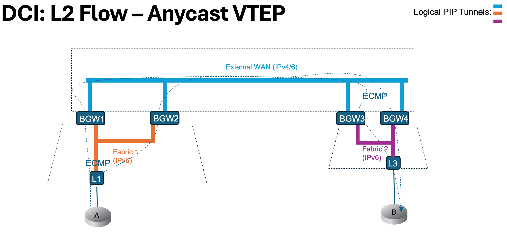
*Figure 12: Traffic flow - Anycast VIP, no orphan port*

##### 6.11.2 Ethernet Segment - directly connected host / orphan port
Packet flows are different with the presence of locally connected host and/or orphan port. BUM packets coming from locally connected hosts are treated with local bias logic. The following picture shows the flow for BUM traffic coming from locally connected host at the BGW.

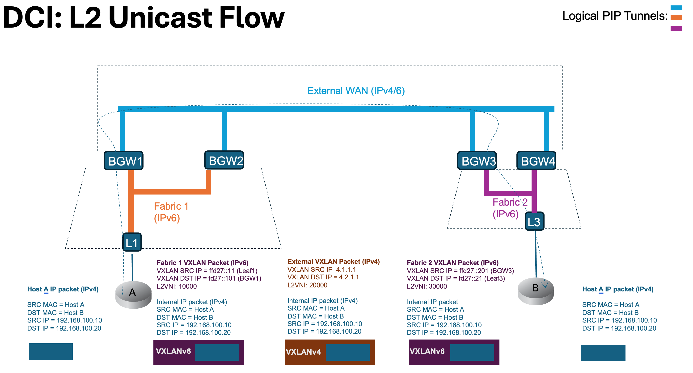
*Figure 13: Packet Flow - Layer-2*

Similarly, the packet flow for Layer-3 connectivity over L3VNI is shown here. The main difference resides on the inner Ethernet Header. As per VxLAN standard, source and destination router MACs are used for routing packets (inter-subnet forwarding).
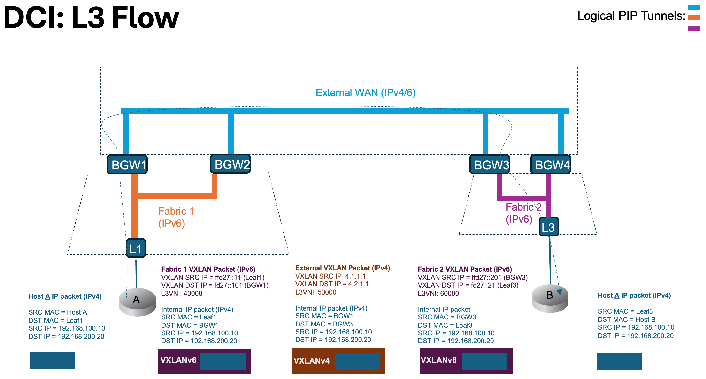
*Figure 14: Packet Flow - Layer-3*

#### 6.12 Mobility 
VM mobility across sites is achieved via L2VNI connectivity across sites. Ingress Route Optimization (IRO) is provided to connect outside customer to a specific appliance within a data center. Connectivity is kept with IRO during motion.

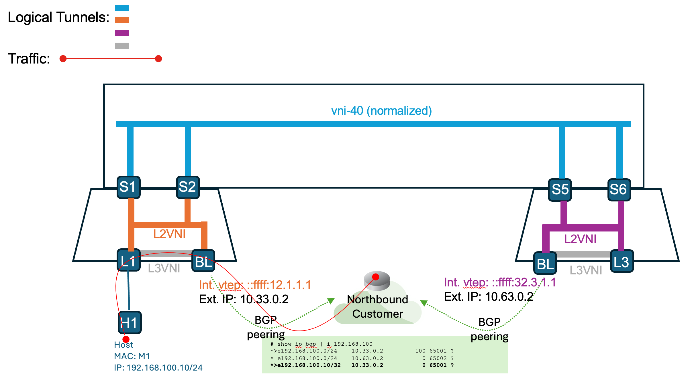
*Figure 15: VM mobility - Initially*

H1 has connectivity with a customer outside DC. That customer is connected via an IP network to a border leaf. VxLAN is not extended to that customer; it is purely IPv4/IPv6 in global routing table.
When H1 moves behind leaf-3, it must maintains it's connectivity. This is achieved by supporting MAC mobility and advertising proper host route to border leaf. Using BGP peering, forwarding tables are getting properly updated on all domains. Northbound customer still have optimized forwarding to H1 post-motion. 

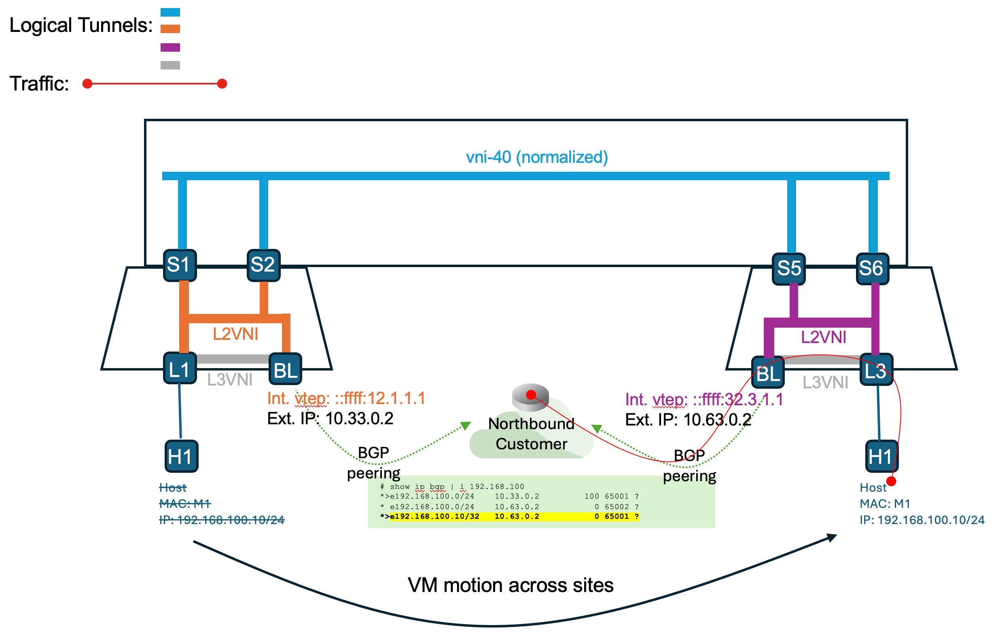
*Figure 16: VM mobility - Post Mobility*

EVPN mobility procedures are followed, with the scope of updates being either global (across multiple sites) or local to a specific site. For example, thew scope is global when a host moves within the same site, RT-2 updates with an incremented sequence number are sent to all remote leaf switches in every remote site. However, this broad update is technically unnecessary, since all remote leafs already have host reachability information pointing to the same site, and the site itself has not changed.

This process can be optimized to operate on a per-site basis. With this improvement, RT-2 updates for host moves within the same site is limited to the local site and does not affected all remote leaf switches. Only traffic arriving at the Border Gateway (BGW) node from the WAN is directed to the appropriate leaf.

The following picture describes the entire motion seen previously across datacenters with multi-site technology.
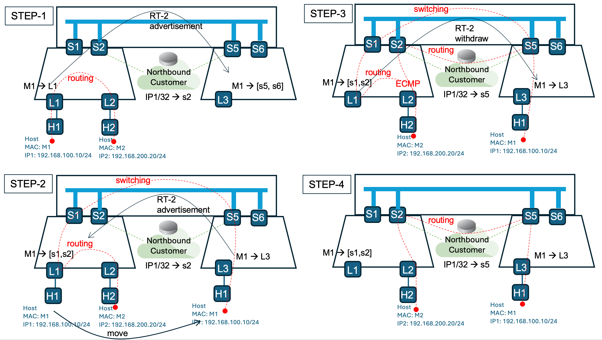
*Figure 17: VM Mobility with IRO - Step-by-step*

The diagram illustrates VM mobility across data centers with Ingress Route Optimization (IRO) enabling external northbound customer connectivity throughout the migration.

- **Step-1 (Initial state):** H1 (192.168.1.10/24) is connected to L1 in DC1. H2 (192.168.2.20/24) is connected to L2 in DC2. RT-2 MAC-only routes are advertised to remote DC sites. RT-2 MAC-IP routes and RT-5 prefix routes are advertised within the local DC. Inter-subnet traffic between H1 and H2 routes through L1 → S1/S2 → L2.

- **Step-2 (H1 moves to DC2):** H1 physically moves behind L3 in DC2. L3 advertises updated RT-2 MAC-only route to DC1 with increased mobility sequence number. RT-2 MAC-IP and RT-5 routes are advertised within DC2. L1 updates its forwarding table based on MAC mobility signaling. The Northbound Customer receives updated /32 host route from S5, pointing to the new location. Traffic from H2 to H1 now routes via L1 → [S1, S2] → WAN → [S5, S6] → L3.

- **Step-3 (Routing convergence):** All routing tables converge across both data centers and WAN. L1 withdraws its previous RT-2 and RT-5 advertisements for H1. Some return traffic from Northbound Customer may briefly transit through DC1 during convergence as BGP best path selection completes. The Northbound Customer's routing table now points exclusively to S5's advertised /32 host route for H1.

- **Step-4 (Optimal forwarding restored):** Forwarding tables stabilize with optimal paths. Traffic between H1 and H2 routes directly: H1 → L3 → S5 → Northbound Customer → S2 → L2. The Northbound Customer maintains uninterrupted connectivity to H1 via S5's /32 host route advertisement, demonstrating successful IRO-enabled mobility.

#### 6.13 Mobility with L2VNI and L3VNI

Multi-site mobility is more commonly achieved by properly leveraging both L2VNI and L3VNI together. While using a backdoor link via a third-party network is sometimes considered, this approach is often not feasible or desirable. Instead, by fully utilizing EVPN RT-2 (MAC-IP) routes, routing reachability is established directly through the WAN, enabling seamless host mobility across data centers without requiring external connectivity paths.

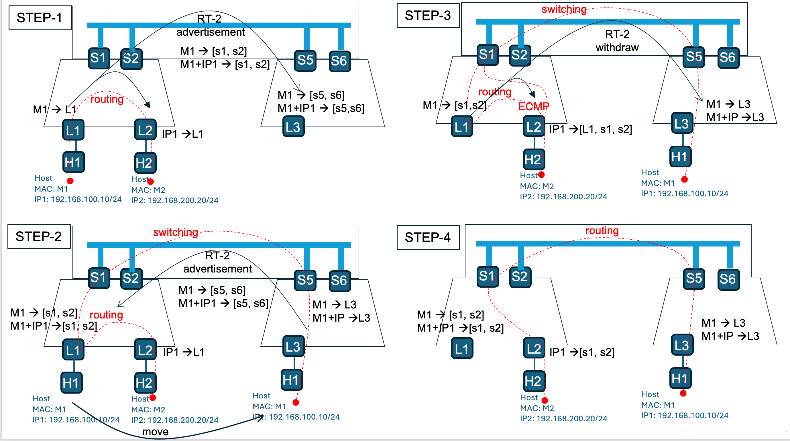
*Figure 18: VM Mobility with L2VNI and L3VNI - Step-by-step*

The diagram illustrates host mobility across data centers using both L2VNI (switching) and L3VNI (routing) connectivity.

- **Step-1 (Initial state):** H1 (MAC: M1, IP: 192.168.100.10/24) is connected to L1 in DC1. H2 (MAC: M2, IP: 192.168.200.20/24) is connected to L2 in DC2. RT-2 advertisements propagate M1 and M1+IP1 to spine switches [s1, s2] locally and [s5, s6] remotely. Inter-subnet traffic between H1 and H2 is routed through L1 → [s1, s2] → L2.

- **Step-2 (H1 moves to DC2):** H1 physically moves behind L3 in DC2. L3 advertises updated RT-2 routes with M1 → L3 and M1+IP1 → L3 with increased mobility sequence number. Route is re-originated by s5, s6 and s1, s2. L1 and L2 update their forwarding tables. Traffic from H1 now routes through L3 → [s5, s6] → WAN → [s1, s2] → L1 → L2.

- **Step-3 (Routing convergence):** All spine switches complete routing table updates. L1 withdraws its previous RT-2 advertisements for H1. Traffic briefly from H2 transitions through spines and still L1 as convergence completes. IP1 forwarding entry on L2 points to [L1, s1, s2] via ECMP.

- **Step-4 (Optimal forwarding restored):** Forwarding tables stabilize. Traffic between H1 and H2 now routes optimally: H1 → L3 (M1 → L3, M1+IP → L3) with direct Layer-3 routing between data centers.

#### 6.14 Control Plane
BGP control plane is extended in multiple ways to support the new DCI functionality:

- The concept of domain is introduced in BGP. This provides future proof flexiblity to interconnect multiple domains together. Moreover, it provides a clear separation between control plane and data plane
- It maps domain configuration with per tunnel information coming from the linux kernel (given from SONiC)
- It maintains individual ingress replication list per domain for Layer-2 BUM traffic
- It manages the EVPN route redistribution across domains:
  - RT-1, RT-2 and RT-5 are redistributed
  - RT-3 are terminated per domain
  - RT-4 are exchanged between a pair of BGW via DC peering side
- It provides proper information for tunnel establishment
  - VxLAN tunnel between peering BGW from DC/WAN side is kept down
- Mobility across sites
- RT-translation across domains
- Policy enforcement and route summarization
- Supports dynamic import/export of route targets for flexible segmentation

##### 6.14.1 Route Re-origination

When BGW provides Layer-2 only DCI functionality, only MAC route need to be re-originated. EVPN RT-2 carrying host information from DC are not fully re-originated; some fields are dropped to ensure proper functionality across multi-site. RT-2 MAC-only routes are re-originated with proper mobility BGP extended community. RT-2 MAC-IP routes and RT-5 are dropped. A new FRRouting configuration knob is provided to enable that under bgp. For instance:
```
router bgp 6543
   address-family l2vpn evpn
     advertise-mac-only      <-----NEW CLI----->
```

#### 6.15 Failure Scenarios
When deploying a new solution, it is important to analyze five key types of failure, commonly referenced in engineering specifications as Types A, B, C, D, and E:

- Failure A: Local interface failure
- Failure B: Link failure (e.g., fiber cut)
- Failure C: Remote interface failure
- Failure D: Node down
- Failure E: Core/network isolation (access interfaces remain up, but the core-facing network is isolated)

##### 6.15.1 Failure Scenarios and Recovery with Anycast VTEP
The following diagram illustrates each failure type and the corresponding recovery process when using anycast VTEP on Border Gateway (BGW) nodes.


*Figure 19: Failure Scenarios with anycast VTEP*

- Failures A, B, and C (link/interface failures):
These events trigger the IGP (eBGP in this scenario) to recompute the best path and update forwarding chains. Alternate paths are available as the leaf VTEP loopback address remains reachable within the data center underlay. For example, if traffic from the WAN to DCI-1 is impacted, it can be rerouted via L2 and DCI-2 to reach L1, avoiding blackholing, although this is not the optimal route. With anycast VTEP, this non-optimal routing persists until the failure is resolved. The reverse traffic path is optimal, as Leaf1 can send traffic directly to DCI-2.

- Failure D (node down):
Anycast VTEP enables rapid convergence. When a BGW node’s anycast IP becomes unreachable in the underlay, its IP address/nexthop is automatically removed from forwarding tables on all other nodes.

- Failure E (core/network isolation):
This scenario is more complex and can show up in two forms:

  - All interfaces to a domain are down: The node still exists in the other domain and continues to attract traffic. Detection relies on interface tracking on the BGW node.
  - All interfaces to a domain are up, but all remote neighbors are unreachable: Neighbor tracking on all remote nodes within the domain is used for detection.
In both cases, the solution is to administratively remove the anycast VTEP from the remaining connected domains to prevent further traffic attraction.

##### 6.15.2 Limitations and Future Improvements
Anycast VTEP provides excellent convergence for node failures (Type D) and partial protection for link/interface failures (Types A, B, and C). However, it also introduces some limitations:

- BGP route withdrawal does not always stop traffic attraction, as anycast IPs may continue to be advertised by peering BGW nodes.
- Establishing a backup tunnel between BGWs with the same anycast VTEP is not possible, preventing the use of fast reroute mechanisms.

A combination of anycast VTEP (VIP) and physical VTEP may be implemented to enhance resilience across all failure types.

Here is summary table of Failure Types:

| Failure Type | Description              | Detection Method           | Recovery Action                          |
|:------------:|:-------------------------|:---------------------------|:-----------------------------------------|
| A            | Local interface failure  | Link monitoring            | eBGP path re-computation                 |
| B            | Link (e.g., fiber cut)   | Link monitoring            | eBGP path re-computation                 |
| C            | Remote interface failure | Link monitoring            | eBGP path re-computation                 |
| D            | Node down                | Underlay reachability check| Remove anycast IP from routing tables    |
| E            | Core/network isolation   | Interface/neighbor tracking| Remove anycast VTEP from other domains   |


#### 6.16 Peer Link and Isolation Behavior using physical VTEPs

The diagram illustrates the logical overlay architecture for a redundant BGW pair (DCI1 and DCI2) using physical VTEPs with multi-homing support.

**Key Components:**
- **BGW Nodes (DCI1 DF, DCI2 NDF):** Each BGW node terminates both DC-facing L2VNI and WAN-facing L2VNI' tunnels
- **Overlay VxLAN Tunnel:** DCI1 and DCI2 are interconnected via WAN-side overlay tunnel for peer communication
- **SVI Interfaces:** Each BGW operates a distributed anycast gateway using shared SVI configuration
- **Traffic Domains:** Clear separation between DC domain (L2VNI) and WAN domain (L2VNI') with SVI providing Layer-3 gateway services
- **Underlay:** WAN and DC fabric may use different underlay (IPv4/IPv6) so their VTEPs

This architecture enables loop-free forwarding with DF/NDF election, local bias for locally connected hosts, and resilient connectivity through redundant BGW nodes.


*Figure 20: DCI Logical Overlay Architecture*

A primary objective is to maintain reachability and EVPN stability during partial isolation events where either WAN or DC connectivity is lost on a BGW node. As described in the split-horizon group section, specific forwarding rules handle BUM traffic in these scenarios. Reachability must be preserved between locally connected hosts and hosts within the local DC or remote sites.

Two fundamental approaches exist: extending EVPN overlay capabilities or relying on underlay routing. The underlay approach is preferred for its simplicity and stability where the overlay/EVPN control plane remains unaffected by isolation events.

For underlay-based recovery, two solutions are available:

1- Route leaking: Advertise DC VTEP loopbacks into WAN and vice versa. This works well in homogeneous environments but becomes problematic with mixed underlays. For example, when WAN uses IPv4 and DC uses IPv6, dual-stack support is required throughout both domains, which may not be feasible.

2- Peer link: Establish a dual-stack L3 link between BGW nodes that participates in both DC and WAN underlay routing. This is not a special L2 trunk or bridging mechanism; it functions as a standard routing hop. It enables WAN to reach VTEP_WAN(DCI1/2) via the peer DCI and DC to reach VTEP_DC(DCI1/2) via the same path when direct connectivity fails.

##### 6.16.1 Peer Link Design: Underlay & eBGP

Underlay characteristics:
- Physical link (or LAG) between DCI1 and DCI2, configured as pure L3.
- Dual-stack addressing on the same link (IPv4 + IPv6).
- IPv4 participates in WAN underlay routing (IGP or eBGP).
- IPv6 participates in DC underlay routing (IGP or eBGP).

Routing / eBGP considerations:
- Run eBGP (or IGP) over IPv4 to advertise VTEP_WAN of both DCIs.
- Run eBGP (or IGP) over IPv6 to advertise VTEP_DC of both DCIs.
- Ensure next-hop and recursion let WAN → DCI2 → DCI1 and DC → DCI2 → DCI1 work cleanly for DCI1 WAN isolation (as example)
- Set metrics so this path is used only when direct fabric paths are lost.

##### 6.16.2 WAN Isolation on DCI1
Failure: DCI1 loses its WAN underlay connectivity.
- WAN fabric cannot directly reach VTEP_WAN(DCI1).
- Because of the IPv4 peer link:
  - WAN routes to VTEP_WAN(DCI1) via DCI2 → DCI1.
  - EVPN sessions/RT-4 remain up (no control-plane flap).
  - H1 and other endpoints behind DCI1 remain reachable from WAN.

##### 6.16.3 DC Isolation on DCI1
Failure: DCI1 loses its DC underlay connectivity.
- DC fabric cannot directly reach VTEP_DC(DCI1).
- Because of the IPv6 peer link:
  - DC routes to VTEP_DC(DCI1) via DCI2 → DCI1.
  - EVPN sessions/RT-4 remain up on DC side.
  - H1 and other endpoints behind DCI1 remain reachable from DC.

##### 6.16.4 AC-originated BUM
AC-originated BUM (e.g., from H1 or H2):
  - Ingress DCI floods to DC, WAN, local ACs, and peer DCI (per design rules).
  - Peer DCI applies EVPN MH local bias:
      - Floods only to single-homed ACs + SVI.
      - Never floods to MH ACs (like H2).
      - Does not re-flood into DC or WAN fabrics.
This prevents loops and duplicate copies while keeping reachability.

### 7. Implementation Details

DCI is implemented as a built-in SONiC feature, with modular extensions for future enhancements. The extensions and modifications required to support DCI functionality affect both control plane and data plane components.

#### 7.1 L2 Interconnect

##### 7.1.1 FRR Changes

FRRouting BGPd and Zebra are modified to support L2 Interconnect with domain-based VNI stitching and Type-2 route re-origination.

**DCI Domain Support:**
- Added DCI domain concept with per-neighbor domain configuration
- Domain hash and comparison functions for route filtering
- `bgp_get_peer_dci_domain()` retrieves domain string for a peer
- Domain propagation via netlink message for VxLAN interface to Zebra

**Bridge-based VNI Stitching:**
- New `bgpevpn_bridge` structure for VNI stitching across domains
- Bridge hash (`bridge_hash_key_make`, `bridge_hash_cmp`) for efficient lookup
- Multiple VNI to same bridge domain mapping
- VLAN ID passed to BGP as bridge ID for stitching
- `bgpevpn_bridge` container holds the stitched VNI list

**Type-2 Route Re-origination:**
- `bgp_evpn_dci_reoriginate_macip_route()` - Re-originate MAC-IP routes to target domains
- `bgp_evpn_dci_withdraw_macip_route()` - Withdraw re-originated routes
- `BGP_PATH_REORIGINATED` flag to track re-originated routes and prevent loops
- Parent pointer linking re-originated route to original route
- Re-origination triggered on route selection for imported MAC-IP routes
- Domain-based route filtering to ensure routes are only re-originated to the appropriate target domains
- Auto-generation of domain-specific BGP route-target

**Type-3 Route Origination per Domain:**
- Type-3 (IMET) routes are originated independently per domain, each carrying the domain-specific VTEP and VNI
- Type-3 routes are terminated at domain boundaries and not leaked across DCs
- Each DCI node originates Type-3 routes on both DC-facing and WAN-facing VNIs with the appropriate VTEP address
- Auto-generation of domain-specific BGP route-target ensures Type-3 routes are imported only by peers in the same domain

**Advertise MAC-only Support:**
- `advertise-mac-only` configuration (global and per-VNI)
- `bgp_evpn_advertise_mac_only_enabled()` checks configuration
- Filters IP information from Type-2 routes when enabled

**Debug and CLI:**
- `debug bgp evpn dci` command for DCI-specific debugging
- `BGP_DEBUG_EVPN_DCI_ENABLED()` macro for conditional debug output
- Enhanced logging for route selection and re-origination

##### 7.1.2 SONiC SWSS Changes

**VxLANMgr (vxlanmgr.cpp/h):**
- Configuration support for multiple VTEPs per domain
- Domain name configuration and referencing
- Distinct tunnel maps per P2MP tunnels
- VNI to VRF mapping per tunnel

**VxLANOrch (vxlanorch.cpp/h):**
- Support of multiple P2MP tunnels per bridge domain
- Attaching distinct tunnel maps (previously all tunnels shared same mapper)
- Per-domain filter group support
- Extended tunnel management for DC and WAN domains

**FDBSYNCD (fdbsync.cpp/h):**
- Source VTEP tracking in VXLAN_REMOTE_VNI_TABLE
- Multiple ingress replication list per bridge domain
- Source VTEP extraction from VxLAN interface name

##### 7.1.3 SONiC Utilities Changes

**Configuration (config/vxlan.py):**
- DCI-specific VXLAN configuration commands
- Domain configuration support

**Show Commands (show/vxlan.py, fdbshow):**
- Extended show commands for DCI status
- Source VTEP display in FDB entries

##### 7.1.4 iproute2 Changes

**VXLAN Domain Support:**
- Added domain attribute for VXLAN interfaces
- `ip link add vxlan0 type vxlan ... domain <name>` syntax
- Domain information passed to kernel via netlink

##### 7.1.5 YANG Model Changes

**sonic-vxlan.yang:**

The VXLAN YANG model is updated to support multiple VTEPs and NVO instances required for DCI domain separation. Previously, the model restricted the system to a single tunnel and a single NVO instance. With DCI, up to three are needed (e.g., `vxlan-dc`, `vxlan-wan`, and an optional tertiary).

- `VXLAN_TUNNEL_LIST`: `max-elements` increased from **1 to 3**, allowing multiple VxLAN tunnels with distinct source VTEPs per domain
- `EVPN_NVO_LIST`: `max-elements` increased from **1 to 3**, allowing multiple EVPN NVO instances each bound to a different tunnel

```yang
// VXLAN_TUNNEL_LIST - before: max-elements 1
list VXLAN_TUNNEL_LIST {
    key "name";
    max-elements 3;  // supports DC, WAN, and tertiary tunnels
    ...
}

// EVPN_NVO_LIST - before: max-elements 1
list EVPN_NVO_LIST {
    key "name";
    max-elements 3;  // one NVO instance per tunnel/domain
    ...
}
```

#### 7.2 L3 Interconnect

##### 7.2.1 FRR Changes

The following enhancements were added to FRRouting to support L3VNI stitching and domain-aware routing:

**BGP Attribute Extensions:**
- Added `evpn_vni` field to BGP attributes for explicit VNI specification on Type-5 routes
- Added `evpn_flags` with `ATTR_EVPN_FLAG_VNI_SET` and `ATTR_EVPN_FLAG_RMAC_LOCAL` flags
- These attributes are included in attribute hash computation for proper route deduplication

**Route-map Extensions for Type-5 Routes:**
New route-map set actions allow explicit control over L3VNI behavior for asymmetric VNI translation:
```
! Example: Rewrite Type-5 routes when advertising to WAN domain
route-map RT-REWRITE-WAN permit 10
  match extcommunity RT-WAN
  set evpn vni 5200          ! Set DCI's L3VNI for WAN-facing advertisement
  set evpn rmac-local        ! Use local VRF's Router MAC
```

These route-map actions enable asymmetric L3VNI translation where each domain can use different VNI values, with the DCI node performing the translation at domain boundaries.

**VRF Lookup for Route Target:**
- New function `bgp_evpn_get_vrf_for_rt()` finds VRFs that import routes with matching RT and have L3VNI configured
- Supports both exact RT matching and wildcard RT matching (e.g., `*:5000`)
- Used for EVPN DCI to find local VRF for VNI/RMAC rewrite

**Domain Propagation in ES VTEPs:**
- Domain string is now propagated through BGP to Zebra via ES VTEP structures
- `bgp_evpn_es_vtep_add()` accepts domain parameter and stores it in `es_vtep->domain`
- Domain is transmitted to Zebra via `ZAPI_ES_VTEP` messages with length-prefixed string
- ES VTEP debug output includes domain information for troubleshooting

**Nexthop Domain Support:**
- `struct nexthop` extended with `nh_domain[ZEBRA_VXLAN_MAX_DOMAIN_LEN]` field
- Domain propagated through L3 NHG (Next Hop Group) updates to kernel
- `zapi_nexthop_from_nexthop()` copies domain to API nexthop structure
- FPM netlink encoding includes domain in VXLAN encap attributes

**L2 Nexthop Domain Handling:**
- `zebra_evpn_l2_nh` structure includes domain pointer (deep copied from es_vtep)
- `kernel_upd_mac_nh()` accepts domain parameter and includes it in netlink message
- Domain transmitted via `NHA_SRC_DEV` netlink attribute to kernel

The linux kernel and iproute2 package are also extended to support the concept of domain per VTEP / VxLAN tunnel.

##### 7.2.2 Linux Kernel Changes

A new netlink attribute `NHA_SRC_DEV` was added to the kernel nexthop subsystem to support source device/domain propagation:

**Kernel Nexthop Structure Changes:**
```c
struct nh_config {
    ...
    u8 src_dev[IFNAMSIZ];  /* Source device name for DCI */
    ...
};

struct nh_info {
    ...
    u8 src_dev[IFNAMSIZ];  /* Source device name stored in nexthop */
    ...
};
```

**Netlink Attribute:**
```c
enum {
    ...
    NHA_RES_BUCKET,
    NHA_SRC_DEV,      /* string; source device for nexthop */
    __NHA_MAX,
};
```

**Kernel Processing:**
- `rtm_to_nh_config()` extracts `NHA_SRC_DEV` using `nla_strscpy()`
- `nexthop_create()` copies `src_dev` from config to nexthop info
- `nh_fill_node()` includes `NHA_SRC_DEV` in netlink responses
- Size calculation in `nh_nlmsg_size_single()` accounts for the new attribute

##### 7.2.3 iproute2 Changes

The `ip nexthop` command was extended to support the `src_dev` parameter:

**CLI Usage:**
```bash
# Add nexthop with source device
ip nexthop add id 100 via 192.168.1.254 dev eth0 src_dev vxlan-dc

# Show nexthop with source device
ip nexthop show id 100
# Output: id 100 via 192.168.1.254 dev eth0 src_dev vxlan-dc scope link

# JSON output includes src_dev
ip -j nexthop show id 100
# Output: [{"id":100,"gateway":"192.168.1.254","dev":"eth0","src_dev":"vxlan-dc",...}]
```

**Data Structure:**
```c
struct nh_entry {
    ...
    __u8 nh_src_dev[16];  /* IFNAMSIZ - source device name */
    ...
};
```

##### 7.2.4 SONiC SWSS Changes

The following SWSS enhancements support L3VNI stitching across domains.

#### 7.3 Database Schema

Few tables are updated to support DCI functionality.

**VXLAN_FDB_TABLE**

Add source_vtep in VXLAN_FDB_TABLE
```
VXLAN_FDB_TABLE: {
  ...
  "remote_vtep": "fd27::233:d0c6:fed5",
  "source_vtep": "vxlan_local",  // <-- NEW FIELD
  "type": "dynamic",
  ...
}
```

**VXLAN_REMOTE_VNI_TABLE**

Add source_vtep into key
```
"VXLAN_REMOTE_VNI_TABLE:vxlan-local:Vlan10:fd27::233:d0c6:fed5": // <-- vxlan-local added to key
{
  ...
}
```

**VXLAN_VRF_TABLE**

Vrf to VNI map is shared by multiple vteps, need replicate following table for both local and inter-DC VTEP according to vlan-vni map.
```
"VXLAN_VRF_TABLE:vxlan-l3:evpn_map_5030_Vrf01"// <-- vxlan-l3 added to key
{
  ...
}
```
**VXLAN_TUNNEL_TABLE**

Add source vtep info in key
```
"VXLAN_TUNNEL_TABLE|EVPN vxlan-local:fd27::233:d0c6:fed5" // <-- vxlan-local added to key
{
  ...
}
```

**ROUTE_TABLE**

Could not use vrf_id to get source vtep anymore​
```
ROUTE_TABLE:Vrf01:10.212.10.0/24":{
  "value": {
    ...
    "ifname": "Vlan30,Vlan30",
    "source-vtep": "vxlan-l3",  // <-- NEW FIELD
    ...
  }
}
```

The L3 SWSS changes build on the L2 foundation described in section 7.1.2.

**VrfMgr Changes:**

Multiple NVO (Network Virtualization Overlay) support was added by changing from a single tunnel string to a map:

```cpp
// Before (single tunnel)
std::string m_evpnVxlanTunnel;

// After (multiple NVO support)
typedef std::unordered_map<std::string, std::string> VtepNVOMapTable;
VtepNVOMapTable m_evpnVxlanTunnel;
```

Key changes:
- `doVrfEvpnNvoAddTask()` now stores NVO name to tunnel name mapping
- `doVrfEvpnNvoDelTask()` removes specific NVO entries
- `VrfVxlanTableSync()` accepts tunnel name parameter for targeted updates
- New `getVxlanTunnelsForVni()` function queries VXLAN_TUNNEL_MAP table to find all tunnels with a given VNI
- `doVrfVxlanTableUpdate()` creates VXLAN_VRF_TABLE entries for all tunnels with matching VNI

**fdbsyncd Changes:**

Source VTEP handling was added for proper DCI domain association:

```cpp
// NHA_SRC_DEV parsing from kernel nexthop messages
if (tb[NHA_SRC_DEV]) {
    char *tunnel_name = (char *)RTA_DATA(tb[NHA_SRC_DEV]);
    if (isVxlanTunnelValid(tunnel_name)) {
        source_vtep = tunnel_name;
    }
}
```

Key changes:
- `isVxlanTunnelValid()` validates tunnel exists in APPL_DB VXLAN_TUNNEL_TABLE
- `nexthopAddGroup()` accepts and stores `source_vtep` parameter
- `macAddVxlan()` and `macDelVxlanDB()` extract source VTEP from VxLAN interface name
- IMET route key format changed to include source VTEP: `source_vtep:vlan_id:remote_vtep`
- Nexthop group entries include `source_vtep` field

**routesync Changes:**

Source VTEP is now propagated through route updates:

- L2 nexthop entries include source VTEP information
- Route table entries include `source-vtep` field for proper VRF-to-tunnel association
- EVPN routes carry domain context through the routing stack

**l2nhgorch Changes:**

L2 Next Hop Group orchestration was extended:

- Source VTEP tracked per nexthop group entry
- Nexthop resolution considers source VTEP for proper tunnel selection
- Debug logging includes source VTEP for troubleshooting

**Test Coverage:**

New test file `tests/test_evpn_tunnel_dci.py` validates:
- Multiple NVO configuration
- Source VTEP propagation through FDB entries
- L3VNI mapping across domains
- VRF to tunnel association

### 8. SAI API
Supporting DCI functionality over BGW required SAI extension and modifications:

The codebase originally supported VXLAN and EVPN features without a unified, dynamic mechanism to differentiate classic Multi‑Homing (MH) behavior from Data Center Interconnect (DCI) / Split‑Horizon mode. The goal was to:

- Introduce dynamic DCI vs MH behavior without adding a new public switch attribute
- Enforce correct isolation/filtering semantics (especially around tunnel ingress/egress)

1- Dynamic Mode Logic (DCI vs MH):
  - Mode is inferred (e.g., based on presence/count of P2MP VXLAN tunnels)
  - Tunnel manager gained state and helpers to update split‑horizon behavior centrally

2- Filter / Isolation Semantics:
  - In DCI mode, certain ingress unicast tunnel filter group assignments are deliberately suppressed or altered to enforce correct traffic segmentation.
  - Isolation groups are associated with tunnel bridge ports in MH scenarios; logic ensures they aren’t misapplied in DCI.

3- Tunnel Manager & Headers:
  - sai_tunnel_manager.cpp and sai_tunnel.h were iteratively extended then pruned:
    - Added counters/flags for mode evaluation
    - Introduced (and later refined) helpers for determining default filter groups per tunnel
    - Removed transitional or redundant variables after stabilization

4- Bridge / Isolation Integration:
  - sai_bridge.cpp and sai_isolation_group.cpp adjusted so the bridge layer cooperates with new DCI/MH mode realities.


As part of sai_device.h, the following changes are made:

1- In vrf_entry table, the decap_vni is replaced by a vector of decap_vnis. Each decap_vni is associated with a distinct VTEP / domain.
```
struct vrf_entry {
    sai_object_id_t vrf_oid = SAI_NULL_OBJECT_ID;
    la_obj_wrap<la_vrf> vrf;
    la_obj_wrap<la_vrf_redirect_destination> vrf_redirect_dest = nullptr;
    la_obj_wrap<la_switch> vxlan_switch;
    la_obj_wrap<la_svi_port> vxlan_svi;
    std::set<sai_object_id_t> m_router_interfaces; // router interfaces belonging to this vrf
    uint32_t vxlan_switch_refcount = 0;

    std::vector<uint32_t> decap_vnis;
    ...
}
```
2- New filter groups are added to support DCI functionality:
```

// Ingress Filter Groups for MH
#define FILTER_GRP_ING_TNL_BUM_FROM_OTHER 1
#define FILTER_GRP_ING_TNL_UC 2
#define FILTER_GRP_ING_TNL_BUM_FROM_PEER 3

// Egress Filter Groups for MH
#define FILTER_GRP_EGR_AC_MH_DF 1
#define FILTER_GRP_EGR_AC_MH_NDF 2
#define FILTER_GRP_EGR_TNL 3

// Ingress Filter Groups for DCI
#define FILTER_GRP_ING_TNL_ONE 1
#define FILTER_GRP_ING_TNL_TWO 2

// Egress Filter Groups for DCI
#define FILTER_GRP_EGR_TNL_ONE 1
#define FILTER_GRP_EGR_TNL_TWO 2
```

A new mode is added to the sai_isolation_group identifying either MH or DCI functionality.
```
    if (enable_dci) {
        // ING_TNL_ONE -> EGR_TNL_ONE should be DENY
        // ING_TNL_ONE -> EGR_TNL_TWO should be PERMIT
        // ING_TNL_TWO -> EGR_TNL_ONE should be PERMIT
        // ING_TNL_TWO -> EGR_TNL_TWO should be DENY
        SET_FILTER_GROUP_PERMISSION(FILTER_GRP_ING_TNL_ONE, FILTER_GRP_EGR_TNL_ONE, FILTER_PERMISSION_DENY);
        SET_FILTER_GROUP_PERMISSION(FILTER_GRP_ING_TNL_ONE, FILTER_GRP_EGR_TNL_TWO, FILTER_PERMISSION_PERMIT);
        SET_FILTER_GROUP_PERMISSION(FILTER_GRP_ING_TNL_TWO, FILTER_GRP_EGR_TNL_ONE, FILTER_PERMISSION_PERMIT);
        SET_FILTER_GROUP_PERMISSION(FILTER_GRP_ING_TNL_TWO, FILTER_GRP_EGR_TNL_TWO, FILTER_PERMISSION_DENY);
    } else {
        // Restore to MH baseline
        SET_FILTER_GROUP_PERMISSION(FILTER_GRP_ING_TNL_BUM_FROM_OTHER, FILTER_GRP_EGR_AC_MH_DF, FILTER_PERMISSION_PERMIT);
        SET_FILTER_GROUP_PERMISSION(FILTER_GRP_ING_TNL_BUM_FROM_OTHER, FILTER_GRP_EGR_AC_MH_NDF, FILTER_PERMISSION_DENY);
        SET_FILTER_GROUP_PERMISSION(FILTER_GRP_ING_TNL_UC, FILTER_GRP_EGR_AC_MH_DF, FILTER_PERMISSION_PERMIT);
        SET_FILTER_GROUP_PERMISSION(FILTER_GRP_ING_TNL_UC, FILTER_GRP_EGR_AC_MH_NDF, FILTER_PERMISSION_PERMIT);
    }
```

Basically, the isolation group table is set to allow dynamic switching without reprogramming the entire table. By default, EVPN multi-homing is enabled. When DCI is enabled i.e, when in the presence of 2 or more VxLAN p2mp tunnel per bridge domain, the filter group table is updated to support DCI functionality. This is done by calling update_split_horizon_mode() function.

```
     * SHG Filter/Drop Matrix (MH baseline):
     * Service Port Type to (RX SHG, TX SHG):
     *                      RX  TX
     *     AC SH            0   0
     *     AC DF            0   1
     *     AC NDF           0   2
     *     TNL MC OTHER     1   3   (a.k.a. BUM_FROM_REMOTE_NODE)
     *     TNL UC           2   3
     *     TNL MC PEER      3   3   (a.k.a. BUM_FROM_PEER)
     *  (Rows = Ingress SHG, Columns = Egress SHG)
     *          0   1   2   3 (Egress)
     *      0   F   F   F   F
     *      1   F   F   D   D
     *      2   F   F   F   D
     *      3   F   D   D   D
     * (Ingress)
     *
     * SHG Filter/Drop Matrix (DCI variant):
     * Service Port Type to (RX SHG, TX SHG):
     *                      RX  TX
     *     AC SH            0   0
     *     TNL DC           1   1   (a.k.a. Tunnel towards DCI peer)
     *     TNL WAN          2   2   (a.k.a. Tunnel towards WAN)
     *
     *  (Rows = Ingress SHG, Columns = Egress SHG)
     *
     *          0   1   2   3 (Egress)
     *      0   F   F   F   X
     *      1   F   D   F   X
     *      2   F   F   D   X
     *      3   X   X   X   X
     * (Ingress)
```

The sai_tunnel is extended to support vector of decap_profile, filter_group, number of tunnels and dci_mode. New functions are added to gather and switch the isolation group table mode. 

```
struct tunnel_t {
  ...
   /*
     * filter group number, applicable in DCI mode only
     */
    uint32_t m_filter_group = 0;

    // Common decap mapping profile keyed by source IP address
    std::map<la_ip_addr, tunnel_vxlan_map_decap_profile_t> m_default_common_vxlan_decap_profile;

    // Number of vxlan tunnels created
    uint32_t m_vxlan_tunnel_count = 0;
    // true when DCI variant active for vxlan tunnels
    bool m_dci_mode = false;
  ...
}
```
New functions to set the encap VNI on a tunnel entry is also provided. With DCI, more than 1 VNI is now supported per switch.
```
    // Retrieve the stored filter group value from a tunnel entry (tunnel_t::m_filter_group).
    // Returns LA_STATUS_SUCCESS on success, LA_STATUS_ENOTFOUND if tunnel oid invalid.
    // In EVPN MH mode returns FILTER_GRP_TUNNEL_DEFAULT.
    // In DCI mode returns the per-tunnel stored m_filter_group value.
    la_status get_tunnel_default_filter_group(sai_object_id_t tunnel_oid, uint32_t& filter_group);

    la_status set_encap_vni_on_switch_properties(tunnel_t* tun_entry, uint16_t vlan_id, uint32_t encap_vni);
    la_status clear_encap_vni_on_switch_properties(tunnel_t* tun_entry, uint16_t vlan_id, uint32_t encap_vni);

    // Toggle DCI (split-horizon) mode and adjust ingress filter groups of existing
    // encap/decap VXLAN tunnels. When enabling DCI, all existing ENCAP_DECAP tunnels
    // have their ingress filter group updated to sdev->m_filter_groups[tunnel count].
    // When disabling DCI, they are reset to sdev->m_filter_groups[FILTER_GRP_ING_TNL_UC].
    la_status transition_split_horizon_mode(bool enable_dci);

```
### 9. Configuration and Management

DCI requires new configuration to support the functionality on SONIC. The configuration comes in three parts: the new DCI service enablement using SONiC configuration, the extension to FRRouting BGP configuration and finally an extension to Linux Kernel iproute2 packages allowing the support of domain per VxLAN tunnel.

#### 9.1. Manifest (if the feature is an Application Extension)

N/A

#### 9.2. Inter-DC L2VNI CLI/YANG model Enhancements
In inter-DC L2VNI deployment, only L2VNI is extended across multiple sites.

**YANG Model Prerequisites:** DCI L2VNI configuration depends on the `sonic-vxlan.yang` changes that raise `max-elements` from 1 to 3 for both `VXLAN_TUNNEL_LIST` and `EVPN_NVO_LIST` (see [Section 7.1.5](#715-yang-model-changes)). Without these changes, the CVL schema validation will reject the creation of a second tunnel or NVO instance.

##### SONiC DCI Configuration

Service enablement is accomplished by adding a new VTEP and tunnel for each domain. In the example below, bridge domain 10 is configured with two VXLAN tunnels, using L2VNIs 5010 and 6010. The domain name for each VTEP is specified with the add command; in this case, the domain names are "vxlan-dc" and "vxlan-wan". These domain names must match those configured in FRRouting BGP. This method creates a direct association between the BGP control plane and the dataplane service configuration, ensuring a clear separation between control plane and dataplane.

```
sudo config interface ip add Loopback0 fd27::233:d0c6:fed1/128
sudo config interface ip add Loopback1 10.10.10.10/32
sudo config interface ip add Loopback10 fd27::233:d0c6:feda/128
sudo config interface ip add Loopback11 101.101.101.101/32


sudo config vxlan add vxlan-dc fd27::233:d0c6:feda
sudo config vxlan evpn_nvo add NVO-LOCAL vxlan-dc

sudo config vxlan add vxlan-wan 101.101.101.101
sudo config vxlan evpn_nvo add NVO-REMOTE vxlan-wan

sudo config vlan add 10
sudo config vxlan map add vxlan-dc 10 5010
sudo config vxlan map add vxlan-wan 10 5011

sudo config vlan add 20
sudo config vxlan map add vxlan-dc 20 5020
sudo config vxlan map add vxlan-wan 20 5022
```

##### CONFIG_DB
Sample CONFIG_DB entries for L2 Interconnect:

```json
CONFIG_DB:
  "VXLAN_EVPN_NVO|NVO-LOCAL": { "source_vtep": "vxlan-dc" },
  "VXLAN_EVPN_NVO|NVO-REMOTE": { "source_vtep": "vxlan-wan" },

  "VXLAN_TUNNEL|vxlan-dc": { "src_ip": "fd27::233:d0c6:feda" },
  "VXLAN_TUNNEL|vxlan-wan": { "src_ip": "101.101.101.101" },

  "VXLAN_TUNNEL_MAP|vxlan-dc|map_5010_Vlan10": { "vlan": "Vlan10", "vni": "5010" },
  "VXLAN_TUNNEL_MAP|vxlan-dc|map_5020_Vlan20": { "vlan": "Vlan20", "vni": "5020" },
  "VXLAN_TUNNEL_MAP|vxlan-wan|map_5011_Vlan10": { "vlan": "Vlan10", "vni": "5011" },
  "VXLAN_TUNNEL_MAP|vxlan-wan|map_5022_Vlan20": { "vlan": "Vlan20", "vni": "5022" }
```

Sample APPL_DB entries:

```json
APPL_DB:
  // FDB entry from DC domain (with source_vtep)
  "VXLAN_FDB_TABLE:Vlan10:00:00:00:00:10:01": {
    "remote_vtep": "fd27::233:d0c6:fed5",
    "source_vtep": "vxlan-dc",
    "type": "dynamic",
    "vni": "5010"
  },

  // FDB entry from WAN domain (with source_vtep)
  "VXLAN_FDB_TABLE:Vlan10:00:00:00:00:10:03": {
    "remote_vtep": "201.201.201.201",
    "source_vtep": "vxlan-wan",
    "type": "dynamic",
    "vni": "5011"
  },

  // Remote VNI entries (source_vtep in key)
  "VXLAN_REMOTE_VNI_TABLE:vxlan-dc:Vlan10:fd27::233:d0c6:fed5": { "vni": "5010" },
  "VXLAN_REMOTE_VNI_TABLE:vxlan-wan:Vlan10:201.201.201.201": { "vni": "5011" }
```

##### SONiC Show Commands
The VxLAN show command is extended to display all tunnels connected to a common VLAN.
```
cisco@SD1:~$ show vxlan tunnel
vxlan tunnel name    source ip            destination ip    tunnel map name    tunnel map mapping(vni -> vlan)
-------------------  -------------------  ----------------  -----------------  ---------------------------------
vxlan-dc             fd27::233:d0c6:feda                    map_5010_Vlan10    5010 -> Vlan10
                                                            map_5020_Vlan20    5020 -> Vlan20
vxlan-wan            101.101.101.101                        map_5011_Vlan10    5011 -> Vlan10
                                                            map_5022_Vlan20    5022 -> Vlan20
cisco@SD1:~$ 

cisco@SD1:~$ show vxlan remotevtep
+---------------------+---------------------+-------------------+--------------+
| SIP                 | DIP                 | Creation Source   | OperStatus   |
+=====================+=====================+===================+==============+
| 101.101.101.101     | 201.201.201.201     | EVPN              | oper_up      |
+---------------------+---------------------+-------------------+--------------+
| fd27::233:d0c6:feda | fd27::233:d0c6:fed5 | EVPN              | oper_up      |
+---------------------+---------------------+-------------------+--------------+
| fd27::233:d0c6:feda | fd27::233:d0c6:fed6 | EVPN              | oper_up      |
+---------------------+---------------------+-------------------+--------------+
Total count : 3

cisco@SD1:~$ show vxlan counter
                   IFACE    RX_PKTS    RX_BYTES    RX_PPS    TX_PKTS    TX_BYTES    TX_PPS
------------------------  ---------  ----------  --------  ---------  ----------  --------
    EVPN_201.201.201.201         10        1212    0.00/s         11        1424    0.00/s
EVPN_fd27::233:d0c6:fed5          9        1296    0.00/s         10        1452    0.00/s
EVPN_fd27::233:d0c6:fed6          5         784    0.00/s          8        1184    0.00/s
                vxlan-dc          0           0    0.00/s          0           0    0.00/s
               vxlan-wan          0           0    0.00/s          0           0    0.00/s

cisco@SD1:~$ show vxlan vrfvnimap
+--------------+-------+-------+
| VTEP         | VRF   |   VNI |
+==============+=======+=======+
| vxlan-local  | Vrf01 |  5300 |
+--------------+-------+-------+
| vxlan-remote | Vrf01 |  5300 |
+--------------+-------+-------+
Total count : 2

```
##### FRRouting BGP Configuration

```
router bgp 65001
 bgp router-id 100.100.100.1
 no bgp ebgp-requires-policy
 no bgp default ipv4-unicast
 bgp disable-ebgp-connected-route-check
 bgp bestpath as-path multipath-relax
 neighbor OVERLAY_DC peer-group
 neighbor OVERLAY_DC remote-as external
 neighbor OVERLAY_DC domain vxlan-dc
 neighbor OVERLAY_DC reoriginate vxlan-wan
 neighbor OVERLAY_DC ebgp-multihop
 neighbor OVERLAY_DC disable-connected-check
 neighbor OVERLAY_DC update-source Loopback0
 neighbor OVERLAY_WAN peer-group
 neighbor OVERLAY_WAN remote-as external
 neighbor OVERLAY_WAN domain vxlan-wan
 neighbor OVERLAY_WAN reoriginate vxlan-dc
 neighbor OVERLAY_WAN ebgp-multihop
 neighbor OVERLAY_WAN disable-connected-check
 neighbor OVERLAY_WAN update-source Loopback1
 neighbor TRANSIT peer-group
 neighbor TRANSIT remote-as external
 neighbor fd27::233:d0c6:fed5 peer-group OVERLAY_DC
 neighbor fd27::233:d0c6:fed6 peer-group OVERLAY_DC
 neighbor 30.30.30.30 peer-group OVERLAY_WAN
 neighbor Ethernet1_1 interface peer-group TRANSIT
 neighbor Ethernet1_2 interface peer-group TRANSIT
 neighbor Ethernet1_5 interface peer-group TRANSIT
 neighbor Ethernet1_6 interface peer-group TRANSIT
 neighbor Ethernet1_8 interface peer-group TRANSIT
 neighbor Ethernet1_9 interface peer-group TRANSIT
 neighbor Ethernet1_10 interface peer-group TRANSIT
 neighbor Ethernet1_11 interface peer-group TRANSIT
 !
 address-family ipv4 unicast
  redistribute connected
  neighbor TRANSIT activate
 exit-address-family
 !
 address-family ipv6 unicast
  redistribute connected
  neighbor TRANSIT activate
 exit-address-family
 !
 address-family l2vpn evpn
  neighbor OVERLAY_DC activate
  neighbor OVERLAY_WAN activate
  advertise-all-vni
  advertise-mac-only
  no use-es-l3nhg
  advertise ipv4 unicast
  advertise ipv6 unicast
 exit-address-family
exit
!

```

##### FRRouting Show Commands 

The output of VxLAN command is extended to display the attached domain name.

```
SD1# show evpn vni detail
VNI: 5020
 Type: L2
 Domain: vxlan-dc
 Tenant VRF: default
 VxLAN interface: vxlan-dc-20
 VxLAN ifIndex: 51
 SVI interface: Vlan20
 SVI ifIndex: 50
 Local VTEP IP: fd27::233:d0c6:feda
 Mcast group: 0.0.0.0
 Remote VTEPs for this VNI:
  fd27::233:d0c6:fed5 flood: HER
 Number of MACs (local and remote) known for this VNI: 0
 Number of ARPs (IPv4 and IPv6, local and remote) known for this VNI: 0
 Advertise-gw-macip: No
 Advertise-svi-macip: No

VNI: 5010
 Type: L2
 Domain: vxlan-dc
 Tenant VRF: default
 VxLAN interface: vxlan-dc-10
 VxLAN ifIndex: 48
 SVI interface: Vlan10
 SVI ifIndex: 47
 Local VTEP IP: fd27::233:d0c6:feda
 Mcast group: 0.0.0.0
 Remote VTEPs for this VNI:
  fd27::233:d0c6:fed5 flood: HER
  fd27::233:d0c6:fed6 flood: HER
 Number of MACs (local and remote) known for this VNI: 5
 Number of ARPs (IPv4 and IPv6, local and remote) known for this VNI: 3
 Advertise-gw-macip: No
 Advertise-svi-macip: No

VNI: 5022
 Type: L2
 Domain: vxlan-wan
 Tenant VRF: default
 VxLAN interface: vxlan-wan-20
 VxLAN ifIndex: 52
 SVI interface: Vlan20
 SVI ifIndex: 50
 Local VTEP IP: 101.101.101.101
 Mcast group: 0.0.0.0
 Remote VTEPs for this VNI:
  201.201.201.201 flood: HER
 Number of MACs (local and remote) known for this VNI: 1
 Number of ARPs (IPv4 and IPv6, local and remote) known for this VNI: 0
 Advertise-gw-macip: No
 Advertise-svi-macip: No

VNI: 5011
 Type: L2
 Domain: vxlan-wan
 Tenant VRF: default
 VxLAN interface: vxlan-wan-10
 VxLAN ifIndex: 49
 SVI interface: Vlan10
 SVI ifIndex: 47
 Local VTEP IP: 101.101.101.101
 Mcast group: 0.0.0.0
 Remote VTEPs for this VNI:
  201.201.201.201 flood: HER
 Number of MACs (local and remote) known for this VNI: 0
 Number of ARPs (IPv4 and IPv6, local and remote) known for this VNI: 0
 Advertise-gw-macip: No
 Advertise-svi-macip: No

```

##### IPROUTE2 Configuration
The ip link add command is extended to pass specific domain string:
```
 ip link add <vxlan_dev_name> type vxlan id <vni> local <src_ip> domain <vxlan_dev_name> remote <dst_ip> dstport 4789 domain <vxlan_tunnel_name>

```

##### IPROUTE2 Show command
The corresponding show command output highlight the added **vxlan-dc** or **vxlan-wan** domain:
```
cisco@SD1:~$ ip -d link show| grep vxlan
48: vxlan-dc-10: <BROADCAST,MULTICAST,UP,LOWER_UP> mtu 1500 qdisc noqueue master Bridge state UNKNOWN mode DEFAULT group default qlen 1000
    vxlan id 5010 local fd27::233:d0c6:feda srcport 0 0 dstport 4789 nolearning ttl auto ageing 300 domain vxlan-dc udpcsum noudp6zerocsumtx udp6zerocsumrx
49: vxlan-wan-10: <BROADCAST,MULTICAST,UP,LOWER_UP> mtu 1500 qdisc noqueue master Bridge state UNKNOWN mode DEFAULT group default qlen 1000
    vxlan id 5011 local 101.101.101.101 srcport 0 0 dstport 4789 nolearning ttl auto ageing 300 domain vxlan-wan udpcsum noudp6zerocsumtx udp6zerocsumrx
51: vxlan-dc-20: <BROADCAST,MULTICAST,UP,LOWER_UP> mtu 1500 qdisc noqueue master Bridge state UNKNOWN mode DEFAULT group default qlen 1000
    vxlan id 5020 local fd27::233:d0c6:feda srcport 0 0 dstport 4789 nolearning ttl auto ageing 300 domain vxlan-dc udpcsum noudp6zerocsumtx udp6zerocsumrx
52: vxlan-wan-20: <BROADCAST,MULTICAST,UP,LOWER_UP> mtu 1500 qdisc noqueue master Bridge state UNKNOWN mode DEFAULT group default qlen 1000
    vxlan id 5022 local 101.101.101.101 srcport 0 0 dstport 4789 nolearning ttl auto ageing 300 domain vxlan-wan udpcsum noudp6zerocsumtx udp6zerocsumrx

```
#### 9.3. Inter-DC L3VNI CLI/YANG model Enhancements
In inter-DC L3VNI deployment, only L3VNI is extended across multiple sites.
Here, we only show config on one BGW node.

##### SONiC DCI Configuration 
```
sudo config interface ip add Loopback0 fd27::233:d0c6:fed1/128
sudo config interface ip add Loopback1 10.10.10.10/32
sudo config interface ip add Loopback10 fd27::233:d0c6:feda/128
sudo config interface ip add Loopback11 101.101.101.101/32

sudo config interface ip add Ethernet1_8 51.53.1.51/24
sudo config interface ip add Ethernet1_9 51.53.2.51/24
sudo config interface ip add Ethernet1_10 51.54.1.51/24
sudo config interface ip add Ethernet1_11 51.54.2.51/24

sudo config vlan add 30
sudo config vrf add Vrf01
sudo config interface vrf bind Vlan30 Vrf01

sudo config vxlan add vxlan-dc fd27::233:d0c6:feda
sudo config vxlan evpn_nvo add NVO-LOCAL vxlan-dc
sudo config vxlan map add vxlan-dc 30 5300

sudo config vxlan add vxlan-wan 101.101.101.101
sudo config vxlan evpn_nvo add NVO-REMOTE vxlan-wan
sudo config vxlan map add vxlan-wan 30 5300

sudo config vrf add_vrf_vni_map Vrf01 5300
```

##### CONFIG_DB
Sample CONFIG_DB entries for L3 Interconnect:

```json
CONFIG_DB:
  // VRF with L3VNI mapping
  "VRF|Vrf01": { "vni": "5300" },

  // NVO configuration for DC and WAN domains
  "VXLAN_EVPN_NVO|NVO-LOCAL": { "source_vtep": "vxlan-dc" },
  "VXLAN_EVPN_NVO|NVO-REMOTE": { "source_vtep": "vxlan-wan" },

  // VXLAN tunnels for each domain
  "VXLAN_TUNNEL|vxlan-dc": { "src_ip": "fd27::233:d0c6:feda" },
  "VXLAN_TUNNEL|vxlan-wan": { "src_ip": "101.101.101.101" },

  // L3VNI tunnel map (same VNI for both domains at DCI)
  "VXLAN_TUNNEL_MAP|vxlan-dc|map_5300_Vlan30": { "vlan": "Vlan30", "vni": "5300" },
  "VXLAN_TUNNEL_MAP|vxlan-wan|map_5300_Vlan30": { "vlan": "Vlan30", "vni": "5300" }
```

##### SONiC Show Commands
The VxLAN show command is extended to display all tunnels connected to a common VLAN.
```
cisco@SD1:~$ show vxlan remotevtep
+---------------------+---------------------+-------------------+--------------+
| SIP                 | DIP                 | Creation Source   | OperStatus   |
+=====================+=====================+===================+==============+
| 101.101.101.101     | 201.201.201.201     | EVPN              | oper_up      |
+---------------------+---------------------+-------------------+--------------+
| fd27::233:d0c6:feda | fd27::233:d0c6:fed5 | EVPN              | oper_up      |
+---------------------+---------------------+-------------------+--------------+
| fd27::233:d0c6:feda | fd27::233:d0c6:fed6 | EVPN              | oper_up      |
+---------------------+---------------------+-------------------+--------------+
Total count : 3

```

##### FRRouting BGP Configuration
```
vrf Vrf01
 vni 5300
exit-vrf
!
router bgp 65001
 bgp router-id 100.100.100.1
 no bgp ebgp-requires-policy
 no bgp default ipv4-unicast
 bgp disable-ebgp-connected-route-check
 bgp bestpath as-path multipath-relax
 neighbor OVERLAY_DC peer-group
 neighbor OVERLAY_DC remote-as external
 neighbor OVERLAY_DC domain vxlan-dc
 neighbor OVERLAY_DC reoriginate vxlan-wan
 neighbor OVERLAY_DC ebgp-multihop
 neighbor OVERLAY_DC disable-connected-check
 neighbor OVERLAY_DC update-source Loopback0
 neighbor OVERLAY_WAN peer-group
 neighbor OVERLAY_WAN remote-as external
 neighbor OVERLAY_WAN domain vxlan-wan
 neighbor OVERLAY_WAN reoriginate vxlan-dc
 neighbor OVERLAY_WAN ebgp-multihop
 neighbor OVERLAY_WAN disable-connected-check
 neighbor OVERLAY_WAN update-source Loopback1
 neighbor TRANSIT peer-group
 neighbor TRANSIT remote-as external
 neighbor TRANSIT_WAN peer-group
 neighbor TRANSIT_WAN remote-as external
 neighbor fd27::233:d0c6:fed5 peer-group OVERLAY_DC
 neighbor fd27::233:d0c6:fed6 peer-group OVERLAY_DC
 neighbor 30.30.30.30 peer-group OVERLAY_WAN
 neighbor Ethernet1_1 interface peer-group TRANSIT
 neighbor Ethernet1_2 interface peer-group TRANSIT
 neighbor Ethernet1_5 interface peer-group TRANSIT
 neighbor Ethernet1_6 interface peer-group TRANSIT
 neighbor 51.53.1.53 peer-group TRANSIT_WAN
 neighbor 51.53.2.53 peer-group TRANSIT_WAN
 neighbor 51.54.1.54 peer-group TRANSIT_WAN
 neighbor 51.54.2.54 peer-group TRANSIT_WAN
 !
 address-family ipv4 unicast
  redistribute connected
  neighbor TRANSIT_WAN activate
 exit-address-family
 !
 address-family ipv6 unicast
  redistribute connected
  neighbor TRANSIT activate
 exit-address-family
 !
 address-family l2vpn evpn
  neighbor OVERLAY_DC activate
  neighbor OVERLAY_DC route-map RT-REWRITE-TO-DC out
  neighbor OVERLAY_WAN activate
  neighbor OVERLAY_WAN route-map RT-REWRITE-TO-WAN out
  advertise-all-vni
  no use-es-l3nhg
  advertise ipv4 unicast
  advertise ipv6 unicast
 exit-address-family
exit
!
router bgp 65001 vrf Vrf01
 bgp bestpath as-path multipath-relax
 !
 address-family ipv4 unicast
  redistribute connected
 exit-address-family
 !
 address-family ipv6 unicast
  redistribute connected
 exit-address-family
 !
 address-family l2vpn evpn
  no use-es-l3nhg
  advertise ipv4 unicast
  advertise ipv6 unicast
  route-target import 65003:5300
  route-target import 65005:5030
  route-target import 65006:5030
  route-target export 65001:5300
 exit-address-family
exit
!
bgp extcommunity-list standard RT-LOCAL-LEAF seq 5 permit rt 65005:5030
bgp extcommunity-list standard RT-LOCAL-LEAF seq 10 permit rt 65006:5030
bgp extcommunity-list standard RT-REMOTE-DC seq 5 permit rt 65003:5300
!
route-map RM_SET_SRC6 permit 10
 set src fd27::233:d0c6:fed1
exit
!
route-map RT-REWRITE-TO-WAN permit 10
 match evpn route-type prefix
 match extcommunity RT-LOCAL-LEAF
 set evpn rmac local
 set evpn vni 5300
 set extcommunity rt 65001:5300
 set ip next-hop 101.101.101.101
exit
!
route-map RT-REWRITE-TO-DC permit 10
 match evpn route-type prefix
 match extcommunity RT-REMOTE-DC
 set evpn rmac local
 set evpn vni 5300
 set extcommunity rt 65001:5300
 set ipv6 next-hop global fd27::233:d0c6:feda
exit
!


```

##### FRRouting Show Commands 

```
SD1# show evpn vni detail 
VNI: 5300
  Type: L3
  Tenant VRF: Vrf01
  Local Vtep Ip: 101.101.101.101
  Vxlan-Intf: vxlan-wan-30
  SVI-If: Vlan30
  State: Up
  VNI Filter: none
  System MAC: 78:47:c6:4c:a0:00
  Router MAC: 78:47:c6:4c:a0:00
  L2 VNIs: 

SD1# show ip route vrf all
Codes: K - kernel route, C - connected, S - static, R - RIP,
       O - OSPF, I - IS-IS, B - BGP, E - EIGRP, N - NHRP,
       T - Table, v - VNC, V - VNC-Direct, A - Babel, F - PBR,
       f - OpenFabric, J - Adjacency,
       > - selected route, * - FIB route, q - queued, r - rejected, b - backup
       t - trapped, o - offload failure

VRF Vrf01:
B>* 10.212.10.0/24 [20/0] via fd27::233:d0c6:fed5, Vlan30 onlink, weight 1, RMAC 78:52:2e:8e:44:00, 01:27:39
  *                       via fd27::233:d0c6:fed6, Vlan30 onlink, weight 1, RMAC 78:07:24:b6:e8:00, 01:27:39
B>* 10.212.10.1/32 [20/0] via fd27::233:d0c6:fed5, Vlan30 onlink, weight 1, RMAC 78:52:2e:8e:44:00, 00:12:19
B>* 10.212.10.2/32 [20/0] via fd27::233:d0c6:fed5, Vlan30 onlink, weight 1, RMAC 78:52:2e:8e:44:00, 00:11:08
  *                       via fd27::233:d0c6:fed6, Vlan30 onlink, weight 1, RMAC 78:07:24:b6:e8:00, 00:11:08
B>* 10.212.20.0/24 [20/0] via fd27::233:d0c6:fed5, Vlan30 onlink, weight 1, RMAC 78:52:2e:8e:44:00, 01:27:39
B>* 10.212.50.0/24 [20/0] via 201.201.201.201, Vlan30 onlink, weight 1, RMAC 78:55:43:2d:e8:00, 01:27:45
B>* 10.212.60.0/24 [20/0] via 201.201.201.201, Vlan30 onlink, weight 1, RMAC 78:55:43:2d:e8:00, 01:27:45


```

#### 9.4. Inter-DC IRB CLI/YANG model Enhancements
In inter-DC IRB deployment, both L2VNI and L3VNI are extended across multiple sites.

Here we only show the config on BGW node.

##### SONiC DCI Configuration
```
sudo config interface ip add Loopback0 fd27::233:d0c6:fed1/128
sudo config interface ip add Loopback1 10.10.10.10/32
sudo config interface ip add Loopback10 fd27::233:d0c6:feda/128
sudo config interface ip add Loopback11 101.101.101.101/32

sudo config interface ip add Ethernet1_8 51.53.1.51/24
sudo config interface ip add Ethernet1_9 51.53.2.51/24
sudo config interface ip add Ethernet1_10 51.54.1.51/24
sudo config interface ip add Ethernet1_11 51.54.2.51/24

sudo config vlan add 30
sudo config vrf add Vrf01
sudo config interface vrf bind Vlan30 Vrf01

sudo config vxlan add vxlan-dc fd27::233:d0c6:feda
sudo config vxlan evpn_nvo add NVO-LOCAL vxlan-dc
sudo config vxlan map add vxlan-dc 30 5300

sudo config vxlan add vxlan-wan 101.101.101.101
sudo config vxlan evpn_nvo add NVO-REMOTE vxlan-wan
sudo config vxlan map add vxlan-wan 30 5300

sudo config vrf add_vrf_vni_map Vrf01 5300

sudo config vlan add 10
sudo config interface vrf bind Vlan10 Vrf01
sudo config vxlan map add vxlan-dc 10 5010
sudo config vxlan map add vxlan-wan 10 5011

sudo config vlan add 20
sudo config interface vrf bind Vlan20 Vrf01
sudo config vxlan map add vxlan-dc 20 5020
sudo config vxlan map add vxlan-wan 20 5022
```

##### CONFIG_DB
Sample CONFIG_DB entries for combined L2 and L3 Interconnect:

```json
CONFIG_DB:
  // VRF with L3VNI mapping
  "VRF|Vrf01": { "vni": "5300" },

  // NVO configuration
  "VXLAN_EVPN_NVO|NVO-LOCAL": { "source_vtep": "vxlan-dc" },
  "VXLAN_EVPN_NVO|NVO-REMOTE": { "source_vtep": "vxlan-wan" },

  // VXLAN tunnels
  "VXLAN_TUNNEL|vxlan-dc": { "src_ip": "fd27::233:d0c6:feda" },
  "VXLAN_TUNNEL|vxlan-wan": { "src_ip": "101.101.101.101" },

  // L2VNI mappings (asymmetric VNIs per domain)
  "VXLAN_TUNNEL_MAP|vxlan-dc|map_5010_Vlan10": { "vlan": "Vlan10", "vni": "5010" },
  "VXLAN_TUNNEL_MAP|vxlan-dc|map_5020_Vlan20": { "vlan": "Vlan20", "vni": "5020" },
  "VXLAN_TUNNEL_MAP|vxlan-wan|map_5011_Vlan10": { "vlan": "Vlan10", "vni": "5011" },
  "VXLAN_TUNNEL_MAP|vxlan-wan|map_5022_Vlan20": { "vlan": "Vlan20", "vni": "5022" },

  // L3VNI mappings (same VNI for both domains at DCI)
  "VXLAN_TUNNEL_MAP|vxlan-dc|map_5300_Vlan30": { "vlan": "Vlan30", "vni": "5300" },
  "VXLAN_TUNNEL_MAP|vxlan-wan|map_5300_Vlan30": { "vlan": "Vlan30", "vni": "5300" }
```

##### SONiC Show Commands
The VxLAN show command is extended to display all tunnels connected to a common VLAN.

```
cisco@CSN0ITGTOVV:~$ show vxlan remotevtep
+---------------------+---------------------+-------------------+--------------+
| SIP                 | DIP                 | Creation Source   | OperStatus   |
+=====================+=====================+===================+==============+
| 101.101.101.101     | 201.201.201.201     | EVPN              | oper_up      |
+---------------------+---------------------+-------------------+--------------+
| fd27::233:d0c6:feda | fd27::233:d0c6:fed5 | EVPN              | oper_up      |
+---------------------+---------------------+-------------------+--------------+
| fd27::233:d0c6:feda | fd27::233:d0c6:fed6 | EVPN              | oper_up      |
+---------------------+---------------------+-------------------+--------------+
Total count : 3

```

##### FRRouting BGP Configuration
```
vrf Vrf01
 vni 5300
exit-vrf
!
router bgp 65001
 bgp router-id 100.100.100.1
 no bgp ebgp-requires-policy
 no bgp default ipv4-unicast
 bgp disable-ebgp-connected-route-check
 bgp bestpath as-path multipath-relax
 neighbor OVERLAY_DC peer-group
 neighbor OVERLAY_DC remote-as external
 neighbor OVERLAY_DC domain vxlan-dc
 neighbor OVERLAY_DC reoriginate vxlan-wan
 neighbor OVERLAY_DC ebgp-multihop
 neighbor OVERLAY_DC disable-connected-check
 neighbor OVERLAY_DC update-source Loopback0
 neighbor OVERLAY_WAN peer-group
 neighbor OVERLAY_WAN remote-as external
 neighbor OVERLAY_WAN domain vxlan-wan
 neighbor OVERLAY_WAN reoriginate vxlan-dc
 neighbor OVERLAY_WAN ebgp-multihop
 neighbor OVERLAY_WAN disable-connected-check
 neighbor OVERLAY_WAN update-source Loopback1
 neighbor TRANSIT peer-group
 neighbor TRANSIT remote-as external
 neighbor TRANSIT_WAN peer-group
 neighbor TRANSIT_WAN remote-as external
 neighbor fd27::233:d0c6:fed5 peer-group OVERLAY_DC
 neighbor fd27::233:d0c6:fed6 peer-group OVERLAY_DC
 neighbor 30.30.30.30 peer-group OVERLAY_WAN
 neighbor Ethernet1_1 interface peer-group TRANSIT
 neighbor Ethernet1_2 interface peer-group TRANSIT
 neighbor Ethernet1_5 interface peer-group TRANSIT
 neighbor Ethernet1_6 interface peer-group TRANSIT
 neighbor 51.53.1.53 peer-group TRANSIT_WAN
 neighbor 51.53.2.53 peer-group TRANSIT_WAN
 neighbor 51.54.1.54 peer-group TRANSIT_WAN
 neighbor 51.54.2.54 peer-group TRANSIT_WAN
 !
 address-family ipv4 unicast
  redistribute connected
  neighbor TRANSIT_WAN activate
 exit-address-family
 !
 address-family ipv6 unicast
  redistribute connected
  neighbor TRANSIT activate
 exit-address-family
 !
 address-family l2vpn evpn
  neighbor OVERLAY_DC activate
  neighbor OVERLAY_WAN activate
  advertise-all-vni
  no use-es-l3nhg
  advertise ipv4 unicast
  advertise ipv6 unicast
 exit-address-family
exit
!
router bgp 65001 vrf Vrf01
 bgp bestpath as-path multipath-relax
 !
 address-family ipv4 unicast
  redistribute connected
 exit-address-family
 !
 address-family ipv6 unicast
  redistribute connected
 exit-address-family
 !
 address-family l2vpn evpn
  no use-es-l3nhg
  advertise ipv4 unicast
  advertise ipv6 unicast
  route-target import 65003:5300
  route-target import 65005:5030
  route-target import 65006:5030
  route-target export 65001:5300
 exit-address-family
exit
!
```

##### FRRouting Show Commands 

The output of VxLAN command is extended to display the attached domain name.
```
SD1# show evpn vni detail
VNI: 5020
 Type: L2
 Domain: vxlan-dc
 Tenant VRF: Vrf01
 VxLAN interface: vxlan-dc-20
 VxLAN ifIndex: 55
 SVI interface: Vlan20
 SVI ifIndex: 54
 Local VTEP IP: fd27::233:d0c6:feda
 Mcast group: 0.0.0.0
 Remote VTEPs for this VNI:
  fd27::233:d0c6:fed5 flood: HER
 Number of MACs (local and remote) known for this VNI: 2
 Number of ARPs (IPv4 and IPv6, local and remote) known for this VNI: 2
 Advertise-gw-macip: No
 Advertise-svi-macip: No

VNI: 5010
 Type: L2
 Domain: vxlan-dc
 Tenant VRF: Vrf01
 VxLAN interface: vxlan-dc-10
 VxLAN ifIndex: 52
 SVI interface: Vlan10
 SVI ifIndex: 51
 Local VTEP IP: fd27::233:d0c6:feda
 Mcast group: 0.0.0.0
 Remote VTEPs for this VNI:
  fd27::233:d0c6:fed6 flood: HER
  fd27::233:d0c6:fed5 flood: HER
 Number of MACs (local and remote) known for this VNI: 5
 Number of ARPs (IPv4 and IPv6, local and remote) known for this VNI: 4
 Advertise-gw-macip: No
 Advertise-svi-macip: No

VNI: 5022
 Type: L2
 Domain: vxlan-wan
 Tenant VRF: Vrf01
 VxLAN interface: vxlan-wan-20
 VxLAN ifIndex: 56
 SVI interface: Vlan20
 SVI ifIndex: 54
 Local VTEP IP: 101.101.101.101
 Mcast group: 0.0.0.0
 Remote VTEPs for this VNI:
  201.201.201.201 flood: HER
 Number of MACs (local and remote) known for this VNI: 2
 Number of ARPs (IPv4 and IPv6, local and remote) known for this VNI: 2
 Advertise-gw-macip: No
 Advertise-svi-macip: No

VNI: 5011
 Type: L2
 Domain: vxlan-wan
 Tenant VRF: Vrf01
 VxLAN interface: vxlan-wan-10
 VxLAN ifIndex: 53
 SVI interface: Vlan10
 SVI ifIndex: 51
 Local VTEP IP: 101.101.101.101
 Mcast group: 0.0.0.0
 Remote VTEPs for this VNI:
  201.201.201.201 flood: HER
 Number of MACs (local and remote) known for this VNI: 2
 Number of ARPs (IPv4 and IPv6, local and remote) known for this VNI: 2
 Advertise-gw-macip: No
 Advertise-svi-macip: No

VNI: 5300
  Type: L3
  Tenant VRF: Vrf01
  Local Vtep Ip: fd27::233:d0c6:feda
  Vxlan-Intf: vxlan-dc-30
  SVI-If: Vlan30
  State: Up
  VNI Filter: none
  System MAC: 78:47:c6:4c:a0:00
  Router MAC: 78:47:c6:4c:a0:00
  L2 VNIs: 5010 5011 5020 5022

```


### 10. Warmboot and Fastboot Design Impact

### Warmboot and Fastboot Performance Impact
- No additional CPU/IO costs in critical boot chain
- Optimizations applied to minimize boot time impact
- TBD: some tables required migration during warm-reboot
### 11. Memory Consumption
- No memory consumption when DCI is disabled
- No growing memory usage when disabled by configuration

### 12. Restrictions/Limitations

#### L2 Interconnect Restrictions
- Normalized L2VNI value must be unique globally across all domains
- Each VLAN requires two VNIs: one for DC domain, one for WAN domain
- Type-2 routes (MAC/MAC-IP) are re-originated at DCI with VNI translation
- BUM traffic uses per-domain ingress replication lists
- `advertise-mac-only` mode filters IP information from Type-2 advertisements

#### L3 Interconnect Restrictions
- L3VNI asymmetric translation requires explicit route-map configuration per RT
- DCI uses a single L3VNI per VRF, but rewrites VNI/NH/RMAC/RT when re-advertising Type-5 routes
- Route-maps must be configured for both directions (To-WAN and To-DC)
- VRF must have L3VNI configured for route-map VNI/RMAC rewrite to function

#### Common Restrictions
- Maximum of two VXLAN tunnels per bridge domain (DC + WAN)
- Domain names must be consistent across BGP peer configuration
- Warmboot/fastboot may require additional table migration (TBD)

#### Future Enhancements
- Connected hosts on BGW nodes
- ESI multi-homing on BGW nodes
- Enhanced isolation recovery mechanisms

### 13. Testing Requirements/Design

#### 13.1. DCI Test Topology

The DCI testing uses an 8-node topology grouped into 3 data centers, supporting both L2 Interconnect and L3 Interconnect validation:

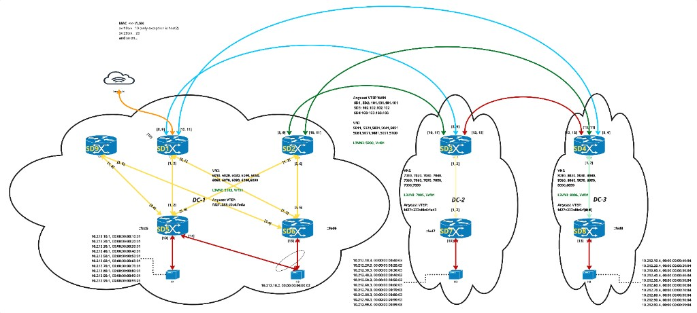
*Figure 23: DCI Test Topology (8-Node, 3 Data Centers)*

**Topology Overview:**
- **DC-1:** SD1 (DC1GW1), SD2 (DC1GW2), SD5 (Leaf1), SD6 (Leaf2) - with DCI redundancy and multi-homing
- **DC-2:** SD3 (DC2GW1), SD7 (Leaf3) - single DCI gateway
- **DC-3:** SD4 (DC3GW1), SD8 (Leaf4) - single DCI gateway

**Network Characteristics:**
- IPv4 underlay/overlay for WAN connectivity (blue/cyan arcs between DCs)
- IPv6 underlay/overlay for local-site connectivity (orange/yellow links within DC)
- L2 Interconnect: Normalized L2VNI per domain (2 VNIs per VLAN)
- L3 Interconnect: Normalized L3VNI with asymmetric translation between domains
- Route-map configuration per RT for L3VNI-VRF combinations
- Host attachment points shown at each leaf (cHost connections)

**Key Design Points:**

*L2 Interconnect:*
- Each VLAN maps to 2 L2VNIs (DC-side + WAN-side)
- DCI performs L2VNI translation when forwarding between domains
- Type-2 routes (MAC/MAC+IP) are re-originated with domain-appropriate L2VNI

*L3 Interconnect:*
- DCI gateways use a WAN-normalized L3VNI for inter-DC communication
- Leafs may use different L3VNIs than the DCI within the same domain
- DCI performs L3VNI translation + attribute rewrite (VNI/NH/RMAC/RT) for Type-5 routes between domains

**Host Connectivity:**
Each leaf (SD5-SD8) has connected hosts (cHost) for traffic testing. Host IP/MAC addresses are configured per the test requirements.

#### 13.2. L3 Interconnect Configuration

**Route-map Configuration for L3VNI Re-advertisement (at DCI):**

The DCI node requires route-map configuration to re-advertise Type-5 routes with local parameters. This enables **asymmetric VNI translation** where:
- **To WAN:** Routes from local DC leafs (using L3VNI 5003/5004) are re-advertised with DCI's WAN-normalized L3VNI (5200)
- **To DC:** Routes from remote DCs (using L3VNI 5200) are re-advertised with a local DC-compatible L3VNI

Note: The DC-facing L3VNI value must be configured to match what local leafs expect. In this example, VNI 5003 is used.

```
# Define Route-Targets of interest for WAN-facing re-advertisement
# These match routes from local DC leafs that need to be advertised to WAN
bgp extcommunity-list standard RT-WAN seq 5 permit rt 75105:5003   # Leaf1 RT (L3VNI 5003)
bgp extcommunity-list standard RT-WAN seq 10 permit rt 75106:5004  # Leaf2 RT (L3VNI 5004)

# Define Route-Targets of interest for DC-facing re-advertisement
# These match routes from remote DCs that need to be advertised to local DC
bgp extcommunity-list standard RT-DC seq 5 permit rt 65003:5200    # Remote DC2 RT
bgp extcommunity-list standard RT-DC seq 10 permit rt 65004:5200   # Remote DC3 RT

# Route-map to rewrite Type-5 routes when advertising TO WAN
# Rewrites leaf's L3VNI (5003/5004) to DCI's L3VNI (5200) for WAN advertisement
route-map RT-REWRITE-WAN permit 10
  match extcommunity RT-WAN
  set evpn vni 5200           # DCI's L3VNI for WAN domain
  set evpn rmac-local         # Use local VRF's Router MAC

# Route-map to rewrite Type-5 routes when advertising TO local DC leafs
# Rewrites remote DC's L3VNI (5200) to a local DC-compatible L3VNI
route-map RT-REWRITE-DC permit 10
  match extcommunity RT-DC
  set evpn vni 5003           # L3VNI that local DC leafs can process
  set evpn rmac-local         # Use DCI's local VRF Router MAC

# Apply route-maps in BGP EVPN address family
address-family l2vpn evpn
  no use-es-l3nhg
  neighbor OVERLAY_DC activate
  neighbor OVERLAY_DC route-map RT-REWRITE-DC out
  neighbor OVERLAY_WAN activate
  neighbor OVERLAY_WAN route-map RT-REWRITE-WAN out
  advertise-all-vni
  advertise ipv4 unicast
  advertise ipv6 unicast
exit-address-family
```

**VRF L3VNI Configuration:**

```
# VRF configuration at DCI (uses WAN-normalized L3VNI)
vrf Vrf01
  vni 5200
exit

# VRF configuration at Leaf (uses local L3VNI - example for Leaf1)
# vrf Vrf01
#   vni 5003
# exit

# BGP VRF configuration with route-targets
router bgp 65001 vrf Vrf01
  bgp bestpath as-path multipath-relax
  address-family l2vpn evpn
    route-target export 65001:5200   # Local DC RT
    route-target import 65003:5200   # Remote DC RT (DC2)
    route-target import 65004:5200   # Remote DC RT (DC3)
  exit-address-family
exit
```

#### 13.3. FRR Topotest Cases

The DCI L2 Interconnect functionality is validated through an FRR topotest suite (`bgp_evpn_mh_dci_func/test_evpn_mh_dci.py`) running on a multi-DC topology with 4 leaf nodes, 4 DCI nodes, and 2 data centers.

| # | Test Case | Description |
|---|-----------|-------------|
| 1 | `test_evpn_dci_base` | Validates EVPN VNI operational values and VTEPs for both DC and WAN domains on all DCI nodes. Verifies BGP peer-group, neighbor domain configurations, and VNI stitching. |
| 2 | `test_evpn_dci_type2_reorigination` | Validates Type-2 MAC-IP route re-origination across DCI domains. Verifies routes are properly re-originated with correct VNI, nexthop, and RT attributes. Includes loop prevention checks via `BGP_PATH_REORIGINATED` flag. |
| 3 | `test_evpn_dci_filtering_type2_routes` | Validates RD-based filtering of Type-2 routes between DCs. Ensures DC2 devices do not have DC1 leaf routes directly and vice versa. Verifies reorigination flags per VNI per device. |
| 4 | `test_evpn_dci_filtering_type1_routes` | Validates that Type-1 (Ethernet Auto-Discovery) routes are properly filtered at DCI domain boundaries. |
| 5 | `test_evpn_dci_filtering_type2_routes_duplicate` | Validates no duplicate Type-2 routes are present after re-origination. Ensures proper RD filtering prevents route multiplication across DC boundaries. |
| 6 | `test_evpn_dci_filtering_type3_routes` | Validates that Type-3 (Inclusive Multicast) routes are terminated per domain and not leaked across DC boundaries. |
| 7 | `test_evpn_dci_filtering_type4_routes` | Validates that Type-4 (Ethernet Segment) routes from leafs are not directly re-advertised or re-originated by DCI nodes to remote DCs. |
| 8 | `test_evpn_dci_filtering_type5_routes` | Validates that Type-5 (IP Prefix) routes from leafs are not directly re-advertised or re-originated by DCI nodes in L2 Interconnect mode. |
| 9 | `test_evpn_dci_dc_vni_remove_add` | Tests DC VNI removal and restoration on DCI1/DCI2. Verifies Type-2 routes are withdrawn from DC2 on removal and restored on re-addition. WAN VNI remains intact throughout. |
| 10 | `test_evpn_dci_wan_vni_remove_add` | Tests WAN VNI removal and restoration on DCI3/DCI4. Verifies inter-DC route re-origination stops on removal while intra-DC communication remains, and restores on re-addition. |
| 11 | `test_evpn_dci_leaf_l2vni_remove_add` | Tests L2VNI removal and restoration on leaf1/leaf2. Verifies Type-2 routes are withdrawn from all DCI and leaf nodes on removal and re-advertised across all nodes on restoration. |
| 12 | `test_evpn_dci_dcigw_l2vni_remove_add` | Tests DCI gateway L2VNI removal (both DC and WAN VNI) and restoration. Validates Type-2 route withdrawal and cross-domain re-origination resumption. |
| 13 | `test_evpn_dci_type2_withdrawal_propagation` | Tests Type-2 EVPN route withdrawal propagation across DCs. Removes MAC/neighbor from leaf and verifies withdrawal is properly propagated across all DCI nodes and remote leaves. |
| 14 | `test_evpn_dci_debug_functionality` | Validates DCI debug commands (`debug bgp evpn dci`) work correctly and debug messages appear in the proper log locations. |
| 15 | `test_evpn_dci_source_domain_overlay_dc_removal` | Tests removal/restoration of source domain (`neighbor domain`) for DCI1/DCI2 overlay-DC BGP neighbors. Verifies re-originated routes behavior and cross-DC visibility impact. |
| 16 | `test_evpn_dci_reoriginate_domain_overlay_wan_removal` | Tests removal/restoration of reoriginate domain for DCI1/DCI2 overlay-WAN BGP neighbors. Verifies DCI stops advertising re-originated routes to remote DCs on removal. |
| 17 | `test_evpn_dci_source_domain_overlay_wan_removal` | Tests removal/restoration of source domain for DCI3/DCI4 overlay-WAN BGP neighbors. Verifies domain removal prevents advertisement to unauthorized peers. |
| 18 | `test_evpn_dci_reoriginate_domain_overlay_dc_removal` | Tests removal/restoration of reoriginate domain for DCI3/DCI4 overlay-DC BGP neighbors. Verifies re-originated routes behavior and cross-DC visibility impact. |
| 19 | `test_evpn_dci_advertise_mac_only_basic` | Validates basic `advertise-mac-only` functionality on DCI nodes. MAC-only routes are re-originated while MAC-IP routes are blocked when enabled. Verifies restoration on disable. |
| 20 | `test_evpn_dci_advertise_mac_only_per_vni` | Validates per-VNI `advertise-mac-only` filtering. Only the configured VNI has MAC-IP routes blocked; other VNIs remain unaffected. |
| 21 | `test_evpn_dci_advertise_mac_only_global_override` | Validates that global `advertise-mac-only` overrides per-VNI configuration. Tests precedence rules when both global and per-VNI configs are present. |
| 22 | `test_evpn_leaf_advertise_mac_only_global` | Validates global `advertise-mac-only` at the leaf layer. Ensures leaf nodes filter MAC-IP routes before sending to DCI nodes. |
| 23 | `test_evpn_leaf_advertise_mac_only_per_vni` | Validates per-VNI `advertise-mac-only` on leaf nodes with independent filtering behavior per VNI. |
| 24 | `test_evpn_leaf_advertise_mac_only_global_override` | Validates global `advertise-mac-only` override behavior on leaf nodes, ensuring consistent precedence. |
| 25 | `test_25_advertise_mac_only_global_then_per_vni_unconfig_global` | Tests config sequence: enable global, enable per-VNI, unconfigure global. Validates per-VNI config persists after global removal. |
| 26 | `test_26_advertise_mac_only_per_vni_then_global_then_unconfig_global` | Tests config sequence: enable per-VNI, enable global, unconfigure global. Validates per-VNI remains active after global removal. |
| 27 | `test_27_advertise_mac_only_global_per_vni_unconfig_per_vni` | Tests config sequence: enable global, enable per-VNI, unconfigure per-VNI. Validates global config still blocks re-origination. |

#### 13.4. SpyTest cases

**L2/L3 Functionality Tests (`test_config.py`):**

The DCI SpyTest suite (`tests/cisco/tortuga/vxlan/dci/`) validates L2 and L3 Interconnect functionality on the 8-node 3-DC topology. Tests are driven by a YAML-based configuration file that defines per-device SONiC CLI, FRR BGP, and pre-BGP commands with corresponding deconfiguration blocks. The test framework applies configuration in a phased order: pre-sonic-bgp → sonic → bgp (and reverse for teardown). Traffic sources are configurable: Linux hosts for basic ping or IXIA for protocol-level emulation.

Every test follows a common verification pattern after reconfiguration:
1. Verify Type-5, Type-4, and Type-1 routes are **not** re-originated (DCI filtering correctness)
2. Verify remote VTEP tunnels are established
3. Initiate MAC learning (anycast ping or IXIA protocol restart)
4. Verify inter-DC L2/L3 traffic reachability
5. Verify remote MAC/VTEP/VNI associations on all DCI gateways

| Test Name | Description |
|-----------|-------------|
| `test_deconfigure_reconfigure_devices` | Full teardown and re-apply of all configuration layers (pre-BGP, SONiC, BGP) across all 8 nodes, verifies route filtering, VTEP tunnels, and inter-DC traffic |
| `test_deconfigure_reconfigure_dc1gw2` | Teardown and re-apply configuration on a single DCI gateway (DC1GW2) while the rest of the fabric remains up, verifies traffic continuity during partial outage and recovery |
| `test_deconfigure_reconfigure_sonic` | Remove and re-apply only the SONiC dataplane configuration (VxLAN tunnels, NVO instances, VLAN-VNI maps, VRF bindings) while leaving BGP intact, includes BGP session clear to recover from known issue |
| `test_deconfigure_reconfigure_bgp` | Remove and re-apply only the FRR BGP configuration (peer-groups, neighbors, domain/reoriginate bindings, route-maps, VRF BGP) while leaving SONiC config intact |
| `test_deconfigure_reconfigure_dci_config` | Remove and re-apply only the DCI-specific BGP commands (`domain`/`reoriginate`) on all gateway nodes while leaving the rest of BGP intact |
| `test_deconfigure_reconfigure_dci_nodes` | Teardown and re-apply full configuration on all 4 DCI gateway nodes only (DC1GW1, DC1GW2, DC2GW1, DC3GW1), leaving leaf nodes untouched |
| `test_deconfigure_reconfigure_vlan_vni_mapping_at_dci_nodes` | Remove and re-apply VLAN-to-VNI mappings (both DC-side and WAN-side) on all DCI gateways, verifying VNI stitching recovery |
| `test_single_link_failures` | Iterates through each DC1 gateway-to-leaf link (D1↔D5, D1↔D6, D2↔D5, D2↔D6), shutting down one link at a time and verifying inter-DC traffic continues via multi-homing redundancy, then restores and re-verifies |
| `test_double_link_failures` | Isolates an entire DC1 gateway from both leaf nodes simultaneously (e.g., DC1GW1 disconnected from Leaf1 and Leaf2), verifies traffic continues via the redundant gateway (DC1GW2), then restores and re-verifies |

**SpyTest Mobility Tests (`test_mobility.py`):**

The mobility test suite validates MAC mobility across the DCI fabric using IXIA traffic generators for fine-grained host emulation. Unlike `test_config.py` which uses Linux hosts, mobility tests use IXIA device groups to simulate host attach/detach events by starting and stopping protocol stacks on specific leaf ports. The test fixture disables automatic protocol start (`DCI_AUTO_START_PROTOCOLS=false`) to allow per-device-group control.

The configuration adds L3VNI/VRF support alongside L2VNI across all nodes:
- **DCI gateways** (DC1GW1/GW2, DC2GW1, DC3GW1): VRF `Vrf01` with L3VNI 5200 (normalized across WAN), route-maps `RT-REWRITE-WAN` and `RT-REWRITE-DC` for Type-5 VNI/RMAC/RT/NH rewriting, and per-VRF BGP with RT import/export
- **Leafs**: VRF `Vrf01` with per-leaf L3VNIs (Leaf1: 5003, Leaf2: 5004, Leaf3: 7005, Leaf4: 8006), per-VRF BGP with RT import from DCI gateways
- **Tunnel naming**: Updated from `vxlan-local`/`vxlan-remote` to `vxlan-dc`/`vxlan-wan` for clarity

| Test Name | Description |
|-----------|-------------|
| `test_intra_dc_mobility` | Simulates host migration within a single DC (Leaf1 → Leaf2 in DC1). Starts hosts on Leaf1, verifies MAC learning, shuts Leaf1-Hosts, activates Leaf2-Hosts with same MAC/IP, verifies MACs move to Leaf2 VTEP on all DCI gateways and remote DCs, then resets topology to original state |
| `test_inter_dc_mobility` | Simulates host migration across data centers (Leaf1 in DC1 → Leaf4 in DC3). Starts hosts on Leaf1 and Leaf3, verifies MAC learning, shuts Leaf1-Hosts, activates Leaf4-Hosts with same MAC/IP in DC3, verifies MACs update across all DCI gateways reflecting the new DC3 location, then resets topology |

Each test follows a 12-step pattern: verify VTEPs → start hosts → verify pre-mobility MACs → trigger mobility (stop source, start destination) → wait for convergence → verify post-mobility MACs → cleanup and reset → verify topology restored.

#### 13.5. SAI Dataplane Tests

The DCI SAI test suite validates hardware-level VXLAN tunnel creation, VNI-to-VRF/VLAN mapping, cross-family encapsulation/decapsulation, L2 bridging with FDB, BUM replication, ARP broadcast handling, PIP (Provider IP) tunnel support, and tunnel reconfiguration lifecycle — all exercised at the SAI object layer using Scapy-crafted packets and `run_and_compare` dataplane assertions.

The suite is organized into three test classes covering mixed-family and single-family DCI topologies:

**`Test_vxlan_dci_v4_v6`** — Mixed IPv4 external / IPv6 internal tunnel topology:

| Test Name | Description |
|-----------|-------------|
| `test_dci_vxlan_topology` | Topology sanity: builds DCI tunnels (v4 EXT + v6 INT, P2P + P2MP) twice — with and without NH groups — and validates tunnel counts, type segregation (v4 vs v6), and required keys before teardown |
| `test_vxlan_v4_to_v6_forward` | L3 unicast: decap IPv4 VXLAN (in_vni) → re-encap over IPv6 tunnel (out_vni) using VRF↔VNI maps and tunnel next-hop routing |
| `test_vxlan_v6_to_v4_forward` | L3 unicast: decap IPv6 VXLAN (in_vni) → re-encap over IPv4 tunnel (out_vni), validating bidirectional map set usage |
| `test_vxlan_v6_to_v6_forward` | L3 unicast dual-egress: decap IPv6 P2MP → select between two IPv6 P2P egress tunnels (t1/t2), verifying both forwarding directions with distinct inner prefixes |
| `test_l2vni_vxlan_v4_to_v6_forward` | L2 bridging: ingress VXLAN over IPv4 → egress over IPv6 with VLAN↔VNI mappings, FDB learning on remote tunnel bridge port, unicast + BUM (R bit) + ARP broadcast COPY trap verification |
| `test_l2vni_vxlan_v6_to_v4_forward` | L2 bridging: ingress VXLAN over IPv6 P2MP → egress over IPv4 P2P, validating FDB unicast, BUM replication semantics, and ARP broadcast handling |
| `test_l2vni_vxlan_v6_to_v4_bidir` | Extended bidirectional L2: symmetric v6↔v4 forwarding with tagged/untagged frames, BUM R-flag, iterative multi-packet flows, and reverse-direction FDB programming |
| `test_pip_p2mp_vrf_vni_mapping_encap_decap` | PIP P2MP tunnel VRF↔VNI mapping: validates encap (plain→VXLAN) and decap (VXLAN→plain) paths with explicit IP length/payload verification |
| `test_multi_vlan_l2vni_vxlan_with_single_pip_vrf_map` | Multiple VLAN↔VNI mappings (3 VLANs) sharing one PIP VRF↔VNI mapping; validates bidirectional L2 forwarding, BUM/ARP per VLAN, and PIP encap/decap coexistence |
| `test_dci_vxlan_reconfig_lifecycle` | Lifecycle: full DCI tunnel set → validate L2 bridging → remove/re-add IPv4 tunnels → remove/re-add IPv6 tunnels across 12 reconfiguration scenarios (partial and full teardown/rebuild) |
| `test_dci_vxlan_reconfig_lifecycle_with_pip` | Same lifecycle validation as above but including PIP P2MP/P2P tunnels and VRF↔VNI mappings, verifying stability across partial tunnel group reconfiguration |
| `test_l2vni_vxlan_v6_to_v4_bidir_with_pip` | Hybrid L2 + PIP L3: bidirectional VLAN/VNI bridging combined with PIP encap/decap, plus negative test cases (invalid VNI, incorrect local IP) |
| `test_vxlan_v6_to_v4_bidir_with_pip` | Comprehensive 3-VLAN (1000/2000/3000) validation: each VLAN with dedicated VRF and L3 VNI for cross-tunnel routing (v4↔v6), separate L2 VNI mappings for bidirectional bridging, and PIP tunnel paths for VLAN 1000 |

**`Test_vxlan_dci_v6_only`** — IPv6-only EXT↔INT tunnel topology:

| Test Name | Description |
|-----------|-------------|
| `test_dci_vxlan_v6_int_ext_topology` | Topology sanity: instantiate EXT + INT v6 DCI tunnels ensuring distinct map objects between groups and presence of L2/L3 maps for every tunnel |
| `test_vxlan_v6ext_to_v6int_forward` | L3 unicast EXT→INT: decap on EXT tunnel → re-encap to INT tunnel with VRF/VNI mappings and tunnel NH routing |
| `test_vxlan_v6int_to_v6ext_forward` | L3 unicast INT→EXT: mirror path validating INT decap to EXT encap and correct loopback source selection per tunnel group |
| `test_l2vni_vxlan_v6ext_to_v6int_forward` | L2 bridging EXT→INT: VLAN/VNI mapping, FDB-directed unicast, and ARP broadcast replication in all-v6 environment |
| `test_l2vni_vxlan_v6int_to_v6ext_forward` | L2 bridging INT→EXT: symmetric maps, FDB unicast, and ARP broadcast in all-v6 setup |

**`Test_vxlan_dci_v4_only`** — IPv4-only EXT↔INT tunnel topology:

| Test Name | Description |
|-----------|-------------|
| `test_dci_vxlan_v4_int_ext_topology` | Topology sanity: instantiate EXT + INT v4 DCI tunnels ensuring distinct map objects between groups and presence of L2/L3 maps for every tunnel |
| `test_vxlan_v4ext_to_v4int_forward` | L3 unicast EXT→INT: decap on EXT tunnel → re-encap to INT tunnel with VRF/VNI mappings over v4 underlay |
| `test_vxlan_v4int_to_v4ext_forward` | L3 unicast INT→EXT: mirror path validating INT decap to EXT encap and correct loopback source selection |
| `test_l2vni_vxlan_v4ext_to_v4int_forward` | L2 bridging EXT→INT: VLAN/VNI mapping, FDB-directed unicast, and ARP broadcast replication in all-v4 environment |
| `test_l2vni_vxlan_v4int_to_v4ext_forward` | L2 bridging INT→EXT: symmetric maps, FDB unicast, and ARP broadcast in all-v4 setup |

Every test uses `VxlanDciBuilder` / `VxlanDciL2Builder` helpers for deterministic setup and teardown of SAI objects (tunnels, map entries, FDB, routes, next-hops, bridge ports). Dataplane validation uses Scapy packet crafting with masked fields (UDP sport, IPv6 flow label, IP ID) and `run_and_compare` for inject-and-capture assertions.


### 14. Open/Action Items

---

#### Special Sections
##### VMotion with IRO
DCI supports VM mobility using inclusive route origination, enabling seamless migration of virtual machines across data centers. The control plane ensures route updates and minimal disruption during migration.

##### BGP RT Translation In/Out from DC
DCI implements flexible BGP route target translation, allowing dynamic policy enforcement and route advertisement between data centers. The translation logic is modular and supports future extensions.

##### L3VNI Stitching (L3 Interconnect)

L3VNI stitching enables interconnection of Layer-3 VNIs across data centers. Unlike L2 Interconnect (where each VLAN maps to two VNIs - one per domain), **L3VNI has only ONE VNI per VRF at the DCI node**. When DCI re-advertises Type-5 routes to another domain, it must rewrite route attributes.

**Key Difference from L2 Interconnect:**
- **L2 Interconnect (Type-2 MAC/MAC+IP):** Each VLAN → 2 L2VNIs (DC-side + WAN-side), DCI performs VNI normalization
- **L3 Interconnect (Type-5 IP Prefix):** VRF → 1 L3VNI at DCI, DCI performs route attribute rewriting (VNI/NH/RMAC/RT)

**Type-5 Route Re-origination at DCI:**

When the DCI receives a Type-5 route from a local leaf and re-advertises it to the WAN/remote DC, the following attributes must be rewritten:

| Attribute | Description | Why Rewrite? |
|-----------|-------------|--------------|
| **VNI** | L3VNI in Type-5 route | Remote DC expects its local L3VNI value |
| **Next-Hop** | EVPN route nexthop | Remote DC must route via DCI's VTEP, not original leaf |
| **Router MAC** | RMAC for inner L2 header | DCI's RMAC needed for symmetric IRB routing |
| **Route Target** | RT extended community | Controls which VRFs import the route |

**Route-map Based Rewrite:**
- `set evpn vni <value>` - Rewrites the L3VNI to DCI's local VNI
- `set evpn rmac-local` - Replaces RMAC with DCI's local VRF Router MAC
- Next-hop is automatically rewritten to DCI's VTEP when route is re-originated

**Per-RT Configuration:**
Each remote VNI-VRF combination requiring re-advertisement has its own route-map entry, allowing selective rewriting based on source domain.

**Source VTEP Propagation:**
Domain information is propagated through the routing stack via `NHA_SRC_DEV` netlink attribute, enabling the data plane to identify which domain a nexthop belongs to.

The implementation spans FRR (bgpd, zebra), Linux kernel (nexthop.c), iproute2, and SONiC SWSS components (fdbsyncd, vrfmgr, routesync).

---
